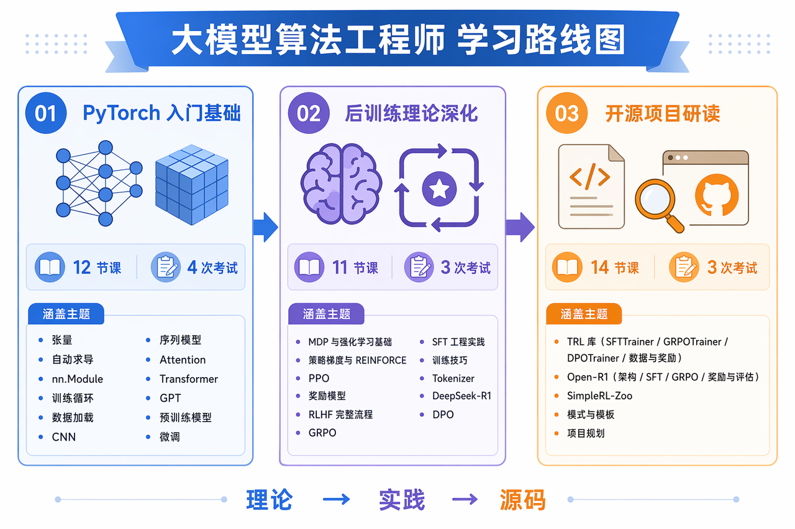
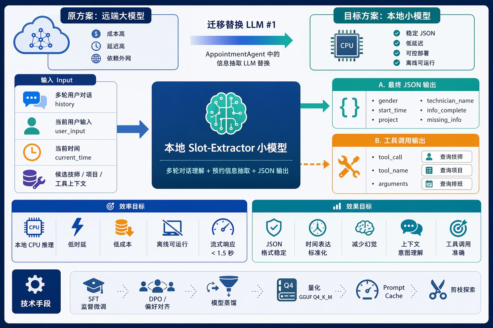

# Slot-Extractor 微调项目 Spec

> Status: Draft v0.1
> Owner: TBD
> Last updated: 2026-06-03

---
前言
在做项目的第一步，我的思路是设计一个文档。就如同我们笔记里的RAG项目一样，有一个非常细节的Dev_SPEC（技术文档）。对于笔记里这个RAG项目，很多同学问的我的一个问题是，你的技术文档是如何写出来的。
其实整个文档的编写并不容易，不是告诉AI，几天就能完工的。而是基于你的知识的积累（比如我是在学完了整个算法的理论章节后,有一些工程经验基础上）才开始设计的。设计的时候也是经过了非常多的思考，和AI反复确认具体的细节，斟酌方案，一点点写出来的。
大概过程是：确立需求 - 写文档 - Review修改。
其中确立需求：我的初步思路是针对于Agent项目的某一个模型做微调，目标是速度和性能。这里设计模型压缩量化和后训练的知识。接着我想的是训练哪个项目的哪一个模型呢？这个思维过程在文档的项目背景里有展示。
写文档：先建立骨架，再不断和AI讨论，思考，填写细节。建立骨架：比如文档分成哪几部分？背景-技术细节-结论等等，这些骨架，然后具体填每一个小节，填写的过程就是不断和AI沟通，思考，查资料，确认是否可行的过程。
Review:让AI评审，过程和写文档一样，让AI一遍评审，一遍思考和修改。


为了让大家能更清楚的理解整个文档是如何设计的，我在整个文档中添加了非常多的思考。比如这一小节：我思考了什么，甚至是写了哪些提示词，参考了哪些资料。目的是为了让大家更好理解，文档如何设计的，你是如何设计出来的，最终目标也是希望你能够用我的一套方法从学习算法理论到做项目，你都可以复用。
当然大家也可以看一下我小红书的笔记：算法章节，基本我也会工作留痕，设计文档的工作心得，我都会记录，这样整条路是如何走的，你心中会更加清楚。

做该项目的理论知识：



## 1. 项目背景



> **如何迁移到你的项目？请思考：**
>
> **❓ 你的项目中哪一块调用模型的功能，适合迁移成本地模型？**  
> 是高频、低复杂度、格式要求明确的结构化抽取任务，还是需要强推理、开放问答和长上下文理解的复杂任务？
>
> **我的做法：**  
> 参考笔记模型选型策略的思维逻辑，让 AI 分析你的项目中有哪些模型调用点，并进一步拆分出不同类型的模型能力：哪些适合继续依赖强模型，哪些可以迁移成本地小模型，哪些需要通过微调来稳定效果。这样就能从项目架构中找到真正值得微调的入手点，而不是一开始就泛泛地讨论“我要训练一个模型”。
>
> **❓ 项目瓶颈是什么？**  
> 当前更需要解决的是回答质量、幻觉控制、格式稳定性，还是推理延迟、部署成本和并发能力？
>
> **❓ 优化目标是什么？**  
> 面向效果问题，通常会从数据构造、SFT、RAG、后训练等方向入手；面向效率问题，则会更多考虑量化、剪枝、蒸馏和小模型替代。
>
> **❓ 技术路径如何组合？**  
> 量化、剪枝用于降低部署成本，但可能带来能力损失；后训练、蒸馏可用于对冲损失或提升小模型表现。你的项目选用哪些技术路线？这一小节列举了这些方向的通用技术，你应该思考，你要采用哪些技术？具体的技术方案是什么？如果这里面的技术名词名称你不懂，需要去问AI，即使不理解细节，也要理解概念。
>
> 本章会围绕这些问题，解释大模型落地时为什么需要同时考虑效果、速度、成本和工程复杂度。

本项目旨在**替换** Smart Appointment AI Agent 项目中 `AppointmentAgent` 的 LLM #1（负责从对话中提取预约信息并输出 JSON 的模型）。

### 1.1 核心功能
本项目要训练一个模型，来负责 Smart Appointment AI Agent 项目中的「预约」模块。它读取用户与机器人多轮交互产生的预约对话历史以及当前最新一轮用户输入，提取性别、到店时间、预约项目、指定技师、用户确认反馈等信息，并输出固定 Schema 的 JSON。此项目虽然和智能预约系统关联，但独立成为一个项目，你可以完全不关心这个 Agent 项目，只记住我们该训练的核心目标：输入是多轮用户对话内容，输出是指定 JSON 格式。

### 1.2 输入输出示例结构

训练和测试时，需要区分两类样本：一类用于判断模型能不能在信息齐全时输出最终 JSON；另一类用于判断模型能不能在信息不齐全时，识别出需要调用哪个工具，并输出正确的工具调用参数。这对应笔记里的Agent评估，我们既需要评估Agent的最终输出，也需要评估Agent的中间结果（工具调用）。

> **思考：**  
> 你的数据集大概要怎么做？每条样本的输入格式是什么，预期输出是什么，训练目标又是什么？本项目的示例会从两类样本入手：一类训练模型判断中间过程，也就是是否需要调用工具、调用哪个工具、参数是什么；另一类训练模型判断最终结果，也就是在信息齐全时输出格式正确、字段正确的 JSON。具体的数据集制作方式，后面的内容会继续展开。

#### 1.2.1 最终结果判断样本

当上下文信息已经足够完整，例如用户意图、预约时间、项目、技师候选信息都已经明确时，模型应该直接输出最终 JSON。这里考察的是：模型能否从多轮对话和候选上下文中提取出正确字段，并保证 JSON 格式稳定。

输入示例：

```text
history:
  用户：我想明天下午做个肩颈按摩
  机器人：可以，请问您有指定技师吗？
user_input: 安排李明吧
current_time: 2026-06-08 10:00
available_technicians:
  - 李明：男，擅长肩颈按摩，2026-06-09 14:00 可约
  - 王芳：女，擅长足疗，2026-06-09 16:00 可约
available_projects:
  - 肩颈按摩
  - 足疗
```

预期输出示例：

```json
{
  "gender": "未知",
  "start_time": "2026-06-09 14:00",
  "duration": "未知",
  "project": "肩颈按摩",
  "preference": "未知",
  "technician_name": "李明",
  "confirmation": "未知",
  "info_complete": true,
  "unrelated": false,
  "missing_info": []
}
```

对于这类样本，评估重点是最终 JSON 是否正确，包括字段值是否正确、格式是否合法、候选列表外的信息是否被输出为 `"未知"`。

#### 1.2.2 中间过程判断样本

当模型当前缺少必要的业务信息时，例如还不知道哪些技师可约、某个项目是否存在、某个时间段是否有排班，就不应该直接猜最终 JSON，而应该输出需要调用的工具。这里考察的是：模型能否判断当前轮次需要调用工具、调用哪个工具，以及工具参数是否正确。

输入示例：

```text
history:
  用户：我想明天下午做个肩颈按摩
  机器人：可以，请问您有指定技师吗？
user_input: 安排小王吧
current_time: 2026-06-08 10:00
available_tools:
  - find_technicians(start_time, duration, technician_name?, gender?, preference?): 按已知预约条件查询可用技师；指定技师则校验其存在/空闲并在不空闲时推荐相似技师，未指定则按性别/偏好返回空闲候选
```

预期输出示例：

```json
{
  "action": "tool_call",
  "tool_name": "find_technicians",
  "arguments": {
    "technician_name": "小王",
    "start_time": "2026-06-09 14:00",
    "duration": "未知",
    "gender": "未知",
    "preference": "无"
  }
}
```

对于这类样本，评估重点不是最终 JSON，而是中间过程是否正确：是否应该调用工具、工具名称是否正确、参数是否从上下文中正确提取。工具返回结果后，模型再进入“最终结果判断样本”的逻辑，基于工具返回的候选集合生成最终 JSON。

### 1.3 训练目标
为摆脱对远端/外网大语言模型的调用依赖，本项目需要在本地 CPU 环境下完成离线推理。因此，训练目标主要分为两类：一类关注推理效率，确保模型能在本地稳定、快速运行；另一类关注任务效果，确保模型能可靠地从对话中提取预约信息并输出正确 JSON。

#### 1.3.1 推理效率目标

> **学习：**  
> 先弄明白量化、蒸馏、剪枝、Prompt Cache 这些概念分别是什么，大概怎么做，以及它们分别解决推理过程中的哪类问题。
>
> **思考：**  
> 你的项目应该使用哪些效率优化技术？为什么选择它们，而不是选择其他方案？这些具体技术选型和策略，后面的内容会继续展开。

使该模块具备低时延、高吞吐的本地 CPU 推理能力。在部署阶段主要通过以下四项**模型压缩与运行期优化技术**来实现：
* **模型量化 (Quantization)**：将训练合并后的模型由高精度（BF16）裁剪精度至极轻量（GGUF Q4_K_M，文件约 2.2GB），极大减小每次推理的内存数据带宽读写需求。
* **模型蒸馏 (Distillation)**：用规模大、理解力强的云端导师模型（如 GPT-5）将复杂的逻辑与输出格式蒸馏给本地 1.5B ~ 3B 级别的极小模型，降低推理时的物理资源占用。
* **模型剪枝 (Pruning)**：在前期或特定硬件下探索对非敏感神经元连通性的物理剪除（若边缘计算环境遇到极致算力瓶颈时选备），进一步优化模型常驻体积。
* **常驻提示词缓存 (Prompt Cache)**：部署时要求本地推理服务打开缓存机制，将静态的系统人设与 JSON 规则的 KV Cache 锁定并常驻在系统物理内存中，避免重复的多轮 Prefill（预填充）前缀计算，将首字延迟直接拉低至毫秒级。

**交付线**：将单轮推理时延从远端的数秒或本地 BF16 的 90 秒，深度压缩至 **CPU 实测流式响应 < 1.5 秒**。

#### 1.3.2 任务效果目标

> **学习：**  
> 先弄明白后训练有哪些常见手段：SFT 有哪些训练方式，强化学习或偏好对齐有哪些方法，它们分别适合解决模型输出中的哪些问题。
>
> **思考：**  
> 你的项目可能会出现哪些效果问题？是格式不稳定、字段抽取不准、容易幻觉、上下文意图理解错误，还是工具调用判断不准确？这些问题分别应该用 SFT、DPO/RL，还是代码后处理来解决？这些具体技术选型和策略，后面的内容会继续展开。

确保本地小模型能够精准接管原本属于大型通用模型的复杂 NLP 理解与结构化提取工作。在后训练阶段主要通过以下两项**后训练（Post-Training）技术**来实现：
* **监督微调 (SFT)**：通过大量“多轮对话历史 + 标准 JSON 标签”的精标范例，对模型进行全参数微调。聚焦训练其对特定 JSON 格式的严格遵循度与逻辑边界。
* **强化学习/偏好对齐 (RL / DPO)**：引入直接偏好对齐（Direct Preference Optimization）等后训练对齐手段，通过训练时计算对比损失，惩罚幻觉输出，强化对特定边界（如拒绝脑补未提过的选项）的归零自律。

**拟解决的核心质量问题（后续章节展开）**：
* **稳定格式**：杜绝小模型易出现的 JSON 损坏、带有额外冗余文本或 Markdown 代码块包裹问题。
* **精准时规**：学会根据给定的当前基准日期时间，完美将多轮对话中的“明天”、“周末下午”、“三点半”等模糊表达标准化翻译至标准的 `YYYY-MM-DD HH:MM`。
* **消除幻觉**：强力抑止小模型容易凭空编造、脑补列表中不存在的技师名字与服务项目的幻觉行为（对用户没有提到、候选列表中也不存在的信息严格输出 `"未知"`）。
* **上下文意图理解**：在复杂、多轮的应答确认路径中，在极短、多义的字词回复下精准分类用户意图。
* **工具调用准确性**：在缺少技师、项目或排班候选信息时，能够判断是否需要调用工具，选择正确工具，并从上下文中提取正确参数。

---

## 2. 技术选型
> **❓ 思考：**  
> 你的项目中，为了完成整个训练过程项目，你需要考虑哪些问题？主要涉及哪些核心模块？从大的方向先想清楚。下面的每一个小节是我先想到的重要的模块，你想一想你的项目需要哪些模块呢？有没有要补充的地方需要思考？先建立宏观上的骨架，然后对每一个小节展开和AI的讨论，确认技术选型和实现方案。
> 我个人的提示词：帮我完成第二部分的框架，第二部分主要做技术选型，你从比如模型基座选择，模型压缩方法，后训练方法，数据集制作，训练框架选择，推理框架选择等这些方面来考虑。你想一想有没有遗漏的点，他们之间的最佳逻辑组织方式什么，哪些小节应该放在前面，哪些应该放在后面。不写具体内容，只是把目录骨架确定。
> 我自己用了这个提示词以后，它建立的骨架基本是完整的，比我想的要全面，我再深入到AI建立的骨架里面去思考，比如思考2.1小节，思考任务定义与输入输出，这中间也可以能决定AI定义的骨架不太合理，我会让他重新修改一下结构。 总之思路是先定骨架，定了骨架再填细节。

### 2.1 任务定义与输入输出格式

> **❓ 思考：**
> 在你的项目中，你要微调的模型到底要负责哪些任务？各种边界条件是什么？可能的输入是什么，预期有哪些输出？包括这个输入输出不是光针对最终结果来说的，当处于中间状态，模型需要调用工具获取外部信息，这个中间的输出结果有哪些可能？想清楚这些，你才知道你的数据集应该怎么做？这部分是要结合我们自己需求想清楚的？有的时候可能我们自己都没想清楚模型的能力边界。你可以从以下的方面去思考清楚这一问题：你的模型职责边界是什么？负责哪些职责？具体的任务有哪些，对应输入输出是啥？有哪些情况要调用工具？有哪些工具？此种情况对应的输入输出是啥？这一小节的内容和具体需求相关，但是思路是通用的。

#### 2.1.1 职责边界（模型负责 vs 工具/数据库负责）
> **❓ 思考：**
> 2.1.1 想清楚模型和工具的功能是什么？要做那些事情？哪些地方用模型处理，哪些依赖于外部工具。2.1.2 和2.1.3来想清楚的对应的功能点的输入输出长啥样？工具怎么设计？
切边界的原则只有一句话：**模型自己能从对话里推出来的，归模型；模型不可能凭空知道、一猜就会幻觉的，归工具/数据库。** 把它定死，后面所有任务类型和样本格式都是在这条线两侧展开。

**一、模型负责（只靠 `history` + `user_input` + `current_time` 就能得到，不查任何外部数据）**

- **字段抽取**：从多轮对话中抽出用户表达的预约要素，产出 `gender`、`project`、`duration`、`preference`、`technician_name`。
- **时间标准化**：结合 `current_time` 把"明天下午三点""周末""三点半"等模糊表达翻译成 `YYYY-MM-DD HH:MM`，产出 `start_time`。
- **意图判断**：判断本轮是否与预约无关、是否在回应推荐确认（"是/不/换一个"等多义短词），产出 `unrelated`、`confirmation`。
- **缺口判断**：对照必填项判断信息是否齐全、还缺哪些，产出 `info_complete`、`missing_info`。
- **动作决策**：在「追问澄清 / 调用工具 / 输出最终 JSON」之间选一个，作为本轮的核心策略输出，产出 `action`。

> 必填项规则沿用主项目：未指定技师时需 `start_time`、`project`、`duration`、`gender`；指定了技师名时 `gender` 可不必填。

**二、工具/数据库负责（模型无法凭空知道，必须发起工具调用去取，取回后才能继续）**

- **指定技师是否存在、其性别/专长**：技师名单在 DB，模型不知道库里有没有"小王"，必须查。
- **某技师某时段是否有空**：排班是动态数据，模型无法知道档期，必须查。
- **满足性别/偏好且当时空闲的候选技师**：需要全量技师 + 排班 + 专长相似度，靠记忆必然编造，必须查。

> 上面这几项本质是**同一个意图**——「给定预约条件，把可约的技师拿出来」，因此 2.1.3 把它们收敛成**单个工具**，由后端代码统一处理内部分支，而不暴露成多个细碎工具（理由见 2.1.3）。

> **划清后的关键含义：** 技师匹配、档期校验这类事实查询始终是确定性代码（零幻觉、准确、便宜），模型只负责"决定要不要调、调哪个、传什么参数"以及"读懂返回结果"。模型绝不能自己编技师名或档期——这正是 2.1.2「工具调用类任务」和后训练惩罚幻觉要锁住的边界。


#### 2.1.2 任务类型清单（情况与判定要点）
> ❓ 思考： 你微调的业务场景有哪些情况？这些情况各自要触发什么决策？需要想清楚各种边界条件，后面才能据此制作数据集。
> 本节只梳理"有哪些情况、每类的判定逻辑和应输出的关键决策"，不固化具体输入输出样本与字段格式——精确的样本结构、字段顺序、时间/工具字段规范统一放到 2.3 数据集制作里标准化。
> 另外，输入中每轮都会带 `current_time`（由 harness 层注入），用于把"今天/明天/三点半"这类相对表达推断成绝对时间；这是各情况的共同前提。

**类型 1：信息不全 → 追问澄清**
必填项还缺（如缺时长、性别）。判定逻辑：对照必填项发现有缺口。关键决策：`action=ask`、`info_complete=false`，并指出还缺哪些项（`missing_info`）。

**类型 2：需要业务事实 → 工具调用**
缺技师是否存在、档期、候选等只能从 DB 取的外部事实。判定逻辑：要素已够但需先核实事实。关键决策：`action=tool_call`，调用 `find_technicians` 并从上下文抽取参数，不得自行编造技师或档期。

**类型 3：信息齐全 → 输出最终预约**
必填项齐全、且所需候选事实已在上下文中（工具结果已回填）。判定逻辑：无缺口、无需再查。关键决策：`action=final`，给出确定的预约要素。

**类型 4：与预约无关 → 路由**
本轮是闲聊、问天气等与预约无关的内容。判定逻辑：意图不落在预约域内。关键决策：`unrelated=true`，交由上层路由。

**类型 5：确认回应 → confirmation**
上一轮机器人在询问推荐确认，本轮是"好/不/换一个"等多义短词。判定逻辑：结合上文识别这是对推荐的回应而非闲聊。关键决策：提取 `confirmation`，且不标记为 `unrelated`。

**类型 6：预约成功 → 天气工具 + 个性化出行建议**
预约已确认并成功落库（类型 3 完成之后），需要给用户一句结合天气的温馨出行提示。判定逻辑：本轮预约已确认成功，进入收尾关怀环节。关键决策：先 `action=tool_call` 调用 `get_current_weather` 查询门店所在城市（默认北京）天气；拿到天气结果后再生成结合天气的个性化出行建议（如「已为您预约明天下午2点，北京有雨记得带伞」）。这一步同样不能凭空编天气，必须以工具返回为准。

#### 2.1.3 工具清单（工具调用类任务涉及的能力）
> ❓ 思考： 你要训练的这个任务，要用到哪些工具？对应的参数和 description 是什么？粒度该多细？
>  因为我们不光要训练模型的回答，中间过程也要训练它对工具的理解和调用。所以工具长什么样、如何体现在上下文里，是需要我们想清楚的。
>  我在做本节设计的时候，想过的一些问题：我的工具设计，我是设计多个工具，分别负责查技师是否存在，是否空闲，专长，还是合并成一个？（最终的决策是合并成一个，因为小模型害怕做选择，不要增加他的推理难度）
>  这个对于技师的专长和用户的要求的匹配，是让模型自己拿到对应的值去匹配，还是说直接借助工具，内部做一个嵌入向量匹配？（最终决策直接借助工具，因为毕竟是小模型，尽量减少模型推理）

**工具：`find_technicians(start_time, duration, technician_name?, gender?, preference?)`**
- 能力：一次性完成全部技师事实查询，后端自动按场景分支：
  - 传了 `technician_name` → 校验该技师是否存在、在该时段是否空闲；不空闲时按专长相似度推荐替代技师。
  - 未传 `technician_name` → 按性别 + 专长偏好筛选，返回该时段空闲的候选技师（按相似度排序）。
- 触发场景：必填要素已够、但需要核实只能从 DB 取的技师事实时（对应任务类型 2）。
- 参数来源：全部取自模型抽取的字段；`technician_name`、`gender`、`preference` 可缺省（结束时间由代码按 `start_time + duration` 推导，模型不需自己算）。
- 返回结构（由 harness/编排层回填，模型只读 `result`）：
  - `candidates`：满足条件的空闲候选技师列表（`id/name/gender/strength`）。
  - `requested_technician`：当传了 `technician_name` 时，回该技师是否存在及是否空闲；否则为 `null`。
  - `recommended`：指定技师不空闲时后端给出的相似替代技师；否则为 `null`。
- Service 落点：对应 `TechnicianFinder.find_technician_with_thought` 的整体逻辑，内部由它组合调用 `get_technician_by_name()` + `is_technician_available()` + `get_all_technicians()` + `services/text_embedding.find_best_match_indices()`（`name → id`、时长换算、分支判断全部在代码侧完成）。

**工具：`get_current_weather(city?)`**
- 能力：查询指定城市的当前天气（天气状况、气温/体感、湿度、风速等），默认门店所在城市北京。
- 触发场景：预约成功后生成结合天气的个性化出行提示（对应任务类型 6），模型不能凭记忆编造天气。
- 参数来源：`city` 可缺省，默认北京。
- 返回结构：一段天气描述文本（如「北京当前天气：小雨，气温18°C，湿度80%…」）；API 失败时回退为兑底晴朗文案。
- Service 落点：主项目 `AppointmentProcessor.WeatherMCPTool`（name=`get_current_weather`，底层调 OpenWeather API）。拿到返回后，模型再基于天气文本生成一句个性化出行建议。


### 2.3 基座模型选择

> **❓ 思考：**
>
> **写作方法：**
> 模型的选型是面试官最喜欢问的问题，我们需要在这块仔细想清楚，有充分的理由做支持。我在写着一块的时候，提示词大概是：先让模型生成大纲，问模型如果做选择，需要从哪些方向考虑：他会告诉我比如选型目标和约束，任务能力需求分析等。然后让他建立这样的目录后，让他完成一个初稿。它填入了初稿后，我来审核。一遍审核一遍思考，比如我认为最终模型的确定不能马上确认。我会让他基于模型的硬件，来计算实际的部署时间来判断大概哪些模型是可以跑的，哪些完全跑不了。我会让他选1.5B,3B,7B三个模型，通过训练看效果做出决策，因为我相信模型最终选择需要实验，而不是写文档就能确定，所以我告诉他思路是选定几个模型同时训练再下结论。通过一边读，一边给他一些我自己的思考和原则，让他修改文档。
>
> **本节目录维度：**
> 章节从训练目标，任务需求，硬件能不能跑？跑的有多快？上下文这些维度考虑。
>
> **可以继续思考的细节：**
> 但实际我在写文档的时候，觉得还有很多细节要考虑，比如你使用模型和训练方法之间的关系？哪些模型适合训练，哪些不适合？即使确定了同一个模型，不同版本之间的选择，比如就算确定了使用千问进行训练，那么使用最新的千问版本，还是老的稳定的版本？他们之间训练有没有差异？但我不想无限发散，出于时间等更方面考虑，我不想把他设计的太复杂。大家有时间可以多想想。
>
> **实验驱动：**
> 另一点想要强调，我们现在做选择，比如推测可能得推理时间，需要的推理内存，这些都是推断，但真正最后结果，还需要实验驱动。所以笔记只是大概确定了几个不同模型，然后会对他们都进行训练，从中对比选择最合适的模型。
>
> **学习提示：**
> 大家自己设计本小节，可以参考上面的思路，以及内容大概，建立一个目录，让模型帮你结合你的项目填写内容，自己去分析修改。同时如果是学习，里面也有很多内容需要你去了解，比如笔记硬件与部署分析，计算推理需要的内容，我们笔记里有专门知识讲解。量化什么意思？GGUF什么意思，Q4_K_M什么意思，多问问AI，多思考。

#### 2.3.1 选型目标与约束

本项目基座模型选择有两个硬目标：一是效果上能够稳定完成预约信息抽取，二是工程上能够被压缩部署到本地 CPU 环境。

从效果目标看，模型需要读取 `history`、`user_input`、`current_time`、候选技师/项目/工具描述等上下文，输出固定 JSON 或工具调用 JSON。它要解决的是高频、低开放度、强格式约束的任务，而不是长篇开放问答。因此，模型的通用知识规模不是第一优先级，**指令遵循、中文理解、结构化输出和边界控制**更重要。

从部署目标看，1.3 中已经明确希望把远端模型调用替换成本地离线推理，而且不是只在高配 GPU 机器上跑通，而是要尽量支持在大多数普通本地电脑上用 CPU 运行。这个约束会直接限制模型规模：14B、32B、72B 这类大模型即使量化后也会带来较高的内存占用和推理延迟，对普通电脑不友好，基本不符合本项目"本地 CPU 可运行"的目标。因此，更合适的候选范围应收敛在 **1.5B ~ 7B**：1.5B 追求速度，3B/4B 追求效果与部署成本平衡，7B 作为质量兜底。

#### 2.3.2 任务能力需求分析

结合 2.1 的任务定义，本项目对基座模型的能力要求可以拆成六类。

**一、中文口语预约理解能力。** 用户输入不是标准表单，而是"明天下午想按个肩颈""安排个女师傅""小王有空吗""那换一个吧"这类自然口语。模型需要理解按摩预约场景中的时间、项目、性别偏好、技师名和确认/否定表达。尤其是中文相对时间表达非常关键，例如"明天""后天下午""周末""三点半"必须结合 `current_time` 标准化，而不是凭模型记忆乱猜。

**二、多轮上下文理解能力。** 很多字段不会在同一轮出现。用户可能第一轮说项目，第二轮补时间，第三轮只说"可以"或"换一个"。模型必须把短回复放回对话历史里解释，不能把"好"误判成闲聊，也不能在上下文没有候选技师时直接生成最终预约。

**三、结构化 JSON 输出能力。** 本任务的评估不是看回答是否自然，而是看 JSON 是否合法、字段是否完整、值是否正确。小模型常见问题包括输出 Markdown 代码块、字段漏写、布尔值写成中文、把解释文本混进 JSON、数组格式损坏等。因此，基座模型最好已经具备较好的结构化输出基础，后续 SFT 才是在此基础上收敛 Schema，而不是从零教它什么是 JSON。

**四、工具调用决策能力。** 本项目虽然不是完整 Function Calling Agent，但训练样本里有明确的 `action=tool_call`、`tool_name` 和 `arguments`。模型要学会什么时候追问、什么时候调用 `find_technicians` 或 `get_current_weather`、什么时候基于工具结果输出最终 JSON。这里需要的是轻量决策能力，不是长链路复杂规划能力。

**五、幻觉抑制能力。** 模型不能编造技师、档期、服务项目和天气。凡是数据库、排班或外部 API 才知道的事实，都必须交给工具。基座模型如果本身指令遵循较弱，后续即使微调，也更容易出现"为了补全 JSON 而脑补字段"的问题。

**六、上下文长度。** 预约抽取通常不需要 128K 长上下文，但需要容纳多轮对话、工具描述、候选列表和固定输出规则。实际输入大概率在几百到几千 token 内，32K 上下文已经足够。超长上下文不是本项目主矛盾，反而可能带来推理时 KV Cache 内存压力。因此，上下文长度只作为门槛项，不作为决定性因素。

#### 2.3.3 硬件与部署条件分析

本项目的最终运行目标是本地 CPU 推理，而不是默认依赖 GPU 在线服务。因此，本小节只讨论一个问题：不同规模的模型在普通 Windows 消费级设备上，经过 INT4/Q4 量化后，从内存和显存角度看是否具备本地运行条件。速度和延迟单独放到下一小节分析。

这里参考笔记中 **6.1.2.2「训练 vs 推理：运行内存里住着什么？」、6.1.4.1「模型参数：精度决定基础显存」、6.1.4.2「KV Cache：随上下文增长的动态开销」和 6.1.4.3「推理总显存 = 参数 + KV Cache」** 的原则来估算。推理阶段不需要梯度和优化器状态，核心开销可以简化为：

```text
推理内存 ≈ 模型参数内存 + KV Cache + 推理框架/运行时开销
模型参数内存 ≈ 参数量 × 单参数字节数
```

其中 fp16/bf16 约等于每个参数 2 字节，INT8 约 1 字节，INT4 理论上约 0.5 字节，但实际还要存量化 scale、分组信息和运行时元数据，所以 GGUF Q4_K_M 一类 4bit 量化模型通常会比理论值更大一些。KV Cache 则和上下文长度、并发数、层数、KV 头数量、head 维度成正比；单用户、短上下文时它通常不是主开销，但长上下文或多并发时会迅速放大。本项目主要是本地单用户短上下文场景，输入大多在 2K token 以内，因此可以按 `batch=1`、`context=2K~4K` 做工程估算。

按本项目更可能采用的 INT4/Q4 量化部署来估算，真正需要关注的是“量化后参数内存 + 单用户 2K~4K 上下文 KV Cache + 推理框架开销 + Windows 系统余量”。这里的 Q4 主要指模型权重经过 4bit 量化；KV Cache 默认按 fp16/bf16 估算，不假设额外做 KV Cache 量化。可以按下面的方式粗算：

- **1.5B Q4**：Q4 权重约 `1GB ~ 1.3GB` + KV Cache 约 `0.1GB ~ 0.3GB` + 推理运行时开销约 `0.5GB ~ 1GB`，模型侧最终运行占用约 `2GB ~ 3GB`；Windows 整机最低建议 `8GB RAM`，`16GB RAM` 更稳；如果用 GPU，`4GB` 显存基本可跑。
- **3B/4B Q4**：Q4 权重约 `2GB ~ 3GB` + KV Cache 约 `0.2GB ~ 0.6GB` + 推理运行时开销约 `0.8GB ~ 1.5GB`，模型侧最终运行占用约 `3GB ~ 5GB`；Windows 整机最低建议 `16GB RAM`，`32GB RAM` 更稳；如果用 GPU，`6GB` 显存可跑，`8GB` 显存更稳。
- **7B Q4**：Q4 权重约 `4.5GB ~ 5.5GB` + KV Cache 约 `0.25GB ~ 1GB` + 推理运行时开销约 `1GB ~ 2GB`，模型侧最终运行占用约 `6GB ~ 8GB`；Windows 整机 `16GB RAM` 勉强可跑，`32GB RAM` 更稳；如果用 GPU，`8GB` 显存可跑短上下文，`12GB/16GB` 显存更稳。

这里的最终运行占用不是单纯的 GGUF 文件大小，而是把 Q4 参数、短上下文 KV Cache 和推理运行时开销合在一起后的粗略结果；Windows 整机内存建议还额外考虑了操作系统、IDE、浏览器、Python 服务和内存余量。因此，虽然 7B Q4 的模型文件可能只有 4GB ~ 5GB，但在 Windows 上要稳定放下模型和运行时开销，仍然更建议 32GB RAM 或 8GB 以上显存。

进一步结合当前主流 Windows 消费级设备来看，普通办公/学习本常见配置大概是 `16GB RAM + 集显`，中高配轻薄本或开发机大概是 `32GB RAM + 集显/轻量独显`，主流游戏本和台式机通常是 `16GB ~ 32GB RAM + 6GB ~ 12GB 显存`，更高端的创作/游戏台式机则可能有 `32GB ~ 64GB RAM + 16GB 以上显存`。

综上，从“面向大部分消费级 Windows 用户机器是否可跑”的角度看，**1.5B、3B/4B、7B 这三个量级在 INT4/Q4 量化后基本都具备本地运行可行性**。也就是说，对于本项目讨论的 1.5B ~ 7B 候选范围，核心问题通常不是“能不能把模型跑起来”，而是跑起来之后的速度、首 token 延迟、完整 JSON 输出耗时和交互体验是否可接受。

#### 2.3.4 推理速度与延迟评估

硬件上“能跑”不等于交互体验一定可接受。对于本项目这种预约信息抽取任务，输出通常只有几十到一两百个 token，速度评估重点不只是输出阶段的 tokens/s，还包括 Prompt Prefill、首 token 延迟、上下文长度、是否使用 Prompt Cache，以及模型权重是否能全部放在 GPU 或内存中顺畅访问。

速度不能像显存那样只用“参数量 × 字节数”直接推出。内存估算关注的是模型能否放得下，而速度评估关注的是一次请求从输入到输出的完整链路，它会同时受到多类因素影响：

- **模型规模与量化格式**：1.5B、3B/4B、7B 的参数量不同，Q4、Q5、Q8 等量化格式的计算开销和内存带宽压力也不同。
- **输入 token 数**：系统提示词、JSON Schema、工具说明、多轮历史、候选技师列表都会增加 Prompt Prefill 成本。输入越长，首 token 前的等待越明显。
- **输出 token 数**：本项目输出通常是工具调用 JSON 或最终预约 JSON，输出越长，Decode 阶段耗时越长。
- **Prompt Cache 是否命中**：如果固定的系统规则、Schema 和工具说明能被缓存，后续请求只需要处理新增对话和候选上下文；如果每轮都重新 Prefill，首 token 延迟会明显增加。
- **硬件与运行后端**：CPU 型号、内存带宽、线程数、是否启用 AVX/BLAS、是否使用 RTX 4060/4070 等独显 offload、offload 了多少层，都会显著影响速度。
- **推理框架配置**：llama.cpp、Ollama、vLLM、Transformers 等框架的实现不同，`context`、`batch`、`threads`、`gpu_layers`、并发数等参数也会改变实际延迟。

```text
完整输出耗时 ≈ Prompt Prefill 耗时 + 首 token 延迟 + 输出 token 数 / 解码速度(tokens/s)
```

因此，本节不直接给出 1.5B、3B/4B、7B 的速度结论，只保留方向性判断：在同一硬件、同一量化格式、同一 Prompt 和同一推理框架下，通常模型越小越快；但具体快多少、是否达到本项目可接受的交互体验，必须通过固定实验测出来，而不能只靠参数规模推断。

后续评估时，需要固定测试集、Prompt 模板、输入上下文长度、输出长度上限、量化格式和推理框架配置，分别对 1.5B、3B/4B、7B 候选模型记录 `模型加载时间`、`Prompt Prefill 耗时`、`首 token 延迟`、`完整输出耗时`、`tokens/s`、`峰值内存/显存占用`、`Prompt Cache 是否命中`。这些实测数据会决定哪个模型规模在具体设备上具有可接受的实际体验。

#### 2.3.5 上下文长度需求估算

除了速度，还需要单独考虑模型上下文窗口是否能容纳一次完整任务输入。这里的“上下文”不能只理解成用户当前一句话，而是一次推理请求中模型实际看到的全部内容：系统提示词、任务规则、JSON Schema、工具描述、多轮对话历史、当前用户输入、当前时间、候选技师/项目、工具返回结果，以及模型即将生成的输出。

输出 token 也需要算进上下文窗口。原因是自回归模型生成时，会把已经生成的 token 继续追加到上下文里；因此推理框架配置的 `context length` 实际要覆盖：

```text
上下文窗口需求 ≈ 输入 token 数 + 最大输出 token 数 + 安全余量
```

按本项目的 Slot-Extractor 任务粗略拆分，一次请求的 token 来源大致包括：

| 内容组成 | 作用 | 粗略 token 范围 |
| --- | --- | --- |
| 系统提示词 + 任务规则 | 约束模型只做预约抽取、只输出 JSON、不编造事实 | `300 ~ 800` |
| JSON Schema / 字段说明 | 说明 `gender`、`start_time`、`missing_info`、`action` 等字段含义 | `300 ~ 700` |
| 工具描述 | 包括 `find_technicians`、`get_current_weather` 的能力、参数和触发条件 | `200 ~ 600` |
| 多轮对话历史 | 用户和机器人的历史轮次，短预约一般 3~6 轮，复杂情况可能更多 | `300 ~ 1200` |
| 当前输入 + 当前时间 | 本轮用户输入和 `current_time` | `50 ~ 150` |
| 候选项目 / 候选技师 / 工具返回 | 可选上下文，取决于是否已经查库、候选列表有多长 | `300 ~ 1500` |
| 输出 JSON 预留 | 工具调用 JSON、追问 JSON 或最终预约 JSON | `100 ~ 300` |
| 安全余量 | 防止少数长历史、长候选列表、字段说明扩展后越界 | `500 ~ 1000` |

因此，本项目常规样本大概率会落在 `2K ~ 4K tokens` 的上下文需求内；如果保留较长多轮历史、候选技师列表较多、工具返回较详细，压力样本可能接近 `6K ~ 8K tokens`。这只是用于设计评估集和推理配置的工程估算，不作为最终结论。

上下文长度不是越大越好。更长的上下文窗口会增加 KV Cache 占用，也会放大 Prompt Prefill 成本；如果模型虽然支持 32K 或 128K，但本项目实际只需要几千 token，盲目追求超长上下文并不会直接提升效果，反而可能降低本地推理体验。更合理的做法是把固定规则和工具说明写得足够紧凑，对历史对话设置截断/摘要策略，对候选列表设置最大返回数量，并在评估集中单独加入长历史和长候选列表样本，验证模型是否真的能在目标上下文长度内稳定输出。

后续评估时，应至少设置三档上下文压力测试：`2K` 代表常规短对话，`4K` 代表较完整的多轮预约流程，`8K` 代表长历史和较多候选上下文。只有当这些样本的 JSON 合法率、字段准确率、工具调用准确率和延迟都可接受时，才能确认某个模型的上下文能力满足本项目需要。

#### 2.3.6 最终选型

综合前面几节的分析，本项目选择模型时不需要构建过大的候选池。任务本身是中文口语预约信息抽取，输出是固定 JSON 或工具调用 JSON，核心不是开放问答能力，而是中文理解、结构化输出、工具调用判断、幻觉控制、本地部署成本和工程链路可用性。因此候选模型应收敛在少数几个真正可能落地的方向上。

从候选范围看，Qwen 系列最适合作为主线。原因是它在中文理解、结构化输出、指令遵循和开源生态上都比较贴近本项目需求；同时，公开资料中 Qwen 官方文档已经覆盖 Transformers 推理、本地运行、量化、训练、Agent/Function Calling 等链路，LLaMA-Factory 也已经在支持模型列表和发布记录中加入 Qwen3/Qwen3.5，并支持 SFT、LoRA/QLoRA、DPO 等训练方式。也就是说，从资料上看，不能简单认为 Qwen3.5 因为“更新”就不适合训练；相反，它应该进入主实验候选。

但如果只在 Qwen 同系列内比较不同参数规模，实验结论容易变成“Qwen 里哪个尺寸最合适”，而不能回答“是不是 Qwen 这个系列本身最适合本任务”。因此，最终选型需要加入一个国产开源模型系列作为横向对照组。国内常见的可微调开源模型包括 Qwen、GLM/ChatGLM、InternLM、Baichuan、Yi、MiniCPM 等；其中 GLM/ChatGLM 在中文场景和早期私有化微调中使用很多，GLM-4 也有较强的 Agent 和 Function Calling 相关能力，但当前适合本项目本地 CPU 路线的小尺寸选择不够连续，GLM-4 主力开源尺寸更偏 9B/32B，ChatGLM3-6B 又相对偏旧，放进第一批主实验会增加工程变量。Baichuan、Yi 等模型也可以调研，但近年的训练框架、部署框架和中文结构化输出案例热度不如 Qwen、InternLM、GLM 这几条主线。

综合可训练性、中文能力、开源许可、尺寸覆盖和工程生态，本项目选择 **InternLM 系列作为横向对照组**。原因是 InternLM2.5/InternLM3 提供了 1.8B、7B、8B 等适合本地部署评估的尺寸，权重许可和开源生态相对清晰；同时 InternLM 官方提供 Transformers、LMDeploy、Ollama、vLLM 等推理方式，LLaMA-Factory 和 ModelScope ms-swift 也支持 InternLM 系列训练。更重要的是，InternLM 与 Qwen 都是国产开源主线模型，但训练数据、模型结构、对齐方式和生态路线不同，把它作为对照组可以验证：本项目的效果提升究竟来自“参数规模变大”，还是来自“某个模型系列更适合中文口语预约抽取和严格 JSON 输出”。

最终选型上，本项目不在文档阶段把模型限制为唯一权重，而是先确定 **Qwen3.5 作为主实验系列，InternLM 作为横向对照系列**，再对两个系列下的相近规模模型进行训练和评估对比。原因是模型选型本质上是实验结论，不是纯文字推断；低配档、平衡档、效果档分别代表速度优先、效果/部署成本平衡和质量上限，横向对照组则用于排除“只比较同一模型家族”的偏差。只有在同一数据集、同一训练方法、同一量化方案和同一评估脚本下跑完，才能判断哪一个模型规模和模型系列最适合本项目。

首轮实验采用 **Qwen3.5 同档位模型 + InternLM 相近规模模型** 进入实验矩阵。Qwen3.5 按公开可用尺寸选择低配档、平衡档和效果档，例如 `0.8B/2B/4B/9B` 中选择接近本地部署目标的几个档位；InternLM 则选择 `1.8B/7B/8B` 等相近规模作为横向对照，不要求参数量完全一一对应，而是按“低成本可跑”和“质量上限兜底”两个维度对齐。这样设计后，实验既能比较 Qwen 内部不同 B 数的速度和效果，也能回答 Qwen 与另一个国产开源系列在相同任务、相同数据 and 相同训练方案下谁更适合接管 Slot-Extractor。

### 2.4 后训练方法选择

> **❓ 思考与学习：你的项目应该采用哪个后训练方法？为什么？分别解决哪些痛点？**
> 
> - 常见的后训练方法是 **SFT（监督微调） + 强化学习/偏好对齐**：
>   - SFT 最常见的方法：全参数微调（Full FT）、LoRA、QLoRA。
>   - 强化学习/偏好对齐常见方案：DPO、PPO、GRPO。
> - 设计这个方案，需要扎实的理论基础（这些方法是什么、大概怎么做，都在笔记的前三个阶段「算法学习章节」学过）。虽然这些设计内容是 AI 生成的，但你仍然需要学习理解这些基本理论与工程经验，才能够设计出合理实用的 SPEC。
> 
> ---
> 
> **💡 写作与设计思路分享（如何编写本章）：**
> 
> 建议按照以下思路逐步构建和完善本章内容：
> 1. **列举项目痛点**：梳理需要解决的问题，拉一张表，列举项目需要进行后训练的全部痛点。
> 2. **深度分析 SFT**：考虑常见的 SFT 方案、各自的优缺点，并结合当前项目（算力、场景）进行分析。
> 3. **深度分析强化学习/对齐**：对比常见的偏好对齐与强化学习方案、优缺点，并结合项目契合度进行分析。
> 4. **确定结论并对齐痛点**：确定最终使用什么方法训练，拉一张匹配表，将这些训练方法和痛点一双双匹配对齐上。
> 
> *经验之谈：可以将内容先写在一个临时的 Markdown 文件中待审核。建议配合适合的提示词，让 AI 能够阅读到你的项目源码或文档，以此基于真实上下文来诊断痛点并多跑几个模型对比生成出来的几份草稿。在审核 AI 输出的初稿时，需要重点修改并提炼其“选择理由不够充分、篇向强调实现简单而忽略实际效果/上限天花板”的细节。同时重点提问自己不理解的地方，例如“为什么 DPO 为主、GRPO 为辅/兜底？”等细节，拉着 AI 多问。*
> 
> ---
> 
> **📚 面试备考与思维拓展：**
> 
> - **❓ 不同后训练方法的底层原理分别是什么？各自有什么特点与优缺点？**
>   这些往往都是非常核心、面试最常考察的算法理论基础。
> - **❓ 你的项目为什么采用 DPO 而不是 PPO？它具体是为了解决什么痛点？**
>   通过梳理并完成本小节的痛点与方案矩阵匹配，相信你可以非常透彻地厘清这套因果逻辑，并在面试时有条理地做出精彩回答。

#### 2.4.1 项目痛点与需要解决的问题

后训练不是"为了训练而训练"。先明确：本地小模型接管 Slot-Extractor 后，**哪些痛点该由 SFT 打基础、哪些还要靠偏好对齐进一步收紧边界**，避免用同一种方法去解所有问题。下表汇总 1.3.2 与 2.1 中暴露的核心痛点（本节只讨论训练手段，事实查询与工程层校验属于编排实现细节，不在此展开）。

| 编号 | 痛点 | 具体表现 | 适合的训练手段 |
|---|---|---|---|
| P1 | JSON 格式不稳定 | 输出被 Markdown 代码块包裹、字段漏写、布尔值写成中文、数组损坏、混入解释文本 | SFT 为主（收敛 Schema） |
| P2 | 时间标准化不准 | "明天""周末下午""三点半"未结合 `current_time` 翻译成 `YYYY-MM-DD HH:MM` | SFT 为主（大量带 `current_time` 的范例） |
| P3 | 字段抽取不准 | `gender`、`project`、`duration`、`preference`、`technician_name` 抽错或遗漏 | SFT 为主 |
| P4 | 幻觉（编造事实） | 脑补候选列表外的技师、项目、档期、天气；该输出 `"未知"` 时却乱填 | SFT 打基础 + DPO/RL 强化惩罚 |
| P5 | 上下文意图理解错误 | 多轮中"好/不/换一个"等多义短词被误判为闲聊或误判 confirmation | SFT 为主 + DPO 处理难例边界 |
| P6 | 工具调用判断不准 | 该追问时直接猜、该调用 `find_technicians`/`get_current_weather` 时不调、工具参数抽错 | SFT 为主（覆盖六类任务）+ DPO 处理易混边界 |
| P7 | 动作决策摇摆 | 在「追问 / 调用工具 / 输出最终 JSON」之间选错 `action` | SFT 为主 + DPO 对齐 |

> 划线原则（沿用 2.1.1）：能从对话推出的归模型（靠 SFT 教格式与抽取），事实性查询归工具；模型只负责"决定要不要调、调哪个、传什么、读懂返回"。本节聚焦"归模型"的这部分该如何训练，工具/数据库的事实查询本身属于编排实现，不在此展开。

#### 2.4.2 SFT（监督微调）方案分析

SFT 用"输入上下文 + 标准输出"的精标范例，教模型严格遵循 Schema、稳定抽取字段、正确决策动作。它是本项目的训练基线，几乎所有痛点都需要先用 SFT 打底。

**参数更新方式对比（决定"改多少权重"）**

| 方案 | 做法 | 优点 | 缺点 | 与本项目契合度 |
|---|---|---|---|---|
| 全参数微调（Full FT） | 更新模型全部权重 | 拟合能力最强，格式/抽取收敛最彻底；小模型显存压力相对可控 | 训练成本与显存最高，易过拟合，多实验切换不灵活，权重体积大 | 1.5B/3B 可考虑；7B 成本偏高 |
| LoRA | 冻结主干，仅训练低秩旁路矩阵 | 显存/存储省、训练快、多任务可挂多套适配器、便于多模型横向对比 | 极端格式收敛可能略弱于全参；需合并后再量化 | **高**，适合 Qwen/InternLM 多模型多档位实验矩阵 |
| QLoRA | 4bit 量化基座 + LoRA | 显存最省，单卡可训更大模型 | 训练精度略损，速度略慢 | 高，适合 7B 或显存受限时 |

> 上面三者是**参数更新方式**（互斥单选），决定改多少权重；下面的训练技巧是**正交维度**（可叠加），决定怎么算损失、怎么组织样本，二者不是同一层面的选项。

**训练技巧（与上面正交，可叠加在任一参数更新方式上）**

| 技巧 | 做法 | 优点 | 缺点 | 与本项目契合度 |
|---|---|---|---|---|
| Response-only loss（仅对回复段计损） | 只在输出 token 上回传损失，屏蔽 prompt | 不让模型学"复述输入"，聚焦输出 JSON 质量 | 需正确构造 loss mask | **强烈建议默认开启**，本任务输出强格式 |
| 多任务混合 SFT | 把追问/工具调用/最终 JSON/无关/确认/天气六类样本按比例混训 | 让模型学会按状态切换 `action` 与输出 schema，不偏科 | 类别天然不均（天气、确认样本少），配比不当会偏向高频类 | **必做**，并需控制配比、对低频类做上采样或难例增强 |
| 指令化模板（统一 system/规则） | 用固定指令模板写死"只输出 JSON、不得编造列表外信息"等规则，并与上线推理 prompt 保持一致 | 训练/推理同一套输入分布，避免不一致掉点；强化任务边界，利于复现 | 模板设计不当影响泛化 | 建议采用，与 2.7 数据格式统一 |

**结合本项目的判断**

- 本任务是高频、低开放度、强格式约束，SFT 能直接解决 P1/P2/P3，并为 P4–P7 打基础。
- 优先 **LoRA / QLoRA**：因 2.3.6 要跑 Qwen3.5 多档位 + InternLM 对照的实验矩阵，LoRA 的低成本、可插拔、易复现最契合；全参数微调仅在小尺寸（1.5B/3B）且 LoRA 效果不足时作为备选。
- 默认开启 **Response-only loss**，避免模型把上下文（含工具描述、候选列表）当成要复述的内容，集中学习输出 JSON / 工具调用 JSON。
- **多任务混合需刻意控制配比**：天气（type6）、确认（type5）等样本天然偏少，需上采样或难例增强，否则模型会偏向高频的"最终 JSON / 追问"，丢失低频但关键的工具调用与确认能力；这些薄弱类别也正是后续 DPO 难例的重要来源。
- **指令化模板与上线对齐**：训练样本统一套用与部署推理一致的 system + 规则前缀，保证训练投入的效果在上线时不因输入分布不一致而打折。
- SFT 的天然短板：它只教"正确答案长什么样"，不擅长教"为什么不能选某个错误答案"。因此 P4 幻觉、P5/P6/P7 的易混边界，单靠 SFT 难以根除，需要偏好对齐补强。

#### 2.4.3 强化学习 / 偏好对齐方案分析

强化学习/偏好对齐用于在 SFT 之上做"边界收紧"：通过对比"好输出 vs 坏输出"，惩罚幻觉、纠正易混判断，让模型在多义、易脑补的场景下更自律。

**常见方案对比**

| 方案 | 做法 | 优点 | 缺点 | 与本项目契合度 |
|---|---|---|---|---|
| DPO（直接偏好对齐） | 用 (chosen, rejected) 偏好对直接优化对比损失，无需独立奖励模型 | 实现简单、稳定、成本低；偏好对易由"标准答案 vs 构造的幻觉/错判"自动生成 | 依赖高质量偏好对；提升上限低于在线 RL | **高**，本项目首选对齐方法 |
| PPO | 训练奖励模型 + 在线策略优化 | 上限高，可优化复杂目标 | 流程复杂、需奖励模型、训练不稳定、成本高 | 低，对本任务过重 |
| GRPO | 组内相对优势估计，免价值网络 | 比 PPO 轻、适合可验证奖励（如 JSON 是否合法、字段是否命中） | 仍需在线多次采样、工程量大于 DPO；强项在大搜索空间探索，本任务用不上 | 低，触发式后手（非"更强版 DPO"，仅 DPO 压不动时再考虑） |

**结合本项目的判断**

选型不能只看"哪个便宜好造"，要从**任务匹配度、效果上限、性能/稳定性**三个维度综合判断，成本只是其中一项约束。

*DPO 是首选——核心理由是"任务匹配度"，而不只是成本。*

- **匹配度（最关键）**：本项目后训练阶段要解决的残余问题是 P4–P7，本质都是**"在正确行为与多种典型错误行为之间收紧边界"**——该不该编列表外技师、短词是 confirmation 还是闲聊还是正常预约、该追问还是该调工具、该输出最终 JSON 还是先 tool_call。注意这多数是**多分类**而非严格二选一（如 P5 的 confirmation/unrelated/正常三类），落到偏好对时一个 chosen 往往要配多个覆盖不同错误模式的 rejected。这种"正确行为 vs 典型错误行为"的对立，正是 DPO「chosen/rejected 对比损失」最擅长的形态：我们不是要模型去"探索"一个未知的更优解，而是要它在已知的对/错之间**收紧决策边界**，DPO 与任务形态天然对齐。
- **效果**：对边界/幻觉这类问题，DPO 通过直接拉大 chosen 与 rejected 的 logit 间隔，能高效压制特定错误模式；在我们这种**输出空间小、错误模式可枚举**的任务上，DPO 的效果上限已基本够用——任务没有"大搜索空间"留给在线 RL 去额外挖掘，所以 DPO 上限低于在线 RL 这条短板在本任务里几乎不构成损失。
- **性能/稳定性**：DPO 是离线、类监督式训练，无在线采样、无奖励模型、无价值网络，训练稳定、显存占用低、可复现性强。这对 2.3.6 的「Qwen3.5 多档位 + InternLM 对照」多模型实验矩阵尤其重要——每个模型都要重复跑，稳定可复现比"理论上限更高但难调"更有价值。
- **成本（次要但加分）**：偏好对可由"标准答案 vs 程序化构造的错误样本"自动批量生成（编造列表外技师/项目、短词误判闲聊、该调工具却直接输出最终 JSON、工具参数抽错），几乎零额外标注成本。这是锦上添花，不是唯一理由。
- **落地注意（DPO 也有代价）**：DPO 以 SFT 权重作参考模型，用 β 约束策略与参考模型的 KL 偏离——β 偏小易"过度优化"，在拉大 chosen/rejected 间隔时连带损伤通用表达甚至已收敛的 JSON 格式；β 偏大则纠偏乏力。需在验证集上同时监控"边界错误率下降"与"JSON 合法率/字段准确率不退化"，必要时 DPO 后用少量 SFT 样本回炉，防止偏好对齐引入新的能力遗忘。

*PPO 不采用——匹配度与性能双输。*

- **匹配度差**：PPO 适合奖励复杂、需在线探索的开放任务；本任务输出短、格式固定、对错明确，没有需要 PPO 去探索的复杂回报结构。
- **性能/稳定性差**：需额外训练奖励模型 + 维护价值网络 + 在线采样，四模型协同，训练不稳、调参成本高、显存大，与本地小模型、轻量实验矩阵的定位背道而驰。收益有限而成本最高，直接排除。

*GRPO 不作首选、仅触发式预留——它不是"更强版 DPO"。*

- **澄清定位**：GRPO 的强项是**大搜索空间的探索型任务**（数学、代码、推理），靠在线采样多份候选挖掘模型潜力。本任务输出空间小、模式固定，**没有这种探索空间可挖**，所以 GRPO 在这里**不存在"效果上限更高"的优势**，反而要多付在线采样 + 实时打分的工程与算力成本，性价比低于 DPO。
- **何时才考虑**：仅当 DPO 之后仍有压不下去的残余幻觉/边界错误、且这些错误能用**规则奖励精确打分**（JSON 合法率、字段是否命中候选、工具名/参数是否正确均可程序化验证）时，才作为高成本后手启用。注意：规则奖励同样**依赖数据集已标注的标准答案**做比对（GRPO 省的是"奖励模型"，不是省"标准答案"）。
- **结论**：技术上成立、条件上满足，但**因任务收益有限而排在 DPO 之后**，不进入首轮方案。

> 一句话：**DPO 首选是因为它与"边界纠错"任务形态最匹配、效果够用且训练最稳，成本低只是附加优势；PPO 因匹配度差、成本高被排除；GRPO 不是更强方案，而是更贵的触发式后手。**

#### 2.4.4 结论：后训练组合方案

**采用两阶段后训练：SFT 打底 + DPO 对齐，均以 LoRA/QLoRA 实现，默认 Response-only loss。**

1. **阶段一 SFT（LoRA/QLoRA + Response-only loss + 多任务混合）**：用六类任务的标准范例并刻意控制配比，收敛 JSON 格式、时间标准化、字段抽取、工具调用决策，建立可用 baseline（对应里程碑 M1）。
2. **阶段二 DPO（LoRA）**：在 SFT 权重上，用"标准答案 vs 构造错误"的偏好对，重点压制幻觉与易混边界判断，并以 β/KL 约束防止过度优化损伤已收敛能力（对应里程碑 M2）。
3. **进阶预留**：GRPO（规则奖励）作为 DPO 之后的可选增强，不进入首轮。

**训练方法 × 痛点对齐表**

| 痛点 | SFT | DPO | 说明 |
|---|---|---|---|
| P1 JSON 格式不稳定 | ✅ 主 | ⬜ | 格式是可枚举的强约束模式，SFT 收敛 Schema 即可压制，无需 DPO |
| P2 时间标准化不准 | ✅ 主 | ◻ 辅 | 大量带 `current_time` 范例打底；难例（"周末""三点半"）可入偏好对 |
| P3 字段抽取不准 | ✅ 主 | ◻ 辅 | SFT 为主，边界错例可 DPO 强化 |
| P4 幻觉（编造事实） | ✅ 打底 | ✅ 主 | DPO 惩罚列表外编造，强化输出 `"未知"` |
| P5 意图理解错误 | ✅ 主 | ✅ 辅 | 多义短词难例进偏好对（confirmation/unrelated/正常为多分类，非二选一） |
| P6 工具调用判断不准 | ✅ 主 | ✅ 辅 | SFT 覆盖六类任务，DPO 纠易混边界 |
| P7 动作决策摇摆 | ✅ 主 | ✅ 辅 | `action`（ask/tool_call/final）由 SFT 学、DPO 收紧 |

> 图例：✅ 主要手段 / ◻ 辅助手段 / ⬜ 不主要依赖。
>
> 一句话结论：**SFT(LoRA/QLoRA) 解决"会不会做"，DPO 解决"会不会犯错"**；两阶段分工对齐 P1–P7。

### 2.5 模型压缩方法选择
> ### 💡 编者按与设计理念
>
> * **何为模型压缩？**
>   - 模型压缩本身里面其实学问就很多，有专门做压缩和推理的。
>   - 常见的手段包含：量化，蒸馏，剪枝。
>
> * **易用性与技术难点：**
>   - 后面两个方法其实是比较难的，需要专门训练，了解模型结构。
>   - 量化相对来说比较简单。
>
> * **本项目的设计理念与技术倾向：**
>   - 我的设计理念，项目肯定不会用到后两个技术，因为走的太深了，本身也不往推理这个方向走，项目目的也是走通后训练这一套。
>   - 还是倾向于只做一个量化：量化相对比较简单，而且我们确实需要量化，要不然推理起来会很慢。
>
> * **面试常考与概念掌握原则：**
>   - 即使我们不知道蒸馏和剪枝具体的技术细节，但是对于这些概念要大概理解，他是什么最少要知道。
>   - 有一次面试HR就问我（注意是HR），蒸馏是啥？他自己肯定不知道具体细节，他就是用这些名词来筛查一下人。
>   - 具体细节我认为暂时不用了解。
>   - 按照 **Agent - RAG - 后训练 - 推理加速** 这个顺序学习：
>     - 其实学前两个，对于面试应用岗就够了。
>     - 后训练属于进阶内容。
>     - 推理是进阶内容后面的，所以大概了解就行。（好在其实我让AI设计方案，他自己推荐的方案也没有选择使用剪枝和蒸馏）。
>
> * **本节核心任务：**
>   - 本小节想清楚使用方案，还有一点也要掌握，使用量化技术，量化技术本身也有多种手段，我们选择该哪一种量化手段。
>
> ---
>
> ### 📝 提示词设计与内容生成背景
>
> * **这个小节我是用的提示词：**
>   > 帮忙完成2.5小节写一下。
>   > 前面交代一下背景：就是使用cpu推理，速度是最大的问题。通过上述的计算，对于本地模型的推理，主要的消费者windows的瓶颈在于推理速度而非内存，先交代背景。
>   > 然后按照这模块来写文档：
>   > 1. 常见的模型压缩方法和特点。
>   > 2. 结合本项目来确定使用哪一个，为什么。
>   > 3. 具体的方案选型（就算是量化，量化也有不同方法，我们使用哪一个呢，具体的技术方案也要确定）
>
> * **生成过程及对比：**
>   - 通过这个提示词（我用opus 4.8和gemini flash 3.5生成了两份内容，最终还是觉得opus 4.8生成的更好）。

承接 2.3.3 与 2.3.4 的结论：
* 本项目最终运行目标是**本地 CPU 推理**，而非默认依赖 GPU 在线服务。
* 从内存角度看，1.5B ~ 7B 的候选模型在 INT4/Q4 量化后都能放进主流消费级 Windows 设备，**内存基本不是卡点**；
* 真正决定交互体验的是**推理速度与延迟**——首 token 延迟、完整 JSON 输出耗时、tokens/s 才是面向消费级 Windows 用户时最稀缺的资源。

换句话说，对本地推理而言，瓶颈在算得快不快，而不在装不装得下。

这一点在 CPU 上尤其关键。CPU 解码（Decode）阶段每生成一个 token，都要把模型权重从内存读进计算单元，**单用户短上下文场景下解码主要受内存带宽制约，而非纯算力**。因此权重精度越低、每个参数占用的字节越少，每个 token 需要搬运的数据量就越小，解码速度越快。这意味着在本项目的 CPU 路线下，模型压缩不只是"为了省内存"，更是**直接缓解速度瓶颈**的核心手段——压缩与提速在这里是同一件事。本节就在这个前提下，确定本项目采用哪条压缩路线、为什么，以及落到具体哪一种技术方案。

#### 2.5.1 常见模型压缩方法与特点

主流模型压缩方法可归为量化、蒸馏、剪枝（以及低秩分解）几类，它们解决的问题、对精度的影响和工程代价差异很大：

| 方法 | 做法 | 主要收益 | 主要代价 / 风险 | CPU 落地友好度 |
|---|---|---|---|---|
| **量化（Quantization）** | 降低权重/激活的数值精度，如 fp16 → INT8/INT4 | 显著减小模型体积、降低内存带宽压力，**直接提升 CPU 解码速度**；无需改网络结构 | 4bit 权重量化对强格式任务精度损失通常很小；位宽过低（≤3bit）或量化激活时可能掉点 | **高**：①低位宽减少每 token 权重搬运量，直击 CPU 解码的内存带宽瓶颈，提速真实；②llama.cpp/GGUF/Ollama 工具链成熟，导出→量化→推理一条龙，普通 CPU 直接可跑 |
| **知识蒸馏（Distillation）** | 用大模型（teacher）的输出/分布训练小模型（student） | 可大幅压缩到更小尺寸，保留较多能力 | 需重新训练 student、准备蒸馏数据、算力成本高；本质是"再造一个模型" | **中**：产物（小模型）本身在 CPU 上能正常跑，所以推理端不难；但"落地"前要先付出重训 student 的高昂前期成本，门槛高于直接量化 |
| **剪枝（Pruning）** | 移除冗余权重/注意力头/层（非结构化稀疏或结构化裁剪） | 减少参数量与计算量 | 非结构化稀疏在普通 CPU 上**缺乏加速内核，实际提速有限**；结构化裁剪改变结构、需再训练恢复精度，掉点风险高 | **低**：非结构化稀疏需要专门的稀疏计算内核才能加速，普通消费级 CPU 没有，"减了参数却快不起来"；结构化裁剪虽通用，但要改结构 + 再训练恢复精度，工程重、掉点风险高 |
| **低秩分解（Low-rank）** | 将权重矩阵分解为低秩近似 | 减少参数与计算 | 通用大模型上精度损失较难控制，工程案例少 | **低**：缺少面向 CPU 的成熟部署工具链与现成案例，且通用大模型上精度难控，落地不确定性高 |

> "CPU 落地友好度"指的是：**这套方法的产物能不能在普通消费级 Windows CPU 上真正跑得又快又稳、且工程链路成熟可复现**。高/中/低同时看两点——一是提速是否真实（普通 CPU 有没有对应的加速支持），二是把它做出来并部署上线的工程成本与成熟工具链是否齐备。

> 量化还可细分两个正交维度：**按训练介入方式**分为训练后量化 PTQ（无需再训练，直接对已训好的权重量化）和量化感知训练 QAT（训练时模拟量化，精度更高但要重训）；**按量化对象**分为仅权重量化（Weight-only，如 W4A16）和权重+激活量化（如 W8A8，需校准激活分布、掉点风险更高）。这两个维度决定了后面的具体方案选型。

#### 2.5.2 结合本项目的方法选择：为什么是量化

从本项目的任务形态（中文口语预约抽取、固定 JSON 输出）、部署目标（本地 CPU）和实验约束（2.3.6 的 Qwen3.5 多档位 + InternLM 对照矩阵）三方面看，**量化是唯一同时满足"直击瓶颈、代价可控、工程成熟"的压缩路线**，蒸馏和剪枝都不适合作为主线：

- **蒸馏不必要、且重复投入**：本项目本来就直接选用 0.8B ~ 9B 的小基座模型，相当于已经站在"小模型"起点上；而 SFT 阶段用标准范例教小模型对齐输出，本身就承担了"把能力压进小模型"的角色。再额外搭一套 teacher→student 蒸馏管线，等于重新造一个模型，数据、算力、调参成本都高，收益与已选方案高度重叠，不进入方案。
- **剪枝在 CPU 上收益不真实、风险高**：非结构化稀疏虽然能降参数，但普通消费级 Windows CPU 缺乏稀疏加速内核，**省下的参数换不来等比例的提速**；结构化裁剪会改变模型结构、需要再训练恢复精度，对本项目这种强格式、低容错的任务，掉点风险大而提速有限，性价比低。
- **量化正好打在瓶颈上**：如 2.5 开头所述，CPU 解码受内存带宽制约，4bit 权重量化把每参数字节数从 2 字节降到约 0.5 字节，**搬运量直接降到约 1/4**，对解码速度和首 token 延迟都有实打实的改善；同时模型体积和内存占用一并下降，对消费级设备更友好。
- **精度代价可接受**：本任务输出是固定 Schema 的短 JSON，输出空间小、模式可枚举，对权重微小扰动不敏感；主流 4bit 权重量化（仅权重、不量化激活）在这类结构化输出任务上精度损失通常很小，配合 SFT/DPO 已收敛的格式能力，足以维持 JSON 合法率与字段准确率。
- **工具链成熟、契合实验矩阵**：量化（尤其 GGUF + llama.cpp/Ollama）在本地 CPU 部署上生态最成熟，导出、量化、推理一条龙；对要反复跑多模型多档位的实验矩阵而言，"可复现、易批量"比"理论压缩率更高但难调"更重要。

> 一句话：**本项目采用"训练后权重量化（PTQ Weight-only）"作为唯一压缩主线**——它直接缓解 CPU 速度瓶颈、对强格式任务精度损失小、工具链成熟；蒸馏与已选小模型 + SFT 路线重复，剪枝在消费级 CPU 上提速不真实，均不采用。

#### 2.5.3 具体量化方案选型
> 既然我们选择了量化，量化的具体选型也要弄清楚，量化成多少位，量化的具体方式，比如PTQ,QAT是什么？采用的哪一个？，Q4_K_M代表什么？这些要弄清楚，这个也是被面试官问过的。
确定走量化后，还要回答"量化也有很多种，具体用哪一种"。本项目按**部署量化**和**训练量化**两条线分别选型，并明确格式与位宽：

**（1）部署量化：GGUF + llama.cpp，默认 Q4_K_M（仅权重量化）**

| 选型维度 | 决策 | 理由 |
|---|---|---|
| 量化时机 | **PTQ（训练后量化）** | 在 SFT/DPO 训练完成、LoRA 合并后再量化，无需为量化重训；本任务精度损失可控，不必上 QAT |
| 量化对象 | **仅权重（Weight-only），激活保持较高精度** | 避免激活量化（W8A8）所需的校准复杂度和掉点风险；CPU 上 llama.cpp 的 Q4 本就是仅权重路线 |
| 部署格式 | **GGUF** | 面向本地 CPU 的 llama.cpp / Ollama 生态标准格式，导出与推理链路成熟 |
| 默认位宽 | **Q4_K_M（4bit K-quant，中等）** | 速度/体积/精度的平衡点；K-quant 按权重重要性分组量化，质量优于早期的 Q4_0 |
| 上探/下探档 | 质量优先：**Q5_K_M / Q8_0**；速度优先：**Q4_0 / Q3_K** | 若 Q4_K_M 出现字段或 JSON 质量回退，上调到 Q5/Q8 兜底；若设备偏弱、需更快，再评估更低位宽 |
| 校准增强 | 用领域数据生成 **importance matrix（imatrix）** 辅助量化 | 用本项目真实预约语料计算重要性矩阵，引导量化更好保留关键权重，进一步降低掉点 |

**（2）训练量化：QLoRA 走 NF4（bitsandbytes），与部署量化区分**

需要强调：**训练阶段的量化和部署阶段的量化是两回事**。2.4 选定 LoRA/QLoRA 训练，其中 QLoRA 在训练时用 **4bit NF4（NormalFloat4，bitsandbytes 实现）** 把基座权重量化以省显存，只训练 LoRA 旁路；这是为了"训得动"，不是最终部署格式。最终部署仍要把 LoRA 合并回基座、再按上面的 GGUF Q4_K_M 路线量化。

**（3）端到端压缩流水线**

```text
SFT/DPO 训练（LoRA，可选 QLoRA + NF4 省显存）
        ↓ 合并 LoRA 到 fp16/bf16 全量权重
fp16 基座权重
        ↓ 转换为 GGUF（fp16）
GGUF (fp16)
        ↓ 用领域语料计算 imatrix，量化为 Q4_K_M（仅权重）
GGUF Q4_K_M  →  llama.cpp / Ollama 本地 CPU 推理
```

> 补充：若后续要做 GPU offload 对照实验，可另选 **GPTQ / AWQ** 等面向 GPU 的 4bit 量化方案做横向对比；但本项目主线是本地 CPU，**以 GGUF Q4_K_M 为默认部署量化方案**，GPTQ/AWQ 仅作可选对照，不进入首轮。

#### 2.5.4 压缩前后的效果评估

量化是有损压缩，必须用统一口径量化"省了多少、丢了多少"，避免只看体积不看质量。评估时固定测试集、Prompt 模板、上下文长度、输出长度上限和推理框架配置，对**量化前（fp16/bf16）与量化后（Q4_K_M 等档位）** 同一模型记录并对比：

| 维度 | 指标 | 关注点 |
|---|---|---|
| **质量** | JSON 合法率、字段准确率、工具调用准确率、幻觉率 | 量化后这些核心指标相对 fp16 的回退幅度是否在可接受阈值内 |
| **速度** | 首 token 延迟、完整输出耗时、tokens/s、Prompt Prefill 耗时 | 量化后在目标 CPU 上的实测提速，是否达到可接受的交互体验 |
| **资源** | 峰值内存/显存占用、模型文件体积 | 是否落在目标消费级设备的内存预算内 |

验收原则：**以"质量指标回退不超过设定阈值"为红线，在此前提下选择速度最快、体积最小的量化档位**。一般先用 Q4_K_M 作为默认，若关键指标（如 JSON 合法率、工具调用准确率）回退超阈值，则上调到 Q5_K_M/Q8_0；若设备性能紧张且质量仍有余量，再评估更低位宽。所有结论都以同一评估脚本下的实测数据为准，而非仅凭位宽推断。

### 2.6 训练框架选择

> 在训练框架这里，我自己其实也没有太多的经验，这也是我做的第一个项目。按照我们的学习思路，我们在算法的学习阶段我们学习过了TRL库，我对TRL库有一定了解，对其他框架其实了解不多。即使我们没有太多经验，也可以写出文档。我这里就是问AI，让他先结合我们的项目需求，来给出建议，编写本小节。 AI建议是使用LLaMA-Factory。其实我之前都不了解LLama-factory的，但是通过和他讨论，沟通，思考，也接受了他的建议，所以即使我们经验不足，也可以在和AI的沟通中，确定方案，写出文档。
> 为什么使用LLaMa-Factory，其实原因很简单，就是因为我们上面做的训练方案，LoRA+DPO，基本都用的最标准的方案，没有说自定义算法，改造之类的。所以使用LLaMA-Facotry，他对于这些算法封装的更好，使用更简单。其实使用TRL库也可以做的，甚至是可以学到更多的东西。不过这里我还是图了省事，选择了LLaMA-Facotry。大家自己想挑战的也可以用TRL，即使用TRL实现代码也不会很复杂。这个就看自己的取舍了。

承接 2.4（SFT+DPO，均以 LoRA/QLoRA 实现，默认 Response-only loss）与 2.3.6（Qwen3.5 多档位 + InternLM 对照的实验矩阵），本节要回答的问题是：用什么框架把这套训练流程跑起来，且能低成本地反复跑很多个「模型 × 档位 × 方法」组合。

#### 2.6.1 候选方案与对比

主流可选方案有三类：LLaMA-Factory（配置驱动的上层训练框架）、Hugging Face TRL + PEFT（需要写代码的训练库）、自写训练脚本。注意 LLaMA-Factory 底层就是封装 transformers / peft / **trl**，三者不是平级竞品，而是"封装程度"不同的同一条技术栈。

| 维度 | LLaMA-Factory | TRL + PEFT | 自写脚本 |
|---|---|---|---|
| SFT（Full/LoRA/QLoRA） | ✅ 一行配置 | ✅ SFTTrainer + PEFT | ⚠️ 全自己写 |
| DPO | ✅ 内置（支持 LoRA/QLoRA） | ✅ DPOTrainer | ✗ 成本极高 |
| Response-only loss | ✅ **默认开启**（`train_on_prompt=False`） | ⚠️ 手动配 collator | ⚠️ 自己写 loss mask |
| 数据格式兼容 | ✅ alpaca/sharegpt + 偏好对，注册即用 | ⚠️ 灵活但要自己写 | ⚠️ 全自己定义 |
| LoRA 合并 + 导出 | ✅ `export` 一条命令出 HF 权重 | ⚠️ 自写 merge 脚本 | ⚠️ 自己写 |
| 多模型支持（Qwen/InternLM） | ✅ 换 `template` 即可 | ⚠️ 模板/特殊 token 要自己理 | ✗ |
| 批量跑实验矩阵 | ✅ YAML + CLI 循环 | ✅ 写脚本读配置 + for 循环（同样可做） | ⚠️ 可做但骨架全自写 |
| **单组实验的"正确性默认值"**（本项目真正的区分点） | ✅ 模板/loss mask 默认即对 | ⚠️ 模板、completion-only mask 要自己配，配错**静默不报错** | ⚠️ 全自己保证 |
| 写训练代码？ | **不写**，只写 YAML（或用 Web UI 点） | **要写** Python | **全写** |

> **关于"不用写代码"：** LLaMA-Factory 提供两种皮肤——Web UI（`llamafactory-cli webui`，网页上选模型/数据/方法/超参，点按钮开训）和 CLI + YAML 配置（严肃训练、跑实验矩阵时用）。两种都**不写训练代码**，但仍要写**配置**。不写"代码" ≠ 不写"配置"：它免掉的是几百行训练循环 / LoRA 注入 / loss mask / DPO 损失逻辑，你只需用 YAML 声明"训哪个模型、用什么方法、什么超参"。

#### 2.6.2 结合本项目的判断：为什么 LLaMA-Factory 主线

承接本节开头的核心逻辑——**按定制深度匹配工具**：需求落在标准流程内，就让框架替你写流程代码、你只管配置；只有要改训练逻辑时，"能写代码"才从冗余变成刚需。注意"能不能批量跑实验"不是区分点（那只是个 `for` 循环，两边都能做），"有没有 SFT/DPO"也不是（标准能力两边都有，TRL 本就有 `SFTTrainer`/`DPOTrainer`）。据此主线选 LLaMA-Factory，两条理由：

1. **（主）需求都是标准能力，LLaMA-Factory 已经封装好，没必要用 TRL+PEFT 重写一遍。** 承接 2.4 与 2.3.6，本项目首轮训练内容全是现成能力——SFT（LoRA/QLoRA）、DPO、Response-only loss、Qwen3.5/InternLM 多档位矩阵、合并导出接 2.5 量化，没有一项需要改训练逻辑。LLaMA-Factory 把它们做成"配置即用"，具体对照（均经仓库/官方文档核实）：
   - **SFT / LoRA / QLoRA**：一行配置切换，不必自己写训练循环和 LoRA 注入；TRL 要 `SFTTrainer` + PEFT 手动拼。
   - **DPO**：内置、支持 LoRA/QLoRA；TRL 要自己组 `DPOTrainer` 和参考模型。
   - **Response-only loss**：`train_on_prompt` 默认 `False`，正是 2.4.2 要的"仅对回复段计损"；TRL 要手动配 completion-only collator。
   - **多模型模板**：换 `template` 即可适配 Qwen3.5 / InternLM 的 chat template 与 special token；TRL 要自己理每个模型的模板和特殊符。
   - **数据格式**：alpaca/sharegpt + 偏好对，注册 `dataset_info.json` 即用；TRL 要自己写数据适配。
   - **合并导出**：`export` 一条命令出标准 safetensors，直接进 2.5.3 的 `convert_hf_to_gguf`→imatrix→Q4_K_M；TRL 要自写 merge 脚本。

   换句话说，用 TRL+PEFT 不是"做不到"，而是要把上面这些**已经封装好的胶水代码**（训练循环、LoRA 注入、loss mask、DPO 损失、数据适配、merge/export）自己再写一遍并长期维护。本项目这些需求都标准，没这个必要。
2. **（次）GRPO 在 TRL 里更方便、LLaMA-Factory 没有；但 GRPO 不是第一阶段内容。** 唯一可能跌出标准流程的是 2.4.3 预留的 GRPO + 自写规则奖励——LLaMA-Factory 主线确实不内置（其 trainer 只有 `rm/ppo/dpo/kto`），而 TRL 的 `GRPOTrainer` 原生支持自写奖励函数、写起来更方便（详见 2.6.3）。但 GRPO 是 DPO 压不动时才考虑的触发式后手，**不进入首轮**；不必为一个还没上的需求，现在就把整套训练骨架改成自写 TRL。真要上了再下沉，数据和概念是通的。

> **诚实的边界（这是判断题，不是碾压）：** 选 TRL 在本项目同样站得住——既然 GRPO 终将落到 TRL，一开始就在 TRL 搭骨架、一个 codebase 全 own，也是合理路线。本节倾向 LLaMA-Factory，依据只是上面两条**当下**成立的理由（近期工作量大头是标准的 SFT+DPO，用封装好的轮子最省事；GRPO 尚未启用），而非"LLaMA-Factory 全面更强"。

#### 2.6.3 TRL 逃生舱：什么时候才下沉到 TRL

LLaMA-Factory 是架在 TRL 之上的封装。一旦需求**跌出标准流程**、需要改训练逻辑，就下沉到 TRL 自己写——数据和概念是通的，迁移成本低。典型触发条件：

- 自定义损失函数（如给 JSON 格式错误加额外惩罚项）；
- 魔改 DPO（改 loss 形式、加正则项）；
- 训练循环里插自定义逻辑（如每 N 步跑一次自有 JSON 合法率评估并据此调整）；
- **GRPO + 自写规则奖励函数**（见下）。

> **⚠️ 重要更正与衔接 2.4.3 的 GRPO 预留：** 经核实，**LLaMA-Factory 主线不内置 GRPO**（其 trainer 仅 `rm / ppo / dpo / kto`；作者把 GRPO 拆到独立项目 EasyR1）。因此 2.4.3/2.4.4 预留的 GRPO 一旦启用，**执行框架是 TRL（或 ms-swift / EasyR1），不是 LLaMA-Factory**。而 TRL 的 `GRPOTrainer` 恰恰就是为"自写奖励函数"设计的：通过 `reward_funcs` 传入自己的 Python 函数（入参 `prompts`/`completions` + 数据集任意列如 `ground_truth`，返回每个 completion 一个 float 分），还可传多个奖励函数 + 权重。本项目 2.4.3 写的"规则奖励"（JSON 合法率、字段是否命中候选、工具名/参数是否正确）每一条都能写成一个奖励函数，纯靠可验证规则打分、无需奖励模型——这正是"跌出标准流程、需要定制"的典型场景，干净落进 TRL 逃生舱。

> 这恰好印证了本节的核心逻辑：**标准能力（SFT/DPO）→ LLaMA-Factory 配置驱动、不写代码；定制能力（GRPO + 自写规则奖励）→ 下沉 TRL 写奖励函数。按定制深度匹配工具，而非论框架高低。**

#### 2.6.4 结论

**主线 LLaMA-Factory（配置驱动跑通 2.4 的 SFT+DPO+LoRA/QLoRA，覆盖首轮全部训练工作量），TRL + PEFT 作为定制逃生舱（GRPO 自写奖励等非标准需求时启用），自写脚本不作为主线**（除非纯为理解原理写个最小 SFT demo）。

补充两点工程落地注意：
- **复现性要锁版本**：Qwen3.5/InternLM 等较新模型对 LLaMA-Factory / transformers 版本敏感，实验矩阵务必 pin 死版本号，否则"可复现"会打折——这是"复现实验成本"维度的具体落地措施。
- **反向约束 2.7**：框架定 LLaMA-Factory 后，2.7 的 jsonl schema 按其 sharegpt / 偏好对格式设计（2.7 开头已说明它依赖 2.6，此处呼应）。

> 一句话：**框架只是"谁帮你写流程代码"。本项目需求全在标准流程内 → 让 LLaMA-Factory 写、你只配置；哪天要改训练逻辑（典型即 GRPO 自写奖励）→ 再下沉 TRL。这是按定制深度选型，不是说哪个更高级。**

> **补充澄清（框架 ≠ 算力）：** LLaMA-Factory 是**软件/库**（带 Web UI、可不写代码），它**不提供算力**——必须安装到一台**带 GPU 的机器**上，通过 PyTorch/CUDA 驱动那张 GPU 来算。也就是说"训练"这一步需要 GPU 机器（自有显卡或租用云 GPU）；而 2.5/2.9 的"部署/推理"才回到本地 CPU。训练用 GPU、部署用 CPU 是两条独立的线，不要混淆。具体算力如何选择见 2.6.5。

#### 2.6.5 训练算力选择

> **❓ 思考：**
> 算力选择和框架选择是两个正交的问题。框架（2.6.1~2.6.4）决定"谁帮你写训练流程"，算力决定"这套流程在哪台机器上算"。因为 LLaMA-Factory 是架在 PyTorch/CUDA 之上的软件，它对底层是哪台 GPU 机器**无感知**——同一套数据 + YAML + `dataset_info.json` 搬到任何一台 Linux + GPU 机器上，`llamafactory-cli train` 的跑法完全一样。所以算力选择的本质不是"哪个平台更强"，而是**"以我这个项目的负载特征和身份，怎么拿到 GPU 最省心、最省钱"**。

承接 2.6.4 的「框架 ≠ 算力」澄清：训练这一步需要一台带 GPU 的机器。先排除自有显卡——本地笔记本的 GPU 显存不足以覆盖 2.3.6 矩阵里偏大的档位（QLoRA 跑 7B/9B 需 ~6~9GB 显存，本地不够），且无法并行多组实验。因此走**云端按小时租 GPU**，最终选定 **AutoDL（RTX 4090，24GB 显存单卡）**。理由从三个角度展开：

**1. 任务类型——典型的"短时、按需、单卡"负载，最适合按小时租。**

| 本项目负载特征 | 对算力的含义 |
|---|---|
| 个人科研/验证项目，非线上服务 | 不需要常驻、不需要高可用，**用完即关** |
| 一次性跑实验矩阵（2.3.6 的十几组） | 总 GPU 时数有限，**按量计费**远比包月/买卡划算 |
| 全是 LoRA/QLoRA 小模型微调 | 单卡 24GB 绰绰有余，**不需要多卡/A100** |
| 单组训练时长短（分钟~小时级） | 适合"开机跑完就关"的节奏，**无卡模式做准备** |

这种负载买卡（一次性投入大、利用率低）和包月（大量闲置）都不划算，**按小时租的单张消费级卡（4090）是成本最优解**。

**2. 个人 vs 企业——身份决定平台类型。**
本项目是**个人开发者**的一次性实验，没有企业级需求（团队协作、合规审计、配额管理、私有网络）。面向企业的大型综合云平台为这些能力设计，伴随实名/配额/审批等较重的开通流程，对个人一次性训练是"杀鸡用牛刀"且摩擦大。AutoDL 这类**面向个人/学生的算力平台**正好相反：注册即用、无审批、按量计费、还有"无卡模式"这种低成本准备档——和"个人、一次性、轻量"的身份完全对齐。

**3. 方便性——预装镜像 + 国内网络，省掉环境搭建。**
- **环境开箱**：社区镜像已预装驱动 / CUDA / PyTorch，甚至直接带 `llamafactory-cli`，省掉装环境这一最易翻车的环节，开机即可训。
- **网络位置对**：平台在国内，从 ModelScope / HF 国内镜像拉 Qwen3.5、InternLM 权重快且稳，不必折腾代理。
- **JupyterLab/SSH 开箱**：浏览器里就能传数据、开终端跑训练。

> **两阶段策略（呼应前几轮讨论）：** 本地 CPU 不做真训练（太慢），但承担**全部准备 + 空跑验证**——造数据、写 YAML、注册 `dataset_info.json`、用 0.5B 小模型 `max_steps=2` 把 SFT/DPO 两条链路空跑通，确认无低级错误（路径/格式/参数/命令）。坑在本地（零成本）扫平后再上 AutoDL，把模型名换成正式档、删掉 `max_steps`，直接顺跑完整矩阵。**免费的活（准备+验证+量化部署）全在本地，花钱的活（真训练）压到最短。**

> **上云的极简流程：** ①选 4090 + 带 LLaMA-Factory 的镜像；②先用**无卡模式**开机（极便宜），把数据/模型传进 `autodl-tmp` 数据盘（关机不丢）；③切带卡开机才开始按 4090 计费；④`llamafactory-cli train xxx.yaml` 跑训练；⑤下载 LoRA 产物后**立刻关机停止计费**；⑥回本地做 2.5 的合并 + GGUF 量化 + CPU 部署。

**费用估算（结合 2.3.6 矩阵，量级参考，以平台现价为准）：**
- 4090 约 **¥2/小时** 量级；无卡准备阶段约 ¥0.1/小时量级，可忽略。
- 矩阵规模：2 系列 ×（3~4 档位）×（SFT→DPO）≈ 十几组；小模型 LoRA/QLoRA 单组约 0.5~1 GPU 小时（含 SFT+DPO），合计约 **十几~三十 GPU 小时**。
- 因本地已扫平低级错误、上云为顺跑，估算总花费 **¥50~150**；即便反复重跑、调参，也基本封顶在**几百元内**。这也是当初不必为此纠结买卡/重平台的原因——一次性实验的算力成本本就很低。

> **可替换、低风险（重要洞察）：** 因为框架屏蔽了平台差异，算力选择是**低风险、可逆**的决定——AutoDL 哪天不可用，同一套数据 + YAML 搬到任意别家 GPU 平台照跑，迁移成本几乎为零。平台间真正的差异只在"外圈"（怎么拿到机器、计费规则、预装环境、网络位置），**训练本身（内圈）完全平台无关**。这与框架选择不同：框架选错要重写代码，算力选错只是换台机器。

> 一句话：**框架决定怎么训、算力决定在哪训，二者正交。本项目是"个人、一次性、轻量 LoRA/QLoRA"的短时按需负载 → 选按小时租的单张 4090（AutoDL），注册即用、镜像开箱、国内网络友好；本地 CPU 做准备+空跑、AutoDL 做真训练；全矩阵成本百元级。且因框架屏蔽平台，此选择可随时替换、风险极低。**

### 2.7 训练数据集制作

> **本节只管"训练数据集"，评估数据集放到 2.8。** 同一个项目要做的是**两套互相独立的数据集**：一套喂给训练（SFT/DPO，本节），一套用于评估和回归（2.8）。它们的目标、字段、生命周期完全不同——训练集追求"样本干净、覆盖全、配比合理，能把能力学进模型"；评估集追求"覆盖边界、标好期望与评分口径、一旦冻结绝不参与训练"。两者**必须严格隔离**：训练集里出现过的样本不能进评估集，否则评估就是在"考已经背过的题"，分数虚高、失去发布闸门意义的数据污染告警）。本节只展开训练集，评估集的制作在 2.8.2。

> **❓ 思考：** 这一节要回答四个问题——
> ① 训练集里有哪几类样本，各自的输入输出长什么样？
> ② 按 SFT / DPO 分别要组织成什么格式，怎么适配 LLaMA-Factory？
> ③ 样本从哪里来、用什么方式造、要多少条（业界做法 + 本项目选型策略）？
> ④ 各类怎么配比、难例怎么上采样、怎么做数据增强、怎么划分 train/val 与版本管理？
>
> 注意全程只服务"把能力训进模型"，**不掺入任何评估专用字段**（如延迟、断言、gold_facts，那些属于 2.8）。
> 本小节其实不光写了最终决策，也写了一些决策的依据和理论的知识。比如数据数量的建议，数据集一般典型的来源，制作数据集的思路（过采样，难例增强，数据集配比的思路）等等，这些理论知识也值得我们思考和学习。

#### 2.7.1 训练样本的两个层次：最终结果 + 中间过程

承接 2.1.2 的六类任务和 1.2 的两类样本，训练集在内容上覆盖**两个层次**，但都统一为"输入上下文 → 一段目标输出 JSON"的监督范例，差别只在目标输出是什么：

| 层次 | 对应 2.1.2 任务类型 | 输入上下文 | 目标输出（label） |
|---|---|---|---|
| **中间过程样本** | 类型 1 追问、类型 2 工具调用、类型 6 天气工具 | `history` + `user_input` + `current_time` + 可用工具描述（+ 已有候选/工具返回） | `action=ask`（追问）或 `action=tool_call`（`tool_name` + `arguments`） |
| **最终结果样本** | 类型 3 输出最终预约、类型 4 无关路由、类型 5 确认回应 | `history` + `user_input` + `current_time` + 已回填的候选/工具结果 | 最终预约 JSON（`gender/start_time/project/.../info_complete/unrelated/missing_info`） |

> 关键：这两层**不是两套训练目标，而是同一个模型在不同状态下的不同输出**。一条真实对话往往是"先追问 → 再 tool_call → 工具返回 → 输出最终 JSON"的链路，我们把每一个决策点切成一条独立训练样本（输入=该点之前的全部上下文，输出=该点应做的决策），让模型学会"在任意状态下，看着上下文决定本轮该输出什么"。这正是 2.1.1「模型只负责决定要不要调、调哪个、传什么、读懂返回」的训练落地。

每条样本统一带 `current_time`（由 harness 注入），统一套用与上线推理一致的 system + 规则前缀（呼应 2.4.2 的"指令化模板与上线对齐"），保证训练分布与部署分布一致。

#### 2.7.2 样本格式与 LLaMA-Factory 适配（SFT / DPO）

承接 2.6 选定 LLaMA-Factory，样本按其原生格式组织，通过 `dataset_info.json` 注册即用。SFT 与 DPO 两阶段格式不同：

**（1）SFT 样本：alpaca / sharegpt 单样本**

把"system + 规则 + 上下文"放进 instruction/input，把目标决策 JSON 放进 output；配合 2.4.2 的 **Response-only loss**（`train_on_prompt=False`），只对 output 段计损。以 2.1.2 类型 2（工具调用）为例：

```json
{
  "instruction": "你是预约信息抽取助手，只输出 JSON，不得编造候选列表外的技师/项目/天气……（与上线 prompt 一致的规则前缀）",
  "input": "history:\n  用户：我想明天下午做个肩颈按摩\n  机器人：可以，请问您有指定技师吗？\nuser_input: 安排小王吧\ncurrent_time: 2026-06-08 10:00\navailable_tools:\n  - find_technicians(start_time, duration, technician_name?, gender?, preference?): ……",
  "output": "{\"action\":\"tool_call\",\"tool_name\":\"find_technicians\",\"arguments\":{\"technician_name\":\"小王\",\"start_time\":\"2026-06-09 14:00\",\"duration\":\"未知\",\"gender\":\"未知\",\"preference\":\"无\"}}"
}
```

最终结果样本同理，只是 output 换成最终预约 JSON。多轮历史统一序列化进 input，避免依赖 sharegpt 多角色结构带来的额外模板变量。

**（2）DPO 样本：chosen / rejected 偏好对**

承接 2.4.3/2.4.4，DPO 针对 P4 幻觉与 P5–P7 易混边界。一个 prompt 配一个 `chosen`（标准答案）和一个 `rejected`（典型错误）。因多数痛点是**多分类边界**（如 P5 的 confirmation/unrelated/正常三类），一个 chosen 往往要派生多条覆盖不同错误模式的 rejected：

```json
{
  "instruction": "……（同上规则前缀）",
  "input": "history:\n  机器人：李明那个时段没空，给您换王芳可以吗？\nuser_input: 那算了\ncurrent_time: 2026-06-08 10:00",
  "chosen": "{\"confirmation\":\"否定\",\"unrelated\":false, ...}",
  "rejected": "{\"confirmation\":\"未知\",\"unrelated\":true, ...}"
}
```

> rejected 的来源是**程序化构造**：把 chosen 按"典型错误模式"做定向扰动——编造候选列表外技师/项目/天气（打 P4）、把多义短词判成闲聊或判错 confirmation（打 P5）、该 tool_call 却直接输出最终 JSON（打 P6/P7）、工具参数抽错或漏填（打 P6）、JSON 被 Markdown 包裹/字段缺失（打 P1，可选）。这样几乎零额外标注成本（呼应 2.4.3）。

#### 2.7.3 数据来源与生成方式

> **❓ 思考（面试高频题，必须自己想清楚）：** "你这个数据集是怎么生成的、一共生成了多少条？"几乎是微调项目面试官最爱问的问题——它直接考你是不是真的动手做过、有没有数据工程的判断力。所以本小节先把这两件事想透：**①数据从哪来、用什么方式造；②各阶段大概要多少条、依据是什么。** 想清楚之后，再结合本项目的实际约束（有没有真实日志、任务形态适不适合规则合成）选定我们自己的策略，而不是照搬业界清单。

**一、业界目前的主流做法（先看行业怎么做）**

业界这几年的共识很清楚：**如今绝大多数微调数据集都是"用强模型自动合成"出来的，而不是纯靠人工标注。** HuggingFace 2025 微调指南（philschmid《How to fine-tune open LLMs in 2025》）原文即指出"Most datasets are now created using automated synthetic workflows with LLMs"，并把来源按优先级排成三档：① 强模型合成（最主流，用 Distilabel 等框架规模化生成）→ ② 复用公开数据集（HF Hub）→ ③ 人工标注（质量最高但最贵，通常只用于小规模兜底/抽检）；OpenAI 模型优化文档也把 SFT 的典型适用场景直接列为"生成特定格式内容""纠正指令遵循失败"，把 DPO 描述为"给一个 prompt 配 correct + incorrect 两个回答"，与结构化抽取任务高度吻合。

落到工程实践，业界常用的数据集制作方法主要有以下四类（下表为**业界通用清单**，不代表本项目最终都采用，本项目选型见"三"）：

| 来源 | 做法 | 解决什么 | 注意 / 局限 |
|---|---|---|---|
| **程序合成（规则/模板）** | 用模板 + 槽位组合 + 规则化换算，批量生成"输入 + 标准 label" | 走量、label 绝对正确、字段分布可控 | 多样性有限，口语风格生硬；只适合输入能被规则枚举的任务 |
| **强模型生成（合成数据）** | 用 GPT-5 等强模型扮演用户/改写口语，或直接产出"对话 + 标准 JSON" | 口语多样性、多轮自然度、边界表达 | 强模型也会幻觉，产出必须过校验/人工抽检才入库 |
| **复用公开数据集** | 从 HuggingFace Hub 等现成数据集直接取用，或筛选/改写后复用 | 零标注成本快速起步，适合通用能力/格式冷启动 | 需任务与 schema 高度匹配；许可证与质量参差不齐；需防数据污染（与评估集重叠） |
| **真实日志清洗** | 从线上真实对话日志抽取多轮，清洗脱敏后重新标注 | 最贴近真实分布，最有价值的难例来源 | 必须有线上流量；需脱敏（PII）；同一条只能进训练或评估之一 |
| **失败 case 回流** | 把评估/线上暴露的错例改造成新训练样本 | 定向补强最弱环节，形成数据闭环 | 必须先有可被采集的线上/评估失败数据 |

> **📏 规模建议（业界知识/标准，面试常追问"到底多少条、依据是什么"）：**
> 先说结论：**数据量没有一个放之四海皆准的绝对标准，但有公认的"经验区间"和"先小后大、用评估说话"的方法论。**
>
> **① 业界给出的明确数字（有出处）：**
> - **OpenAI 官方 SFT 指南**（《Supervised fine-tuning》"Right number of examples"）给出了最直接的下界：**最少 10 条**即可启动；**50~100 条**就能看到效果；官方建议"**从 50 条精心打磨的样本起步、先评估**，若有效再加量，若 50 条毫无作用则先回去改任务/prompt 而不是盲目加数据"。这正是"几百条就能见效"说法的来源——**窄任务、强格式、label 明确的场景，几十到几百条就足以让模型对齐到目标格式**。
> - **少而精路线（LIMA, Meta 2023, NeurIPS）**：仅用 **1,000 条**人工精选样本做 SFT，对齐效果即可媲美大规模数据，论证了"质量>数量"，**1k 量级**因此成为公认的"可用起点"。
> - **规模化上限参考**：HuggingFace 2025 微调指南用 **10,000 条** Orca-Math 样本，把 Llama-3.1-8B 在 GSM8K 上做到 **54%**——说明**约 1 万条**对单一窄任务已是"很扎实"的量，再往上对本类任务边际收益递减。
> - **DPO**：偏好对通常**比 SFT 少一个量级**，**几百 ~ 数千对**即可压制特定幻觉/边界错误（OpenAI DPO 指南强调按"实际暴露的错误"配对，而非追求绝对量）。
>
> **② 方法论（比绝对数字更重要）：** **没有"标准条数"，只有"先小规模起步 → 跑评估 → 看曲线决定加不加量"。** 决定效果的是覆盖度、label 正确性、难例占比，而非单纯堆条数；盲目加重复的简单样本，不如补一条新难例。

**本项目的规模决策（结合上面标准 + 自身约束）**

**① 量级定位：落在"几百 ~ 万级"。** 我们的任务比 OpenAI 举例的还要窄（固定 Schema 的槽位抽取 + 六类决策），输出空间小、label 可判定，属于"50~100 条就能见效"那一档的典型场景。但我们有**六类任务 + 多种难例（多义短词、相对时间、易混边界）要覆盖**，所以按"**每类数百条、合计数千 ~ 万级**"定位，既高于 OpenAI 的最小见效量，又不超过 HF 验证过的 1 万级扎实区间。

**② 迭代策略：小步快跑、先建小集再按结果扩量。** 不一次性把数据堆满，而是**先建一个小而均衡的首版数据集 → 训练 → 跑 2.8 评估 → 按结果决定"加不加、加在哪"**，每轮迭代再扩。两条加量逻辑方向不同：

- **整体加量（解决"量不够"）**：把不同规模连成"数据量 vs 评估指标"的扩展曲线，**曲线还在明显上升就整体扩量**，走平到拐点就停止堆量、转去提质量。
- **定向补样（解决"某处不够"）**：看**分类别 / 分难例**指标，哪一类（如 confirmation、工具调用）或哪种难例（如相对时间、多义短词）分数低，就**只补那一块**，并据此**回调类别配比与难例占比**（呼应 2.7.4），而不是无差别整体加。
- **前提**：加量前先分清是"量的问题"还是"质/配比的问题"——若某类样本少或标错，应定向补 + 查标注；若加量后某类反而掉（被挤占），是配比问题该调比例；若 val loss 抬头（过拟合），应早停或补新难例而非堆重复样本。

**③ 首版数据量级决定（M1 起跑用，后续按上面策略迭代修正）：** 这里只定**量级**，不定各类怎么分——

| 训练阶段 | 数据形态 | 首版量级 | 量级依据 |
|---|---|---|---|
| **SFT** | 单样本（输入 + 标准输出） | **合计 ~1,400（约 1.5k）** | 落在"50~100 见效"之上、HF 1 万级扎实区间之内，留足六类覆盖 |
| **DPO** | 偏好对（chosen/rejected） | **~300~500 对** | 比 SFT 少一个量级，只针对 SFT 后实测暴露的边界/幻觉错例构造 |

> **本小节到此为止只回答"大概多少"。** 至于这 ~1.5k 在六类任务上**具体每类多少条**、300~500 对在各痛点上怎么分、以及每类内部难例占多少——这些都属于"配比方案"，统一放到 **2.7.4** 展开（量级与配比分开写，避免混在一处）。
>
> 注：~1.5k 是**起跑量不是终点量**——M1 训完跑 M0 冻结评估集，扩展曲线仍上升就按比例整体扩到 3k/5k；某类分项指标差就只补该类并上调其配比；迭代到曲线走平、各分项达标即定版（呼应 M4 数据闭环）。

**二、本项目的选型策略（业界清单 ≠ 我们的做法）**

上面四类是业界通用清单，但**本项目有自己的约束，不会四条全用**。结合我们的实际情况筛选如下：

- **❌ 真实日志清洗——不用。** 本项目是个人一次性微调实验，**没有真实线上流量、没有可采集的真实对话日志**，这条客观上无米下锅，直接排除。
- **❌ 复用公开数据集——不用。** 本任务是**针对按摩预约场景定制的槽位抽取 + 固定 JSON Schema**，公开数据集（HF Hub 上的通用指令/对话/函数调用集）的任务形态、字段、工具定义都与我们的 Schema 对不上，改造成本高于重新生成；且公开集还有数据污染（与评估集重叠）、许可证与质量参差不齐的问题，故不采用。
- **❌ 失败 case 回流——首轮不用（仅留作闭环预留）。** 它依赖"先有线上/评估失败数据"，而我们首轮连 baseline 都还没跑出来。它更适合作为 M4 数据闭环的后续增量手段（评估暴露弱点 → 回流补样），**不进入首轮主力来源**。
- **⚠️ 程序合成（规则/模板）——不作主力。** 我们的任务输入是**自然口语多轮对话**（"明天下午随便按个肩颈""那算了换一个吧"），其多样性、语气、改口、歧义很难用模板规则穷举；硬用规则生成只会得到生硬、同质化的假对话，反而把模型训偏。规则合成只适合输入可枚举的任务，不适合本项目这种开放口语输入。
- **✅ 强模型生成 + 抽检——主力（本项目主线）。** 既然规则造不出自然口语、又没有真实日志，**最合适的就是用强模型直接合成"多轮对话 + 标准 JSON label"**，再配人工/规则抽检兜底质量。理由有三：①强模型完全能胜任——本任务输出是固定 Schema 的短 JSON，标准答案明确，在不计 API 成本的前提下，主流强模型都能稳定生成合格样本；②能覆盖口语多样性、多轮改口、相对时间、易混短词等本项目最需要的难例；③label 可程序化校验（JSON 合法性、字段 schema、时间格式、是否越界编造），抽检成本低、质量可控。

> **本项目主线策略：以"强模型生成 + 抽检"为唯一主力来源**——用强模型批量合成"多轮对话 + 标准 label"（SFT）与"标准答案 + 定向构造错误"的偏好对（DPO 的 rejected，呼应 2.7.2），再用规则校验 + 人工抽检把关质量。**不依赖真实日志、首轮不做失败回流、不以规则合成为主**；失败回流仅作为 M4 数据闭环的后续预留。这样既贴合业界"合成优先、人工只做抽检兜底"的主流路线，又如实匹配本项目"无真实流量、输入是开放口语"的实际约束。


#### 2.7.4 类别配比、难例上采样与数据增强

> **术语与理论依据（先说清楚，避免望文生义）：** 本节三件事都不是自造概念，各有出处——
> - **过采样（over-sampling）**：处理**类别不均衡（class imbalance）**的标准手段，即对少数类重复或额外合成样本、抬高其在训练集中的占比；代表方法有 random oversampling、SMOTE（Chawla et al., 2002）、ADASYN（He et al., 2008）。
> - **难例（hard example）/ 难例挖掘（Hard Example Mining）**：源自 OHEM（Shrivastava, Gupta, Girshick, *CVPR 2016*）——"数据集里简单样本占绝大多数、难样本占少数，**刻意多喂难样本能让训练更有效**"。ADASYN 进一步指出"**越难学的样本越多给它合成**"，与之同源。
> - **数据增强（data augmentation）**：通过对输入做不改变标签的变换来增加多样性、抑制过拟合（Shorten & Khoshgoftaar, 2019）。
>
> 需要诚实说明：**"难例过采样"并不是一个有正式名字的固定专有名词**，它是把"难例（hard example）"与"过采样（over-sampling）"两个真实概念组合后的工程化做法——即"对难例做上采样"。下文按这个意思使用，不把它当作某个被命名的标准技术。

> **承上启下（与 2.7.3 的关系）：** 2.7.3 只定了**量级**（SFT ~1.5k 级、DPO ~300~500 对级）。本节负责把量级**落成具体配比方案**，回答三件事：**①SFT 的 1.5k 在六类任务上怎么分（每类多少条）；②每类内部难例占多大比例；③DPO 的 300~500 对又按什么分。** 注意 **SFT 与 DPO 的配比逻辑不同**——SFT 按"任务"分、DPO 按"痛点"分——所以下面**分两套主表**给出：表一/表二是 SFT，表三是 DPO。

**【表一】SFT 类别配比（class balancing）——按"任务"分，低频类过采样。** 六类任务天然不均衡：若真按线上自然分布采样，**最终 JSON + 追问会占到 ~80%**，而工具调用、确认（type5）、天气（type6）、无关各自只有**百分之几**，模型会偏向高频类、丢掉低频但关键的工具调用与确认能力（呼应 2.4.2）。所以我们**不按自然分布、而是给每个低频关键类设"地板量"**——这正是"类别不均衡 → 过采样"的标准做法。SFT 的 1.5k 具体这样分（占比即过采样后的均衡分布）：

| 任务类别 | 首版 SFT 条数 | 占比 | 相对自然分布 |
|---|---|---|---|
| 追问（信息不全） | 300 | ~21% | 接近自然（高频类，不额外抬） |
| 工具调用（查技师/天气） | 300 | ~21% | **过采样**（自然偏低，抬到与高频类齐平） |
| 最终预约 JSON | 300 | ~21% | 接近自然（高频类） |
| 确认（type5） | 200 | ~14% | **强过采样**（自然仅几%，抬约 3~5×） |
| 天气（type6） | 150 | ~11% | **强过采样**（同上） |
| 无关/拒答（unrelated） | 150 | ~11% | **强过采样**（防过度触发工具） |
| **合计** | **~1,400** | **100%** | 六类接近"均衡分布"，而非自然分布 |

> 一句话：**这不是随手定的条数，而是"把自然分布里被压到几%的低频关键类，过采样抬到 11%~21%"的均衡配比**；train/val 内部切分（2.7.5）也按这个比例**分层切**，保证 val 上每类都有足够样本单独算分，避免被高频类总分掩盖。

**【表二】SFT 难例上采样（hard-example over-sampling）——每类内部按"难例≥50%"构造。** 借用难例挖掘（OHEM）与 ADASYN 的思想：难样本天然稀少、但对最终能力贡献最大，应**刻意提高其占比**。落到本项目的可执行口径——**在每一类的几百条之内，再切一刀"常规 : 难例"，目标难例占比 ≥ 50%（即难例:常规 ≈ 1:1 或更高）**，而不是让强模型随手生成（随手生成几乎都是简单样本）。各类的难例定义如下：

| 任务类别 | 该类的"难例"指什么 | 难例占比目标 |
|---|---|---|
| 追问 | 多义短词（"那算了""换一个""都行"）、多轮改口 | ≥ 50% |
| 工具调用 | 该调工具 vs 该追问的边界、相对时间参数（"周末下午""下下周三"） | ≥ 60%（最易判错，难例多给） |
| 最终 JSON | 列表外信息须填 `"未知"`、多槽位一次抽全 | ~50% |
| 确认（type5） | confirmation vs unrelated 易混边界 | ≥ 60% |
| 天气（type6） | 相对时间 + 地点缺省 | ~50% |
| 无关/拒答 | 看似相关实则越界、诱导触发工具 | ≥ 50% |

> 具体做法：合成 prompt 里**显式要求强模型"本批 N 条中至少一半是难例，并标注 `tags`（相对时间/多义短词/易混边界/长上下文…）"**，入库时按 `tags` 统计实际难例占比、不足就补生成。后续跑出 baseline（M0）后，再按 2.8 评估按 `tags` 暴露的弱项**定向补样、回调上面比例**（M4 闭环），而不是无差别整体加。

**【表三】DPO 偏好对配比——按"痛点"分（与 SFT 两表不是同一套）。** 这是 DPO 区别于 SFT 的关键，单独成表：
> - **分配轴不同**：SFT 要把六类**任务**从头教会，所以按任务铺开、低频类过采样补齐（表一）；DPO 不教基本能力、只**纠错收紧边界**，所以它按 **P4–P7 痛点**分配额度（呼应 2.4.4 痛点对齐表），不挂在六类任务上。
> - **分布形状不同**：SFT 要把六类拉**平**；DPO 故意**不均衡**，火力向最难纠的幻觉/边界倾斜，SFT 已能收敛的 P1（JSON 格式）几乎不做。
> - **难例占比不同**：SFT 里"难例占一半"；DPO 的偏好对**几乎全部是难例**——一眼就对的简单样本没有"边界"可纠、构不成 chosen/rejected 对。
>
> 300~500 对大致按痛点这样分：

| 痛点（对应 2.4.4） | 偏好对占比 | 该痛点的 rejected 怎么造 |
|---|---|---|
| P4 幻觉（编造列表外信息） | ~40%（主力） | 把 chosen 改成编造候选外的技师/项目/天气，该填 `"未知"` 却乱填 |
| P6 工具调用边界 | ~20% | 该 tool_call 却直接输出最终 JSON、或工具参数抽错/漏填 |
| P5 意图理解边界 | ~20% | 多义短词判成闲聊、或 confirmation/unrelated/正常三类互判错 |
| P7 动作决策摇摆 | ~15% | 在 ask / tool_call / final 之间选错 `action` |
| P2/P3 难例（时间/字段） | ~5%（少量辅） | 相对时间译错、关键字段抽错（仅难例入对，常规交给 SFT） |
| P1 JSON 格式 | ~0%（不做） | SFT 已能收敛，无需 DPO |
| **合计** | **~300~500 对** | chosen = 标准答案，rejected = 程序化定向扰动（呼应 2.7.2） |

> **三张表的关系（一句话）：** 表一/表二是 **SFT**（按任务分 + 类内难例占半）；表三是 **DPO**（按痛点分 + 几乎全难例）。两套配比的**思想同源**——都不按自然分布、按重要性分配额度、聚焦难例——但**轴不同**：SFT 的轴是"六类任务、要拉平"，DPO 的轴是"P4–P7 痛点、要向幻觉/边界倾斜"。

**数据增强（在不改变 label 的前提下增加输入多样性）：**
- **工具描述泛化**：同一工具的 description 用不同措辞/字段顺序表述，避免模型死记某一种工具说明文本；
- **候选列表泛化**：技师候选的数量、顺序、姓名随机化，防止模型记住特定名字；
- **口语噪声注入**：加语气词、错别字、省略，贴近真实输入；
- **历史长度泛化**：构造 2K / 4K / 8K 不同长度的多轮历史，配合 2.3.5 的上下文压力。

> 红线：增强只动**输入表述**，不动 label；任何会改变正确答案的"增强"都是在制造脏数据。

#### 2.7.5 数据划分、规模与版本管理

- **划分**：训练集内部切 `train.jsonl` / `val.jsonl`（如 9:1），val 仅用于训练期监控 loss 与分类别指标、early stop，**不等于 2.8 的评估集**。评估用的 `test.jsonl` 属于 2.8，且必须在 M0 baseline 前**冻结、与训练集零重叠**。
- **规模**：量级建议见 2.7.3 的"规模建议"（SFT 数千~万级、DPO 数百~数千对、质量优先）；先按起步量跑通，再按 2.8 评估暴露的弱点补量。具体规模是实验结论，不在文档阶段写死。
- **版本管理**：数据集打版本号（如 `v0.1`），记录每版的来源构成、各类配比、生成脚本与 commit，保证"某次训练用的是哪一版数据"可追溯、可复现（呼应 2.6 的复现性要求）。
- **质量检查**：入库前统一过校验——JSON 可解析、字段 schema 合法、时间格式 `YYYY-MM-DD HH:MM`、候选列表外信息是否被错误填入、label 与 input 是否自洽；强模型合成的样本统一再过人工抽检。

> 一句话：**训练集 = 两层样本（中间过程 + 最终结果）× 两种格式（SFT 单样本 / DPO 偏好对），以"强模型生成 + 抽检"为唯一主力来源（不依赖真实日志、首轮不做失败回流、不以规则合成为主），刻意上采样低频关键类与难例，增强只动输入不动 label，内部切 train/val，并与 2.8 评估集严格隔离。**

### 2.8 评估方案（含评估数据集制作）

> 这一小节和上一小节的区别是：上一小节2.7小节，我们是在制作训练数据集。我们当然会把训练数据集制作好，分成训练集和测试集。即使是测试集的评测指标，这里的指标是训练框架对应的体现训练有没有收敛，有没有过拟合这样的数据。主要体现训练的效果。 我们这一小节，他是从业务的角度，也就是大家可以看我们笔记的Agent评测部分，从Agent(模型) 对于工具调用的情况，回答的情况，速度，轨迹等方面，从业务指标来评测最终的结果。这个结果反应的是我们的训练，对于最终业务有没有提升。二者是不一样的维度。这一小节的很多思想都是来自于，我们大模型笔记Agent评测，可以说是这个章节笔记的实战部分。

#### 2.8.1 要评估哪些维度

> 先想清楚两件事：**这条样本拿什么标准答案去比（评什么产出）**，以及**最后给出哪几个角度的分（怎么汇报）**。

**第一件事：模型每轮只产出两种东西之一，决定拿什么去比。**
Slot-Extractor 在一轮里要么"信息还不全 → 输出一次工具调用（先追问/先查）"，要么"信息齐了 → 输出最终预约 JSON"。所以每条评估样本先看它考的是哪种产出，再拿对应的标准答案比：

- **工具调用样本（中间过程）**：比的是——本轮该不该调工具、`tool_name` 对不对、`arguments` 有没有从上下文正确抽出来。这是 Agent 区别于普通模型的核心能力，也是高频失败点；**只盯最终 JSON 会漏掉"中间用错工具、绕远路"的问题**。
- **最终结果样本**：比的是——最终预约 JSON 是否合法、字段值是否正确、列表外信息是否老老实实输出 `"未知"`。

**第二件事：不管考哪种产出，都不打一个笼统的"对/错"总分，而是拆成多个角度各打一分，最后汇成一张分数卡。**
为什么要拆角度？因为"这条错了"没法指导改进，但"工具名对、就是 `start_time` 抽错了"能。下面就是要打分的全部角度（每个角度评什么、用什么规则判、对应解决哪个痛点）。**因为模型输出是纯结构化 JSON，每个角度都能用规则判完，全程不需要 LLM judge**：

| 评估角度 | 评的是什么 | 判分方式 | 对齐痛点 |
|---|---|---|---|
| **指令 / 规则遵循** | JSON 能否解析、schema 是否完整合法、该 `"未知"` 时是否输出 `"未知"`、有没有输出 schema 外字段 | 规则（代码断言） | P1 |
| **工具调用准确性** | 该不该调、`tool_name` 对不对、必填参数齐不齐、有没有编造参数、参数值对不对 | 规则静态检查 + 关键工具执行检查 | P6/P7 |
| **字段抽取准确性** | 各槽位值（`start_time`/`duration`/`gender`…）与 `expected` 逐字段命中 | 规则（逐字段比对） | P2/P3 |
| **幻觉率**（越低越好） | 是否输出 `gold_facts` 之外的技师/项目/天气，或该 `"未知"` 却乱填 | 规则（越界检测） | P4 |
| **意图判定准确性** | `unrelated`、`confirmation` 等意图是否判对 | 规则（多分类比对） | P5 |
| **克制与约束遵守** | 不该调工具时是否克制、是否守住营业时间约束、信息不全时是否硬猜（反思错误） | 规则 | P5/P7 |
| **多轮鲁棒性** | 用户追问、改口（"那算了""换一个"）、相对时间下最终结果能否跟住 | 规则（判终态） | P2/P5 |
| **速度** | 首 token 延迟、完整输出耗时、tokens/s、Prompt Prefill 耗时 | 规则（埋点测量） | — |
| **资源** | 峰值内存/显存、模型文件体积 | 规则（测量） | — |

> 这些角度可以归成三类，发布闸门时分别卡线：**质量**（前 7 行，模型会不会做、会不会犯错）+ **速度** + **资源**。
>
> 关键认知（呼应你的判断）：**速度/延迟主要由量化与推理框架决定，不是靠训练得来**（2.5/2.9）。所以速度是评估字段、是量化前后对比的回归项，但**绝不是训练集的字段**——训练集只管质量层的能力，这正是 2.7 与 2.8 必须分两套数据的根本原因。本地路线也**没有 API token 计费**，所以"成本"维度在本项目收敛为"资源"维度（内存 + 体积）。

#### 2.8.2 评估数据集长什么样（test.jsonl，冻结）

评估集和训练集**字段不同、生命周期不同**。训练集只有"输入 + label"；评估集每条 case 还要带**评分所需的附加信息**（标准答案、逐项断言、幻觉参照、case 类型标签），并且一旦冻结就不再参与任何训练。

**① 单轮样本（工具调用 / 最终结果）：**

```jsonc
{
  "id": "tool-call-0007",
  "layer": "tool_call",                 // tool_call / final，决定走哪套判分
  "input": { "history": "...", "user_input": "安排小王吧", "current_time": "2026-06-08 10:00", "available_tools": [ ... ] },
  "expected": {                          // 标准答案（只给判分器，模型看不到）
    "action": "tool_call",
    "tool_name": "find_technicians",
    "arguments": { "technician_name": "小王", "start_time": "2026-06-09 14:00", "duration": "未知", "gender": "未知", "preference": "无" }
  },
  "assertions": [                        // 逐项检查表，定位错在哪一项、给哪个角度扣分
    "tool_name == find_technicians",     // → 工具调用准确性
    "args.technician_name == 小王",       // → 字段抽取准确性
    "no_field_outside_schema"            // → 指令/规则遵循
  ],
  "gold_facts": { "technicians_in_db": ["李明","王芳"] },  // 幻觉检测参照：库里到底有谁
  "tags": ["相对时间", "指定技师", "易混边界"]
}
```

**② 多轮样本（固定历史 + 关键行为断言）：** 多轮 case 不写死"标准对话"，而是固定一段 `history` 和一组**关键行为断言**，看模型在改口/相对时间下最终状态与行为对不对：

```jsonc
{
  "id": "multiturn-0003",
  "layer": "multi_turn",
  "input": {
    "history": "用户：约个精油按摩\n助手：好的，您希望什么时间？\n用户：明天下午两点\n助手：好的，时长呢？\n用户：等下，改成后天同一时间，60分钟",
    "user_input": "对，就这样",
    "current_time": "2026-06-08 10:00"
  },
  "expected": { "action": "final", "service": "精油按摩", "start_time": "2026-06-10 14:00", "duration": "60分钟" },
  "assertions": [
    "start_time == 2026-06-10 14:00",    // 规则：改口跟住（明天→后天）本质就是 start_time 比对 → 字段抽取
    "duration == 60分钟",              // 规则：新补充的时长有没有抽对
    "no_field_outside_schema"            // 规则：指令遵循
  ],
  "tags": ["多轮", "改口", "相对时间"]
}
```

> 注意：多轮 case 看起来"考语义理解"，但**只要最终产物是结构化的，它依然是纯规则题**——"有没有正确理解改口"等价于"`start_time` 等不等于期望值"，用 `assertions` 就能判完，不需要 LLM。

> 字段说明：`expected` 是标准答案；`assertions` 是把规则可判的项（工具名/参数/越界字段/时间）拆成逐项断言，**每条断言挂到对应的评估角度上**（这样失败时能精确定位扣的是哪个角度的分）；`gold_facts` 用于幻觉检测；`tags` 用于标注 case 类型（如相对时间/多义短词），便于筛选定位。**这些附加字段都是评估专用，训练集里不会有。**
>
> 为什么样本里没有 `semantic_checks`（交给 LLM 判的语义检查项）？因为 Slot-Extractor 输出的是纯结构化 JSON，每个字段的期望值都能写进 `expected`，**规则能 100% 覆盖，不需要 LLM judge**（详见 2.8.3）。

**覆盖面（常见 + 边界 + 易错 + 反例）：**

- **常见路径**：标准的追问 → 工具调用 → 最终 JSON 链路；
- **边界 / 难例**：相对时间（"周末下午""三点半"）、多义短词（"那算了""换一个"）、长历史/长候选（2K/4K/8K 三档压力，呼应 2.3.5）；
- **反例（不该触发）**：与预约无关的闲聊、信息不全却诱导模型硬猜的输入——专门看模型会不会"克制不乱调工具、不脑补字段"（喂给"克制与约束遵守"角度）；
- **幻觉陷阱**：上下文故意不给某技师，看模型会不会编造（喂给"幻觉率"角度）。

**冻结与隔离纪律：**
- 评估集必须在 **M0 baseline 之前冻结**，之后不再改动、不参与任何训练（防"刷分"、防数据污染）；
- 与训练集**零重叠**：真实日志来源的同一条对话只能进训练集或评估集之一；
- 拆两套粒度：`test file`（小批、调试期高频跑的单元用例）+ `evalset`（成套、覆盖全场景的回归集）。

#### 2.8.3 每个维度怎么测：全是规则判分

**总原则（判分口诀）：能用功能正确性（代码断言）就别用相似度，能用相似度就别用 LLM-judge——越靠前越客观、越便宜、越可复现。** Slot-Extractor 的输出是纯结构化 JSON，每个字段的期望值都能枚举进 `expected`，本任务**没有面向用户的自由文本回复**这种规则枚举不了的产物，所以**全程用规则判分、不需要 LLM judge**。据此把判分拆成两条都是规则的通道：

**通道 A · 规则 / 代码断言（覆盖除工具调用外的所有角度）**
不调用任何大模型，纯代码确定性判分（既准又便宜，避开裁判偏见）：

| 评估角度 | 规则怎么判（程序化） |
|---|---|
| 指令 / 规则遵循 | `json.loads` 能否解析 → schema 字段是否完整合法 → 是否存在 schema 外字段（`no_field_outside_schema`）→ 该 `"未知"` 处是否为 `"未知"` |
| 字段抽取准确性 | 各字段值与 `expected` **逐字段比对**；时间字段额外走格式正则（如 `YYYY-MM-DD HH:MM`）；可分字段单列命中率 |
| 多轮鲁棒性 | 多轮改口/相对时间，本质还是"最终字段 == 期望值"，走字段抽取同一套比对 |
| 幻觉率 | 把输出里的技师/项目/天气与 `gold_facts` 做**越界检测**，出现库外实体或该 `"未知"` 却乱填即判幻觉 |
| 意图判定准确性 | `action` / `unrelated` / `confirmation` 按**多分类**与 `expected` 比对 |
| 克制与约束遵守 | 反例样本里"不该调"时是否输出了 `tool_call`（不该调却调=失败）；最终时间是否落在**营业时间**区间内；信息不全时是否按 `expected` 该追问/该 `"未知"` 而不是硬填 |

**通道 B · 规则 / 工具调用检查（静态为主 + 关键工具执行兜底）**
静态与执行两档位搭配，覆盖"工具调用准确性"角度：
- **静态检查（默认，快/省/不联网）**：把模型输出的调用拆开，逐项核对 `tool_name` 对不对、必填参数齐不齐、有没有编造参数、参数类型/值对不对——任何一项错该条即失败，并定位到具体哪一项；
- **执行检查（关键工具兜底）**：对 `find_technicians`、`get_current_weather` 等关键工具补少量"真的调用一次"，看返回是否合理，防止静态看着对、实际调起来报错。

> 一句话对照：**本任务是“结构化输出模型”，所有产物都是可枚举的 JSON 字段，所以规则（通道 A + B）完整覆盖 100%，根本用不到 LLM judge。** 这正是“能用规则就不用 LLM”口诀在本任务里的极端体现。（假如以后产品加了一句面向用户的自由文本回复、且要评判那句话的措辞质量，那时才需要额外引入 LLM judge。）
>
> **稳定性**：对同一模型用固定温度（贪婪或低温）跑多次，必要时引入 Pass@k / Pass^k 看稳定性——多轮 case 尤其建议 Pass^k（多次对话路径全过才算稳）；本任务输出确定性强，初版可先用单次贪婪 + 少量重复抽样验证波动。

#### 2.8.4 输出的多维度分数长什么样

每跑完一遍评估集，**不给一个笼统总分，而是按角度汇成一张多维度分数卡**。这张分数卡是逐样本拿 `expected` / `assertions` / `gold_facts` 跟模型输出逐字段比对后的天然汇总结果，不需要额外再换一个维度另写一套统计代码。

```text
===== Slot-Extractor 评估分数卡  (model=sft-v3 / Q4_K_M / n=600) =====
质量角度
  指令 / 规则遵循        96.2%      (JSON合法 + schema合规 + 越界字段=0)
  工具调用准确性         91.4%      (action+tool_name+参数 全中才算对)
  字段抽取准确性         93.7%      (start_time 88.1% | duration 95.0% | gender 97.2% ...)
  幻觉率 (↓越低越好)      2.1%
  意图判定准确性         97.8%      (unrelated / confirmation 多分类)
  克制与约束遵守         94.0%      (不该调时克制 + 营业时间约束 + 不硬猜)
  多轮鲁棒性 (Pass^4)    85.0%
速度角度 (P95)
  首 token 延迟          0.9 s      | 完整输出耗时 1.4 s | tokens/s 18.3 | prefill 0.3 s
资源角度
  峰值内存 5.8 GB        | 模型体积 2.3 GB
量化损失 (vs fp16)
  质量综合回退           -1.2%      (各质量角度相对 fp16 的平均回退)
```

### 2.9 推理框架选择

> ### 💡 编者按与设计思路
>
> * **这一节要回答的其实很窄。** 前面 2.5 已经把部署格式钉死在 **GGUF Q4_K_M / 本地 CPU**，2.3 又确定了目标是**消费级 Windows、单用户、短上下文**。所以"推理框架选谁"这个问题，一大半在前面的选型里就已经被约束死了——一旦选了 GGUF，主线基本就落在 llama.cpp 这条生态上，本节更多是把"为什么是它、Ollama 和 vLLM 为什么不作为主线"讲清楚，而不是重新做一次开放式选型。
> * **训练用 GPU、部署用 CPU 是两条线（呼应 2.6.4）。** GPU 系框架（vLLM 等）之所以会被列进来对比，是因为它们在"在线服务 / 高并发 / GPU"场景是事实标准；但本项目的部署端是 CPU 单用户，属于另一条线，这正是本节要澄清的一个常见混淆。这里关于推理框架，我也专门问过我们公司做部署的同事，针对于cpu上的推理框架，本身就挺少的，llama.cpp几乎是唯一选择，所以这一块其实我们也没有什么太大的选择空间。


承接 2.5（部署格式定为 **GGUF Q4_K_M、仅权重量化**）与 2.3.3/2.3.4（运行目标为**本地消费级 Windows CPU、单用户、短上下文**），本节要回答的问题是：**用什么推理框架，把量化后的 GGUF 模型跑成一个稳定、可被主项目通过 API 调用的本地服务**。选型不追求"理论上最强的吞吐"，而追求"在 CPU 单用户场景下，接入简单、延迟可控、回滚成本低"。

#### 2.9.1 主流推理框架概览（先摊开全景）

先不急着选，把当下主流的 LLM 推理框架按"最擅长的部署场景"分成三条线。关键认知是：**框架不是按"谁更强"排序，而是各自绑定了不同的部署目标（CPU 本地 / GPU 在线服务 / 跨平台）和模型格式**。

**① 本地 / CPU 线（GGUF 生态）——本项目所在的一条线**

| 框架 | 定位 | 与 llama.cpp 的关系 |
|---|---|---|
| **llama.cpp** | CPU 推理的事实标准、GGUF 的原生宿主，自带 `llama-server` | —（内核本身） |
| **Ollama** | 本地模型管理 + 一键起服务的封装，`ollama run` 开箱即用 | 上层封装，底层复用 llama.cpp |
| **LM Studio / GPT4All / llamafile / Jan** | 面向桌面用户的 GUI / 单文件分发等封装 | 大多也基于 llama.cpp 内核 |

> 这条线的共同点：**面向消费级 CPU、吃 GGUF 量化模型、单用户友好**。本质是"一个 llama.cpp 内核 + 一堆上层皮肤"，不是一堆平级竞品。

**② GPU / 在线服务线（高并发、高吞吐）——本项目用不上，但要知道**

| 框架 | 定位 | 典型场景 |
|---|---|---|
| **vLLM** | PagedAttention + 连续批处理，高并发吞吐的事实标准 | GPU 集群、在线 API 服务 |
| **TGI**（HF Text Generation Inference） | HuggingFace 官方在线推理服务框架 | 生产级 GPU 服务 |
| **TensorRT-LLM** | NVIDIA 官方、面向自家 GPU 的极致优化 | NVIDIA GPU 上追求极限延迟/吞吐 |
| **SGLang / LMDeploy** | 新一代高吞吐推理引擎（结构化输出、并发优化等） | GPU 高并发服务 |

> 这条线的共同点：**强依赖 GPU/CUDA、为多用户高并发在线服务设计、主吃 safetensors + GPTQ/AWQ 量化**，CPU 上要么不支持、要么很弱。它们的强项（并发吞吐）正是本项目 CPU 单用户场景**完全用不上**的。

**③ 通用 / 跨平台线（CPU、GPU 都能跑，但更偏底层）**

| 框架 | 定位 | 备注 |
|---|---|---|
| **ONNX Runtime** | 跨平台通用推理运行时，吃 ONNX 格式 | CPU/GPU 皆可，但跑量化 LLM 的易用度不如 llama.cpp |
| **OpenVINO** | Intel 面向自家 CPU/核显的深度优化 | Intel CPU 上性能可观，但工具链/生态更专用 |
| **原生 PyTorch / transformers** | 直接加载 HF 权重推理 | 最通用，但 CPU 上跑量化 LLM 又慢又不成熟 |

> **一句话看全景：** CPU 本地跑量化 LLM，主力是 **① 的 llama.cpp 生态**；**② 全是 GPU/在线服务框架**（本项目错位）；**③ 通用但偏底层、易用度不占优**。所以真正落进本项目候选池的，只有第 ① 条线。

#### 2.9.2 候选方案与对比（收窄到本项目相关的候选）

经过 2.9.1 的全景梳理，虽然诸多 GPU 专属高并发框架因部署目标错位在本项目中被直接排除，但为了全面评估技术生态并作为技术科普，我们将它们一并列入对比矩阵。

真正需要在本项目里进行底层细比的是 GGUF 生态内部的 **llama.cpp** 与 **Ollama**，同时引入 **vLLM**、**TGI**、**TensorRT-LLM** 和 **SGLang** 四款企业级 GPU/在线推理框架作为高并发、服务端维度的技术对照：

| 维度 | llama.cpp（`llama-server`） | Ollama | vLLM | TGI (HuggingFace) | TensorRT-LLM (NVIDIA) | SGLang |
|---|---|---|---|---|---|---|
| **CPU 支持** | ✅ 原生设计，普通 CPU 直接可跑 | ✅ 支持（底层复用 llama.cpp） | ⚠️ 实验性支持，极弱且非核心场景 | ⚠️ 实验性，不推荐在 CPU 上跑 | ❌ 完全不支持，强绑定 NVIDIA 独显 | ❌ 不支持，无成熟的 CPU 支持 |
| **GGUF 支持** | ✅ 原生宿主，imatrix一键转换 | ✅ 支持直接读取（Modelfile 封装）| ⚠️ 社区有非主线支持，非核心主路径 | ❌ 完全不支持，主吃 HuggingFace 格式 | ❌ 完全不支持，须转换 TRT 专有格式（Engine） | ❌ 不支持结构，只支持 safetensors + GPTQ/AWQ |
| **OpenAI API** | ✅ 自带 `/v1/chat/completions` | ✅ 自带标准 OpenAI API 兼容 | ✅ 自带标准 OpenAI API 兼容 | ✅ 提供 OpenAI 兼容接口 | ⚠️ 需额外套一层 Triton 推理服务外壳 | ✅ 自带标准 OpenAI API 兼容 |
| **并发吞吐能力**| ⚠️ 支持多 slots 但受限于本地 CPU 算力 | ⚠️ 同上（受底层内核限制） | ✅ 极佳（PagedAttention / 连续批处理）| ✅ 极强（生产级并发调度机制）| ✅ 业界巅峰吞吐，极大规模服务 | ✅ 极优（Radix Attention 前缀复用）|
| **部署复杂度**| ✅ 单二进制文件，零 Python 依赖环境 | ✅ 一步安装包，开箱即用（守护进程） | ⚠️ 依赖 CUDA 硬件驱动及复杂 Python 环境 | ⚠️ 通常强依赖 Docker 及 Rust/C++ 依赖堆栈 | ❌ 极繁琐，须自建专用 TRT 编译镜像和适配 | ⚠️ 依赖 PyTorch/CUDA 深度绑定环境 |
| **回滚更新成本**| ✅ 极其轻量，替换 GGUF 文件重启进程即可 | ✅ 较轻量，更新本地 model 标签即可 | ⚠️ 较重，通常需要变更服务容器镜像层 | ⚠️ 较重，通常伴随大型 Docker 镜像变动 | ❌ 极高，TRT 模型文件强绑定特定 GPU 驱动/算力版本 | ⚠️ 较重，高度依赖 Python 第三方依赖包版本 |

> **一句话读表：** 
> * **CPU 本地线（llama.cpp / Ollama）**：虽然没有庞大的并行调度机制，但其核心优势是极其精简、零 Python 甚至零 CUDA 依赖、可在无显卡的消费级设备上超轻量跑通。
> * **GPU 在线线（vLLM / TGI / TensorRT-LLM / SGLang）**：为了追求极致的高并发、高性能吞吐而生。为此在部署复杂度、软硬件依赖（强绑定特定的 CUDA 显卡算力、大内存吞吐运行环境）、容器层堆叠上付出了极大的开发与回滚代价。这在单用户、本地 CPU 场景中，属于无用甚至起负作用的开销。
> * 真正适合本项目的选择只在 **llama.cpp vs Ollama** 之间产生。

#### 2.9.3 结合本项目的判断：为什么选择 llama.cpp

基于本项目的落地约束，选型的取舍逻辑完全围绕两个核心维度展开：

##### 1. 单用户场景 + CPU 本地部署（排除 GPU 专属高并发框架）
本项目的目标运行环境是**本地消费级 Windows CPU**，且属于**单用户前台交互**。
* **GPU 框架不适用**：vLLM, TensorRT-LLM, SGLang, TGI 等框架是专为 GPU/CUDA 打造的。它们的核心技术（如连续批处理、PagedAttention、多卡分布式）都是为了在 GPU 高并发场景榨干吞吐量。
* **本地 CPU 严重阻碍**：在单用户本地 CPU 环境下，没有高并行吞吐请求的需求，这些机制完全无用武之地，反而会引入极其沉重的底层环境依赖（CUDA、复杂的 Python runtime）以及巨大的系统资源开销。
* **结论**：直接排除所有 GPU 专属框架，技术路线锁定在原生支持 CPU 的 GGUF 生态中。

##### 2. 底层参数控制权与实验对比（为什么选择原生的 llama.cpp 而不是 Ollama）
在 CPU/GGUF 推理生态内，虽然 Ollama 使用极简，但在本项目阶段，我们最终选择直接使用原生的 **llama.cpp（`llama-server`）**：
* **更高级的参数控制权**：作为后训练与量化的微调项目，我们需要在本地精确控制、测试并评估不同量化位宽（Q4_K_M vs Q5_K_M vs Q8_0）、重要性矩阵（imatrix 参数）、上下文长度等推理 runtime 参数对首 token 延迟和 JSON 合法率的细微影响。
* **避免黑盒包装带来的限制**：Ollama 包装了后台守护进程、自有的 Modelfile 以及特定的模型路径管理。这种“零门槛”的封装牺牲了底层的灵活性，不便于我们作为算法开发者直接记录精确的运行时延迟指标并跑多模型对比。
* **精简、无额外依赖**：原生的 `llama-server` 只是一个单独的 C++ 编译二进制，执行极简，配置全透明，且天然与 2.5 的量化工具链（imatrix、quantize）处于同一生态，没有任何胶水层消耗。

> **Ollama 的定义：** 属于本地演示和快速验证的便捷替代。但在正式微调实验和评估管线中，使用 llama.cpp 直控参数才最符合一个后训练项目的严谨要求。

#### 2.9.4 结论

**主线 llama.cpp（`llama-server`）**：作为 2.5 节 GGUF 格式的直接宿主，单二进制文件部署，无任何复杂 Python 环境依赖，提供对 CPU 单用户推理运行时参数的最佳控制度（如位宽、imatrix 评估）。**Ollama 作为同源的便捷替代**（快速本地验证用），**vLLM 等 GPU 专属高并发框架则直接排除**。

补充两点工程落地注意：
- **参数复现**：量化档位、上下文、slot 参数等推理侧 runtime 配置必须随实验矩阵一并记录，以保证 2.5.4 压缩前后的性能对比口径统一。

> 一句话：**本项目定位为“本地 CPU 推理 + 单用户交互”，直接将所有重度依赖 CUDA 的 GPU 高并发框架排除；在 CPU (GGUF) 生态中，为实现算法实验指标的严谨控制 and 跑通完整的量化/评估流程，选择直接暴露底层参数、零胶水开销的原生 llama.cpp，而将 Ollama 降为前台便捷演示的后手。**

### 2.10 集成与回滚策略

> **占位说明（本项目不落地）：** 本小节原本用于说明微调后的模型服务如何真正接入主项目 Smart Appointment AI Agent（替换 `AppointmentAgent` 的 LLM #1）、线上配置如何灰度切换、出问题如何快速回滚。**本项目的目标止于"训练 + 量化 + 本地推理服务跑通"这一整套后训练链路的验证，不做后续真正接入主项目的工程落地。** 因此本节不展开具体内容，仅作为文档结构的占位，保证从"任务定义 → 选型 → 训练 → 评估 → 部署 → 集成"这条完整链路在形式上闭环、便于日后需要时补齐。

---

## 3. 实施规划

> **❓ 思考：定好了"做什么"（第 2 章选型），还得定"按什么顺序做"。**
> 选型章节回答的是每一块技术选谁、为什么；本章回答的是**先做哪一步、后做哪一步、谁依赖谁**，把一堆并行的选型结论收敛成一条可执行的落地路线。排期的核心不是"从易到难"，而是**按依赖关系倒推**：哪些产物是后续步骤的前置条件，就必须先做。
>
> **本章的排序主线（关键判断）：**
> 一个很容易踩的坑是"先急着训练"。但训练出来的模型好不好，必须有一把**尺子**去量——这把尺子就是「评估框架 + 冻结评估集 + baseline」。**没有 baseline，训练完了也不知道到底提升了没有、提升了多少。** 所以本项目刻意把顺序定成：**先搭好"能推理、能打分"的框架 → 再造评估集、量出 baseline → 然后才造训练数据、开训 → 训完用同一把尺子回归对比 → 最后量化部署。** 训练数据集反而排在评估之后，因为它体量最大、且要根据 baseline 暴露的弱项来定配比，先造 baseline 能少走弯路。
>
> **一条贯穿始终的分线：** **训练用云端 GPU、推理/部署用本地 CPU** 是两条独立的线。除了"阶段四真训练"上云用 4090，其余所有阶段（推理框架、评估、造数据、量化、部署、空跑验证）都在本地做——免费的活全压在本地，花钱的 GPU 时数压到最短。

本项目落地拆成六个阶段，前一阶段的产物是后一阶段的前置条件。各阶段与里程碑（M0–M4）的对应关系见本章末尾的汇总表。

### 3.1 阶段一：工程脚手架 + 推理/评估框架搭建

**目标：先把"能在本地把一个模型跑起来、并能自动给它打分"的闭环搭好**，这是后面所有工作的地基。此阶段不训练、不造正式数据，只搭骨架与链路。

- **建独立仓库**：搭出与主项目零耦合的独立工程骨架。
- **固化 Prompt 模板**：定一套训练/评估/部署共用、与上线一致的输入模板。
- **搭推理 harness**：让同一条上下文能同口径喂给远端模型与本地模型两种后端。
- **打通本地推理链路**：验证本地 CPU 能把模型跑起来、能通过接口出结果。
- **搭评估框架**：能对模型输出做规则判分并产出多维度分数卡。

> **交付线（DoD）**：能用一条命令，对"任意一个模型 + 一份 test 样本"跑出一张分数卡。此时框架是空的、数据是假的，但链路必须真通。

### 3.2 阶段二：评估数据集制作 + 建立 Baseline（M0）

**目标：造出并冻结评估集，用它量出"不微调时到底是什么水平"，作为后续一切改进的基准线。**

- **制作评估集 `test.jsonl`**：造带 `expected` / `assertions` / `gold_facts` / `tags` 的评估样本，覆盖常见路径、边界难例（相对时间、多义短词、2K/4K/8K 长上下文）、反例（不该触发工具/不该硬猜）、幻觉陷阱四类。
- **冻结与隔离纪律**：评估集在 baseline 之前**冻结**，之后不再改动、不参与任何训练，并与后续训练集**零重叠**（防刷分、防数据污染）。
- **跑 Baseline**：用阶段一的框架，评估"当前远端大模型"（以及若干候选基座模型的未微调版本）在冻结评估集上的多维度分数卡，量化 JSON 合法率、工具调用准确率、字段抽取、幻觉率、速度等。

> **交付线（DoD = M0）**：`test.jsonl` 冻结 + 一份 baseline 报告，后续所有模型都拿这把尺子、这份基准去比。

### 3.3 阶段三：训练数据集制作（SFT + DPO）

**目标：造出把能力训进模型的训练数据。** 放在 baseline 之后，是因为它体量最大、且配比要参考 baseline 暴露的弱项来定，先量后造能少返工。

- **SFT 数据**：以「强模型生成 + 抽检」为唯一主力来源，覆盖六类任务的两层样本（中间过程 + 最终结果），首版约 1.5k 条，做类别均衡配比并保证每类难例占比。
- **DPO 偏好对**：首版约 300–500 对，`chosen`=标准答案、`rejected`=程序化定向扰动，火力向幻觉与易混边界倾斜。
- **格式适配与注册**：按选定的 LLaMA-Factory 组织成 sharegpt/alpaca（SFT）与偏好对（DPO），注册 `dataset_info.json`；配 Response-only loss 的模板。
- **质量校验与版本管理**：入库前统一过 JSON 可解析 / schema / 时间格式 / 越界检测校验，打数据集版本号（`v0.1`），保证可追溯可复现。

> **交付线（DoD）**：`train.jsonl` / `val.jsonl` + DPO 偏好对，通过全部质量校验、完成版本登记，且与冻结评估集零重叠。

### 3.4 阶段四：模型训练与实验矩阵（SFT → DPO，M1/M2）

**目标：把「Qwen3.5 多档位 + InternLM 对照」实验矩阵跑出来，得到 SFT / DPO 权重，并用同一把尺子回归对比、选出最优组合。**

- **本地空跑验证**：先在本地 CPU 用 0.5B 小模型 + `max_steps=2` 把 SFT / DPO 两条链路空跑通，扫平路径/格式/参数/命令等低级错误——免费扫坑。
- **上云真训练**：本地无卡准备阶段传好数据/模型 → 切 AutoDL 4090 带卡开机 → `llamafactory-cli train` 顺跑矩阵 → 下载 LoRA 产物后立刻关机停计费。
  - **SFT（LoRA/QLoRA + Response-only loss + 多任务混合）→ M1**：建立可用 baseline，关键指标显著优于 M0。
  - **DPO（在 SFT 权重上）→ M2**：压制幻觉与易混边界，以 β/KL 约束防过度优化。
- **回归对比与选型**：每训完一版，用阶段一框架在冻结评估集上出分数卡，与 baseline 及上一版对比；横向对比模型系列/档位，选出速度与效果最平衡的组合。

> **交付线（DoD = M1 / M2）**：SFT / DPO LoRA 权重 + 各自评估报告；关键质量指标相对 baseline 与上一阶段有显著、可复现的提升。

### 3.5 阶段五：量化压缩与本地部署（M3 的部署部分）

**目标：把训练好的最优模型压成能在本地 CPU 快速跑的服务，并验证"提速没有以质量崩塌为代价"。**

- **合并 + 量化流水线**：合并 LoRA → fp16 → 转 GGUF → 用领域语料算 imatrix → 量化到默认 Q4_K_M（仅权重）。
- **本地部署**：仍用阶段一搭好的 `llama-server` 推理服务，把量化后的 GGUF 换进去，暴露 OpenAI 兼容接口供主项目/harness 调用。
- **压缩前后评估**：仍用阶段一的评估框架，对 fp16 与 Q4_K_M（及必要时 Q5_K_M/Q8_0）同口径跑分数卡，核对质量回退在阈值内、速度达到 CPU 实测 < 1.5s 的交付线；不达标则上探位宽或调 runtime 参数。

> **交付线（DoD）**：一个可本地 CPU 调用的量化推理服务 + 一份"量化前后对比"分数卡，质量回退在红线内、速度达标。

### 3.6 阶段六：迭代优化与数据闭环（M4，含预留项）

**目标：用评估暴露的弱项定向补强，迭代到各分项达标即定版。**

- **定向补样**：按分数卡里"分类别 / 分 `tags`"的弱项定向补数据、回调配比，而非无差别整体加量；据扩展曲线判断该整体扩量还是提质量。
- **数据闭环（M4，预留）**：把评估/后续可能的线上失败 case 回流成新训练候选，形成"评估暴露弱点 → 回流补样 → 再训"的闭环。
- **范围边界**：真正接入主项目（替换 `AppointmentAgent` 的 LLM #1）、灰度切换与回滚**不在本项目范围**，本项目止于"训练 + 量化 + 本地推理服务跑通"的完整后训练链路验证。

> **交付线（DoD = M4）**：一套可复现的"评估 → 补样 → 再训"迭代机制；迭代到扩展曲线走平、各分项达标后定版。

### 3.7 阶段七：撰写项目报告

**目标：把整条链路的过程与结论沉淀成一份完整报告，讲清楚性能提升与效果收益。**

- **过程复盘**：串起从框架搭建、baseline、造数据、训练到量化部署的完整流程与关键决策。
- **效果对比**：以 baseline 为基准，汇报微调前后在各质量维度上的提升。
- **性能对比**：汇报量化前后在速度、延迟、资源占用上的变化。
- **结论与不足**：给出最终选型结论、达标情况，以及遗留问题与后续方向。

> **交付线（DoD）**：一份完整的项目报告，用数据说清"提升了什么、提升了多少、代价是什么"。

### 3.8 阶段与里程碑对应关系

| 阶段 | 核心产物 | 主要依赖前置 | 对应里程碑 | 执行环境 |
|---|---|---|---|---|
| 3.1 脚手架 + 推理/评估框架 | 仓库骨架、推理 harness、llama.cpp 链路、评估打分器 | 第 2 章选型结论 | （M0 前置） | 本地 CPU |
| 3.2 评估集 + Baseline | 冻结 `test.jsonl`、baseline 报告 | 3.1 框架 | **M0** | 本地 CPU |
| 3.3 训练数据集 | `train/val.jsonl`、DPO 偏好对、`dataset_info.json` | 3.2（配比参考 baseline 弱项） | （M1 前置） | 本地 CPU |
| 3.4 训练（SFT→DPO） | SFT/DPO LoRA 权重 + 评估报告 | 3.1 框架 + 3.3 数据 | **M1 / M2** | 云端 4090（真训练）+ 本地（空跑） |
| 3.5 量化与部署 | GGUF Q4_K_M + 本地推理服务 + 压缩前后对比 | 3.4 最优权重 | **M3（部署部分）** | 本地 CPU |
| 3.6 迭代与数据闭环 | 定向补样机制、失败回流管道（预留） | 3.5 上线评估暴露的弱项 | **M4** | 本地 CPU |
| 3.7 项目报告 | 完整项目报告（效果 + 性能对比） | 3.1~3.6 全过程与数据 | （收尾） | 本地 |

> **一句话：先搭"能推理能打分"的框架（3.1）→ 造评估集量出 baseline（3.2/M0）→ 再造训练数据（3.3）→ 上云训练并回归对比（3.4/M1、M2）→ 本地量化部署验收（3.5/M3）→ 迭代补强形成闭环（3.6/M4）→ 撰写报告沉淀结论（3.7）。整条线除真训练上 GPU，其余全在本地 CPU 完成；每一步都拿同一把尺子（冻结评估集 + 分数卡）去量提升。**

---

## 4. 风险与开放问题

- TODO：基座模型许可证与商用限制
- TODO：训练数据中真实用户数据的合规与脱敏
- TODO：推理成本（自建 GPU vs 调用云端微调 API）
- TODO：评估集如何防止"刷分"，需不需要 holdout 测试集
- TODO：模型版本灰度策略（先 10% 流量？还是 shadow mode 对比？）

---

## 5. 附录

- 主项目相关代码索引（待补）
  - `agents/appointment_agent.py`
  - `agents/appointment/input_parser.py`
  - `agents/appointment/appointment_processor.py`
  - `config/model_provider.py`
- 参考文档：TODO
