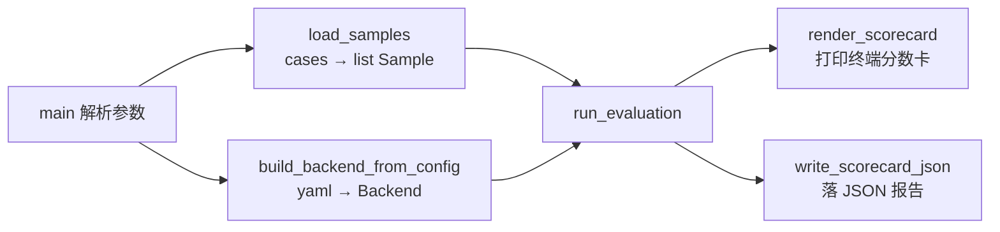

# 阶段 01 · 工程脚手架 + 推理框架 + 评测框架

> 对应 `finetune-spec.md` 3.1（阶段一 / M0 前置）。
> 本文按四部分组织：**1. 实现目标 → 2. 实现方法 → 3. 手动实践 → 4. 重点关注和学习**。

---

## 1. 该阶段实现目标

一句话概括阶段一要交付的能力：

> **用一条命令，把「任意一个模型后端 + 一份评测样本」跑成一张多维度分数卡；这条链路里推理是真的（能连真实本地 `llama-server`）、评分是真的（规则判分），只有评测数据是假的（占位 fixture）。**

这正是 spec 3.1 的交付线——「框架是空的、数据是假的，但链路必须真通」。

### 1.1 范围

| 在阶段一范围内 ✅ | 不在阶段一（留给后续阶段）❌ |
|---|---|
| Python 工程化（uv、包结构、lint/test） | 正式评测集 `test.jsonl`（阶段二） |
| 共享 prompt 模板（训练/评估/部署同源） | SFT/DPO 训练数据（阶段三） |
| 输出 schema + 校验 | LLaMA-Factory 训练（阶段四） |
| 推理 harness（Mock + 本地 `llama-server` 两后端） | 合并 / 量化 / GGUF 生产流程（阶段五） |
| 装 llama.cpp + 下 Qwen3 低配档冒烟模型 | 9 维度里的 5 个（阶段二逐个补） |
| 规则评分框架 + 分数卡（4 真 scorer + 5 占位） | 远端后端实现（阶段二量 baseline 时再加） |

### 1.2 交付线（DoD）与达成情况

| # | 交付线 | 状态 |
|---|---|---|
| 1 | `uv run` 一条评测命令，吃「后端配置 + fixture 样本」，产出分数卡 | ✅ 达成 |
| 2 | 该命令用 **MockBackend** 能离线 / CI 零依赖跑通 | ✅ 达成（`pytest -m "not local_backend"` 16 passed） |
| 3 | 该命令指向真实 **本地 `llama-server`** 能真连真出、速度维度有真实埋点 | ✅ 达成（见 1.3 真机记录） |
| 4 | 全部单元 / 集成测试通过（ruff + pytest 全绿）+ 本日志更新 | ✅ 达成 |

### 1.3 关键验证记录

**离线链路（Mock 后端）**

- `uv run ruff check .`：通过。
- `uv run pytest -m "not local_backend" -v`：16 passed, 1 deselected。
- `uv run slot-eval --backend-config configs/inference/mock.yaml --cases tests/fixtures/phase01_eval.jsonl --report-dir reports/generated`：通过，生成 `reports/generated/scorecard-mock-phase01.json`。

**真机后端（DoD 第 3 条，2026-07-08）**

- **环境**：下载 llama.cpp 预编译 CPU 包 `b9912`，解压 `llama-server.exe` + 依赖 DLL 到 `deployment/llama_cpp/bin/`；下载官方 GGUF 到 `models/gguf/`。
- **冒烟模型偏离说明（诚实记录）**：spec 字面指定 `Qwen3.5-0.8B-Instruct Q4_K_M`，但 HuggingFace 上**不存在**该型号官方 GGUF（仅个人上传的非官方版本），且 Qwen3.5 为带视觉编码器的多模态系列、不适配本纯文本任务。经确认改用官方 `Qwen/Qwen3-0.6B-GGUF`（该仓库仅 `Q8_0` 一档，约 610MB）作为**链路冒烟模型**——只证明链路真通，非正式选型；正式选型属阶段四实验矩阵。
- **启动**：`llama-server.exe -m models/gguf/Qwen3-0.6B-Q8_0.gguf --host 127.0.0.1 --port 8080 --ctx-size 4096 --threads 8`，`/health` 返回 `{"status":"ok"}`。
- `uv run slot-eval --backend-config configs/inference/llama_server.yaml --cases tests/fixtures/phase01_eval.jsonl --report-dir reports/generated`：**通过**，真实模型真连真出，生成 `reports/generated/scorecard-qwen3-0.6b-q8_0.json`。
- **速度维度有真实埋点数字**：三条样本 `first_token_ms` 分别 4602.9 / 4713.2 / 4579.4 ms，`tokens_per_s` 为 31.5 / 45.4 / 47.3。速度**分数 0%** 属真实计时超阈值（0.6B 小模型 CPU 推理首 token ≈4.6s，远超 800ms 阈值），非埋点缺失导致的假 0。
- **质量维度低分说明**：Qwen3 为思考型模型，`<think>` 推理在 256 `max_tokens` 内即耗尽、未输出正文 JSON。符合 spec「小模型 JSON 质量可能很低，阶段一只验链路真通、不看分数高低」的预期。

---

## 2. 实现方法（Superpowers 文档驱动开发）

阶段一全程用 [Superpowers](#41-superpowers-的使用) 框架，走**规范驱动开发（SDD）**流程完成：*安装 → 头脑风暴 → 写设计文档 → 写实施计划 → worktree 中 TDD 执行 → 评审*。想自己复刻本项目的读者，建议照此路径亲手走一遍，对最终产出的代码会理解得更深。

> 提示：下面每一步的「触发提示词」都是示意。Superpowers 的旧斜杠命令（如 `/brainstorm`）已废弃，实际是用自然语言**触发对应 skill**，例如「用 brainstorming skill 帮我……」。

### 2.1 第 0 步 · 安装 Superpowers

无需手动敲安装命令。只要用提示词让 Claude Code 去安装 Superpowers，**重启会话**后即生效：

- 插件市场：`anthropics/claude-plugins-official`（已存在）。
- 底层执行：`claude plugin install superpowers@claude-plugins-official --scope user`。
- 结果：`superpowers@claude-plugins-official` **v6.0.2**，作用域 `user`，状态 `enabled`。
- 提供 **14 个 skills**：`brainstorming`、`writing-plans`、`executing-plans`、`test-driven-development`、`subagent-driven-development`、`using-git-worktrees`、`systematic-debugging`、`requesting-code-review`、`receiving-code-review`、`verification-before-completion`、`dispatching-parallel-agents`、`finishing-a-development-branch`、`using-superpowers`、`writing-skills`。

> 坑：装在 `user` 作用域对本机所有项目生效，需**重启会话**后 skills 才加载；`Superpower.txt` 是该框架的视频字幕（保留作参考），非正式安装文档。

### 2.2 第 1 步 · 触发 `brainstorming`，敲定阶段一细节

触发提示词（示意）：

> 用 brainstorming skill，根据 `finetune-spec.md` 的实施规划，帮我把**阶段一**的实施细节讨论清楚。

`brainstorming` skill 会用**苏格拉底式提问**逐步逼问细节，和你一起把「模糊目标」收敛成「可执行 spec」。本阶段被逼问 / 敲定的关键决策有三条：

1. **只实现 Mock + 本地 `llama-server` 两个后端**，远端后端推迟到阶段二（最终交付物是纯本地推理，远端只在阶段二量 baseline 才需要）——但保留 `Backend` 协议契约，将来加远端只是换 `base_url` 的几行子类。
2. **评估框架「契约先行 + 垂直切片」**，9 维度只实现 4 个真的、5 个占位（`n/a`），分数卡永远列全 9 行。
3. **把「装 llama.cpp + 下 Qwen3 低配档 GGUF」纳入阶段一**，因为 DoD 要求真机跑通。

### 2.3 第 2 步 · 触发写设计文档的 skill → 产出 design.md

讨论收敛后，触发写文档 skill，把 brainstorming 的结论固化成设计文档：

- 产物：[docs/superpowers/phase-01.md](../../docs/superpowers/phase-01.md)
- 内容：范围与目标、DoD、整体架构与数据流、四个贯穿全链路的契约（`Sample` / `GenerationResult` / `CaseResult` / `Scorecard`）、模块分解与目录落位、测试方案、与后续阶段的衔接。
- 关键设计原则：**后端可换、契约不变**；**评分器可插拔**；**速度靠埋点不靠模型**。

### 2.4 第 3 步 · 触发 `writing-plans` → 产出 implementation.md

设计定稿后，触发 `writing-plans`，把设计拆成**逐任务、带 checkbox、可独立验收**的实施计划：

- 实施细节已合并到：[docs/superpowers/phase-01.md](../../docs/superpowers/phase-01.md)
- 结构：先列全部新建 / 修改文件清单，再按依赖方向排 Task（工程化打底 → schemas 契约 → prompts 模板 → inference harness → evaluation 评分框架 → CLI 主命令 + Mock 集成 → 真机验收）。
- 每个 Task 内部都是「**先写失败测试 → 再写实现 → 跑测试转绿 → 提交**」的 TDD 节奏，连命令和预期输出都写死，供执行阶段照做。

### 2.5 第 4 步 · worktree 中 TDD 执行

触发 `using-git-worktrees` 开一个独立 worktree（隔离阶段一开发，不污染主分支），再用 `subagent-driven-development` / `executing-plans` 逐 Task 执行计划。每个 Task 严格走 `test-driven-development`：

1. 先写失败的单元 / 集成测试（红）。
2. 写最小实现让测试转绿（绿）。
3. `uv run ruff check .` + `uv run pytest` 全绿后提交。

三层测试落地：

- **单元测试**（`tests/unit/`）：schema 校验、样本加载、prompt 构造、4 个真 scorer、分数卡聚合。
- **集成测试**（`tests/integration/`）：`test_pipeline_mock.py`（Mock 后端跑完整链路，CI 主力）、`test_cli_smoke.py`（直接调 CLI 入口）。
- **真机验收**（标 `@pytest.mark.local_backend`，CI 默认跳过）：`test_pipeline_llama_server.py`。

### 2.6 第 5 步 · 触发 code review 与收尾

- `requesting-code-review` / `receiving-code-review`：让 AI 评审代码，逐条思考并修改。
- `verification-before-completion`：收尾前逐条核对 DoD 四条是否真达成（而非「感觉完成了」）。
- `finishing-a-development-branch`：合并 worktree、清理分支。

> 一句话：整个阶段一的代码不是「vibe coding」堆出来的，而是**先讨论清楚 → 写成文档 → 拆成带测试的计划 → TDD 执行 → 评审**，每一步都有留痕（design.md / implementation.md / 本 log）。

---

## 3. 手动实践：4 个可亲手跑的体验实验

> 目的：任何人 clone 下来都能照下面 4 步亲手验证「链路真、评分真、只有数据假」。实验 1~3 零依赖、离线可跑；实验 4 需下载模型 + 起本地服务。所有命令在项目根目录 `后训练项目/` 下执行。

### 实验 1 · 端到端跑通（假后端，最快上手）

**目的**：感受「数据集 → prompt → 后端 → 评分 → 分数卡」这条完整链路一条命令跑通。

```bash
uv run slot-eval --backend-config configs/inference/mock.yaml --cases tests/fixtures/phase01_eval.jsonl --report-dir reports/generated
```

**预期**：终端打印一张 9 行分数卡；`指令/规则遵循`、`工具调用`、`字段抽取`、`速度` 四个维度均为 `100.0%`（Mock 后端返回的是预置标准答案，故满分），其余 5 个维度显示 `n/a`（阶段二才实现）；同时在 `reports/generated/scorecard-mock-phase01.json` 写出报告。

### 实验 2 · 证明评分是「真的」（改 mock 答案看分数下降）

**目的**：确认分数确实是「模型输出 vs 标准答案 `expected`」比对算出来的，而非写死的。

做法：编辑 `configs/inference/mock.yaml`，把某条样本 `responses` 里的 `text` 字段故意改错一处——例如把 `final-basic-0001` 里的 `"technician_name":"王芳"` 改成 `"technician_name":"李明"`（数据集 `expected` 里期望的是「王芳」）。保存后重跑实验 1 的命令。

**预期**：`字段抽取准确性` 从 `100.0%` 下降（该样本该字段判为未命中）；`指令/规则遵循` 仍为 100%（JSON 本身依然合法）。这直观证明 scorer 在真比对，而不是恒定满分。**验证完记得把 mock.yaml 改回去**（或 `git checkout configs/inference/mock.yaml` 还原）。

### 实验 3 · 跑单元 / 集成测试（自动化守护）

**目的**：验证整套解析器、校验器、scorer、管道的逻辑正确，且无需模型、无需网络。

```bash
uv run pytest -m "not local_backend" -v
```

**预期**：`16 passed, 1 deselected`。被 deselect 的 1 个是需要真实 llama-server 的 `test_pipeline_llama_server`（见实验 4）。

### 实验 4 · 真实模型推理（下模型 + 起 llama.cpp 后端）

**目的**：感受真实本地模型的推理——验证链路能真连真出、速度维度是真实埋点数字（DoD 第 3 条）。

**前置准备**（详见 [scripts/serve/setup_llama_cpp.md](../../scripts/serve/setup_llama_cpp.md)）：

1. **装 llama.cpp（Windows CPU）**：从 llama.cpp releases 下载预编译 CPU 包（如 `llama-b9912-bin-win-cpu-x64.zip`，约 16MB），解压后把 `llama-server.exe` 及其全部 `*.dll` 依赖放到 `deployment/llama_cpp/bin/`。
2. **下模型**：从 `https://huggingface.co/Qwen/Qwen3-0.6B-GGUF` 下载 `Qwen3-0.6B-Q8_0.gguf`（约 610MB）到 `models/gguf/`。模型与二进制均被 `.gitignore` 忽略，只存在本地。

**第一步 · 启动后端服务**（这是真后端相对假后端多出来的前提）：

```powershell
.\scripts\serve\start_llama_server.ps1
```

预期：服务加载模型后监听 `http://127.0.0.1:8080`；`curl http://127.0.0.1:8080/health` 返回 `{"status":"ok"}`。

**第二步 · 换真后端配置跑评估**（与实验 1 唯一的差别就是 `--backend-config`）：

```bash
uv run slot-eval --backend-config configs/inference/llama_server.yaml --cases tests/fixtures/phase01_eval.jsonl --report-dir reports/generated
```

或直接跑那条真机集成测试：

```bash
uv run pytest tests/integration/test_pipeline_llama_server.py -m local_backend -v
```

**预期**：真实模型真连真出，输出一张同格式分数卡（报告写到 `reports/generated/scorecard-qwen3-0.6b-q8_0.json`）；`速度` 维度带真实计时（本机实测 `first_token_ms ≈ 4.6s`、`tokens_per_s ≈ 31~47`）。**质量维度分数很低甚至为 0 属正常**：Qwen3 为思考型模型，`<think>` 推理易在 `max_tokens` 内耗尽而无正文 JSON 输出——阶段一只验链路真通与速度埋点，不看分数高低。

### 四实验对照

| 实验 | 后端 | 需起服务 | 需下模型 | 预期结果 |
|---|---|---|---|---|
| 1 端到端 | Mock（查表） | 否 | 否 | 4 真维度 100%、5 维度 n/a |
| 2 改 mock | Mock（查表） | 否 | 否 | 改错字段后对应维度分数下降 |
| 3 测试 | 无（纯逻辑） | 否 | 否 | 16 passed, 1 deselected |
| 4 真机 | llama-server（真模型） | 是 | 是 | 真连真出、速度有真实埋点、质量分可低 |

---

## 4. 重点关注和学习

本阶段最值得读者深入的三块内容。

### 4.1 Superpowers 的使用

**它是什么**：一个 agentic skill 框架，推动 AI 遵循结构化的**文档驱动（SDD）工作流** —— 头脑风暴 → 规范 → 计划 → 测试驱动实现 → 评审 —— 而不是随性的「vibe coding」。这能让 agent 少犯错、更贴合规范地完成工作，正是微调流水线各阶段所需要的。

**给读者的建议**：如果你想自己做这个项目，**建议回退到阶段一起点，用 Superpowers 的方法亲手把整个过程走一遍**（第 2 部分那条路径）。在「和 AI 苏格拉底式讨论 → 写设计 → 写计划 → TDD 执行」的过程里，你会对每一行代码为什么这么写、契约为什么这么定，理解得远比直接读成品代码深。开发方法本身，比最终代码更值得学。

### 4.2 整个程序运行的逻辑

以实验 1 那条命令为例，拆解执行 `uv run slot-eval --backend-config configs/inference/mock.yaml --cases tests/fixtures/phase01_eval.jsonl --report-dir reports/generated` 时发生了什么。

**函数入口**：`slot-eval` 是 `pyproject.toml` 里 `[project.scripts]` 注册的命令，指向 [scripts/eval/run_eval.py](../../scripts/eval/run_eval.py) 的 `main()`。`uv run` 会在项目虚拟环境里执行它。

**三个参数分别做什么**：

| 参数 | 作用 | 在代码里的去向 |
|---|---|---|
| `--backend-config` | 指定**用哪个后端、怎么配** | 传给 `build_backend_from_config()`，读 YAML 的 `backend` 字段决定造 `MockBackend` 还是 `LlamaServerBackend` |
| `--cases` | 指定**评测哪份样本** | 传给 `load_samples()`，把 jsonl 解析成 `list[Sample]`（带 schema 校验） |
| `--report-dir` | 指定**分数卡 JSON 写到哪** | 传给 `write_scorecard_json()`，落 `scorecard-<model>.json` |

**主流程（`main` → `run_evaluation`）**：



`run_evaluation()`（在 [src/slot_extractor/evaluation/runner.py](../../src/slot_extractor/evaluation/runner.py)）是核心循环，对每条 `Sample`：

1. **构造 prompt**：`PromptBuilder.build(sample)` 把 `SYSTEM_RULES` + schema 提示 + `sample.input` 序列化拼成一段 prompt 文本（训练/评估/部署同源的模板）。
2. **推理**：`backend.generate(prompt)` → `GenerationResult`（文本 + 计时埋点）。runner **完全不知道**背后是 Mock 还是 llama-server，只依赖 `Backend` 协议——这就是「后端可换、契约不变」。
3. **评分**：遍历 9 个 scorer，对 `applies_to(sample)` 为真的逐个 `score(sample, generation)`，产出 `{dimension: DimensionScore}`。`default_scorers()` 注册 4 个真 scorer（`instruction` / `tool_call` / `field_extraction` / `speed`）+ 5 个 `NotAvailableScorer`（返回 `n/a`）。
4. **收集**：打包成 `CaseResult`（含 `sample_id` / `layer` / `model_output` / 各维度分）。

所有 `CaseResult` 交给 `aggregate_scorecard()`：按固定 `DIMENSION_ORDER` 对每个维度求均值（无适用样本则记 `n/a`），生成 `Scorecard`。最后 `render_scorecard()` 打印 9 行分数卡、`write_scorecard_json()` 落盘。

**四个贯穿全链路的契约**（数据结构定死、组件可替换的关键）：`Sample`（输入样本）→ `GenerationResult`（后端产出 + 计时）→ `CaseResult`（单样本逐维度分）→ `Scorecard`（全维度汇总）。

### 4.3 推理相关代码：llama.cpp 是怎么跑通的

实验 4 用 llama.cpp 跑通了真实本地推理。这里把**推理原理**和**代码链路**对应起来。

**推理的两个阶段（理论）**：自回归 LLM 一次生成分两阶段——

1. **Prefill（预填充 / prompt 编码）**：把整段 prompt 的所有 token 一次性喂进模型，并行计算，填满 **KV Cache**（每层注意力的 Key/Value 缓存）。这一阶段是**计算密集（compute-bound）**，决定「首 token 延迟」（`first_token_ms` / 埋点里的 `prompt_ms`）。
2. **Decode（解码 / 自回归生成）**：逐个 token 生成，每步只算 1 个新 token、复用 KV Cache、再把新 token 追加进缓存。这一阶段是**访存密集（memory-bandwidth-bound）**，决定「吞吐」（`tokens_per_s`）。生成到 EOS 或达 `max_tokens` 停止。

> 这解释了本机现象：0.6B 小模型 CPU 推理，prefill 就要 ≈4.6s（首 token 慢），但 decode 阶段能到 31~47 tokens/s。

**代码链路（从 prompt 到分数）**：

```text
PromptBuilder.build(sample)                    # 1. 拼 prompt 文本
   │  prompt 文本
   ▼
LlamaServerBackend.generate(prompt)            # 2. inference/llama_server.py
   │  httpx.post → POST http://127.0.0.1:8080/v1/chat/completions
   │  body: { model, messages:[{role:user, content:prompt}],
   │          temperature:0, max_tokens:256,
   │          chat_template_kwargs:{enable_thinking:False} }
   ▼
llama-server.exe（llama.cpp）                   # 3. 独立进程，加载 GGUF
   │  在 CPU 上跑 Qwen3-0.6B-Q8_0.gguf：prefill → decode
   │  返回 JSON：choices[0].message.content + usage + timings
   ▼
GenerationResult(text, prefill_ms, first_token_ms,   # 4. 解析响应
                 total_ms, output_tokens, tokens_per_s)
   │
   ▼
Scorer × N  →  CaseResult  →  Scorecard         # 5. 规则评分
```

**代码要点（[src/slot_extractor/inference/llama_server.py](../../src/slot_extractor/inference/llama_server.py)）**：

- **OpenAI 兼容协议**：llama-server 暴露 `/v1/chat/completions`，和 OpenAI API 同形。所以 `LlamaServerBackend` 和将来阶段二的远端后端能**共用一套调用逻辑**，只是换 `base_url`。
- **计时来源**：`total_ms` 由客户端 `time.perf_counter()` 埋点测端到端耗时；`prefill_ms` / `first_token_ms` 直接读 llama-server 返回的 `timings.prompt_ms` / `timings.predicted_ms`（服务端真实埋点，非估算）。
- **`enable_thinking: False`**：显式关掉 Qwen3 的思考模式，避免 `<think>` 段吃满 `max_tokens`。即便如此小模型仍可能不输出合法 JSON——阶段一只验链路，不追质量。
- **`temperature: 0`**：贪心解码，保证评测可复现。

**进程视角**：`llama-server.exe` 是一个**独立进程**（实验 4 第一步先起它），Python 端只是 HTTP 客户端。二者通过 localhost HTTP 交互——这也是「部署链路」的雏形：阶段五换成量化后的 GGUF，只需把 `-m` 指向新模型文件，Python 侧零改动。

#### 延伸学习：借这条推理链路往深里走

我们在这一阶段只是**跑通了一条推理的端到端流程**，但「推理（inference）」本身是大模型领域一个专门且深的方向。借着这个机会，读者完全可以顺着这条链路继续深挖。下面只列方向和问题、不给答案，供你自己去查资料、读源码、做实验：

- **llama.cpp 内部是怎么实现的？** 它如何加载 GGUF、如何用 `ggml` 计算图组织算子、CPU 上又是怎么做张量运算与多线程调度的？
- **推理的底层原理还有哪些？** 除了 prefill / decode 两阶段，KV Cache 在内存里到底怎么组织？采样（greedy / top-k / top-p / temperature）具体如何影响输出？batching、连续批处理（continuous batching）又是怎么回事？
- **如果要做速度优化，能从哪些方向下手？** 量化（Q8/Q4/…）、prompt 精简、prefix caching（复用固定前缀的 prefill）、投机解码（speculative decoding）、KV Cache 量化、线程/后端（CPU vs GPU/Metal/CUDA）选择——哪些适合我们「长输入、短输出、小模型」的场景？
- **`llama_server.py` 里那个 HTTP 请求，对应的协议格式到底长什么样？** OpenAI 兼容的 `/v1/chat/completions` 请求体与响应体各字段是什么含义？`messages` / `choices` / `usage` / `timings` 分别对应什么？
- **请求里的几个参数分别在干嘛、有什么用？**
  - `temperature`：它如何控制采样的随机性？为什么我们设成 `0`？
  - `max_tokens`：它限制的是什么？设小了 / 设大了各会发生什么（回想小模型 `<think>` 吃满 token 的现象）？
  - `enable_thinking`：Qwen3 的「思考模式」开关到底改变了什么？开与关对输出、速度、token 消耗分别有什么影响？

> 建议：把上面每个问题当成一个小实验去验证（改一个参数、重跑一次、观察分数卡与计时的变化），比单纯读文档理解得更深。

---

## 5. 决策与产物小结

**关键决策**：

- 保持实现与 Smart Appointment AI Agent 项目相互独立；可复用 Python 逻辑放 `src/slot_extractor/`，脚本保持轻量、以工作流为导向。
- 采用 Superpowers 在各阶段强制执行 SDD 工作流；通过给 AI 发提示词来安装，而非手动配置。
- 冒烟模型偏离 spec 字面型号（改用官方 `Qwen3-0.6B-Q8_0`），理由见 1.3，仅用于链路冒烟。

**主要产物**：

- 工程：`pyproject.toml` + `uv.lock`、`src/slot_extractor/`（schemas / prompts / inference / evaluation / config / utils，4 真 + 5 占位 scorer）。
- 脚本与配置：`scripts/eval/run_eval.py`、`scripts/serve/`、`configs/`。
- 测试与报告：`tests/` 三层测试 + fixture、`reports/generated/` 示例分数卡。
- 文档：设计文档、实施计划、本 log。
