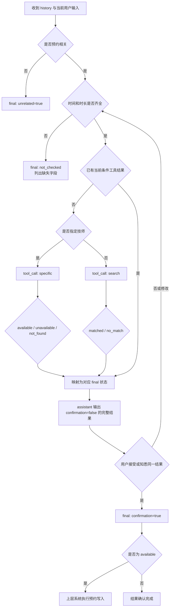

# 阶段二：搭建真实 Agent 评测流程与训练前 Baseline

## 1. 本阶段的目的

本阶段的核心目标，是为按摩预约 Agent 建立一套可以真实运行、可以重复执行、可以定位问题的评测流程，并在模型训练前形成统一的 Baseline。

这套流程不只是为了后续微调服务。即使不做模型训练，只开发一个普通的 Agent 项目，Agent评估其实也是必做的，也是面试的高频考点。
本阶段本质上是一个小型但完整的 **Agent 评估实战**：先定义业务与协议，再制作冻结评估集，然后接入真实模型运行，最后生成可比较的分数卡，为后续训练提供统一的训练前标准。即使你不关注算法项目，其实这个阶段也可以独立学习，所谓Agent评估内容的实战学习。

Agent 评估的理论部分，可结合“大模型笔记”中对应的 Agent 评估章节阅读；本章重点记录这套理论在当前项目中的实际落地。

---

## 2. 实现方法

### 2.1 使用 Superpowers 推进完整实现

本阶段仍然按照 Superpowers 的整套工作流推进。作者先让 AI 阅读 `finetune-spec.md` 和阶段一已经搭好的推理、Prompt、Schema、Scorer、Scorecard 等扩展点，再依次完成：

1. 编写阶段二设计文档，明确评估目标、数据合同、工具合同和验收标准。
2. 编写实施计划，把数据集、评分器、推理后端、模型运行和测试拆成可验证任务。
3. 实现 Agent 输入输出协议、评估数据加载、Prompt 组装、评分逻辑和报告生成。
4. 制作并反复修订评估数据集。
5. 下载本地 GGUF 模型，通过 `llama.cpp` 的 `llama-server` 接入真实推理。
6. 对三个模型运行同一份评估集，保存逐样本输出、计时数据和分数卡。
7. 根据失败样本反查数据、Prompt、Schema 和评分器，持续修正评估体系。

这一阶段在“如何让 AI 写代码”方面没有额外的新技巧，仍然是先设计、再计划、再执行、最后验证。真正困难的地方，是在让 AI 生成评估数据和评估代码之前，作者自己必须先把业务想清楚。

### 2.2 先定义业务流程，再制作数据集

评估集不是一批随意编写的用户问题。每条样本都应该对应业务流程中的一个节点或一次状态转移。

在生成数据集之前，至少要先回答以下问题：

- Agent 负责什么，不负责什么？
- 完整业务流程有哪些分支？
- 每个分支的进入条件和结束条件是什么？
- 每类输入应该得到 `tool_call`，还是得到 `final`？
- 信息不足时应该追问什么？
- 信息齐全后什么时候调用工具？
- 工具成功、无结果、技师不存在、技师不可用时分别怎么处理？
- 用户确认、拒绝、暂停、改时间、换技师时，状态如何变化？
- 哪些事实来自用户，哪些事实必须来自工具，哪些内容模型绝对不能编造？

当前项目最终整理出的核心业务流程图如下。阶段说明位于 `docs/superpowers/phase-02.md`，`finetune-spec.md` 2.1.3 也引用了该流程图。



流程图的作用不是为了让文档好看，而是把数据集的覆盖范围变成可以检查的清单。例如：

- “时间和时长是否齐全”对应缺时间、缺时长、两者都缺等追问样本。
- “是否指定技师”对应指定技师查询和条件搜索两种工具模式。
- 工具结果对应 `available`、`unavailable`、`not_found`、`matched`、`no_match` 等分支。
- “用户接受或修改”对应确认、拒绝、改时间、换技师、重新查询等多轮样本。
- “是否预约相关”对应无关输入和 Agent 路由样本。

只有先把流程和分支列清楚，才可能检查评估集是否真正覆盖业务。

### 2.3 明确 Agent 的输入、状态和工具合同

当前机器合同为 v2.1，共 51 条样本。任务已经不再是简单的“输入一句话，抽取几个槽位”，而是：

```text
上一状态 + 完整消息历史 + 当前输入
→ 新状态 + 工具调用或最终回复
```

每条样本的运行时输入固定包含以下内容：

```json
{
  "history": [],
  "current_state": null,
  "user_input": "明天下午两点做60分钟按摩",
  "current_time": "2026-06-08 10:00",
  "available_tools": ["find_technicians"]
}
```

各字段的职责如下：

| 字段 | 作用 |
|---|---|
| `history` | 按时间顺序保存 `user`、`assistant`、`assistant.tool_calls` 和 `tool` 消息 |
| `current_state` | 本轮开始前系统保存的结构化预约状态，第一轮为 `null` |
| `user_input` | 当前用户输入；工具返回后的即时推理可以为 `null` |
| `current_time` | 解析“明天、后天、周末”等相对时间的基准 |
| `available_tools` | 当前可用工具列表，不能根据标准答案决定是否暴露工具 |

这里必须特别区分两个概念：

1. `history` 保存完整事件序列：用户输入、助手回复、工具调用和工具结果均为同级消息。
2. `current_state` 保存已经确认或抽取出的结构化状态，用来避免模型每轮都从长历史中重新还原全部字段。

两者的职责仍需保持清晰：把本轮 `expected` 才知道的信息提前写入 `current_state` 会造成答案泄漏；工具事实必须来自与 `assistant.tool_calls` 对应的 `tool` 历史消息，不能伪装成 `user` 或拼进 system 文本。

本项目只提供一个工具：

```text
find_technicians(
  technician_name,
  start_time,
  duration_minutes,
  gender,
  preferences
)
```

工具包含两种模式：

- `technician_name != null`：指定技师模式，只检查该技师是否存在以及目标时段是否可用。
- `technician_name == null`：条件搜索模式，根据时间、时长、性别和偏好搜索可用技师。

调用工具时，五个参数必须完整出现。未知技师和性别使用 `null`，无偏好使用 `[]`。时间或时长缺失时不能调用工具；工具已经返回当前条件的有效结果时，也不能重复调用。

### 2.4 明确模型输出协议

模型输出分为两类。

#### Tool Call

```json
{
  "action": "tool_call",
  "tool_name": "find_technicians",
  "arguments": {
    "technician_name": null,
    "start_time": "2026-06-09 14:00",
    "duration_minutes": 60,
    "gender": null,
    "preferences": []
  }
}
```

Tool Call 只负责调用工具，不生成给用户看的回复，也不包含 Final 状态字段。

#### Final

```json
{
  "action": "final",
  "gender": "female",
  "start_time": "2026-06-09 14:00",
  "duration_minutes": 60,
  "preferences": ["肩颈"],
  "technician_name": "王芳",
  "technician_status": "available",
  "confirmation": false,
  "info_complete": true,
  "unrelated": false,
  "missing_info": [],
  "reply_type": "confirm_available",
  "reply": "王芳技师明天下午2点有空，可以为您安排60分钟肩颈按摩，您确认吗？"
}
```

Final 不只包含结构化状态，还包含 `reply_type` 和自然语言 `reply`。因此评估时既要检查“状态对不对”，也要检查“回复动作对不对”“回复有没有遗漏关键信息”“回复有没有编造工具没有提供的事实”。

### 2.5 先定义评估样本，再让 AI 批量制作

当前项目的单条评估样本主要包含：

| 字段 | 作用 |
|---|---|
| `id` | 样本唯一标识 |
| `layer` | `final`、`tool_call` 或 `multi_turn` |
| `input` | 模型在本轮真实能够看到的上下文 |
| `expected` | 本轮标准 Tool Call 或 Final 输出 |
| `reply_expectations` | 回复必须表达、禁止表达、必须提及的字段和事实 |
| `assertions` | 可执行的确定性断言 |
| `tags` | 场景、错误类型和数据切片标签 |
| `chain_id` / `step` | 把同一业务链路中的多个决策点串联起来 |

当前 51 条样本中，36 条期望 `final`、15 条期望 `tool_call`；其中 10 条带多轮标签，覆盖追问、指定技师、条件搜索、工具结果、确认、拒绝、修改方案、重复查询和无关输入等场景。

设计样本时，不能只写输入和标准答案。还要明确：

- 模型运行后需要保存什么：原始输出、解析后的 JSON、消息上下文、耗时、首字延迟、吞吐等。
- 标准答案和模型输出如何比较：严格字段比较、语义比较、动作比较还是事实一致性比较。
- 哪些字段允许语义等价，哪些字段必须严格相等。
- 哪些错误应该独立记录，便于后续按错误模式制作训练数据。
- 多轮样本之间如何证明状态继承、修改和工具结果消费是正确的。

文档最好把合同、分支、字段类型和典型样本写到足够具体，至少给出一到两个完整示例。AI 更擅长根据明确规则扩写数据，不擅长替作者决定模糊的业务规则。

### 2.6 当前评估流程如何运行

整个评估链路如下：

```text
读取 test.jsonl
    ↓
校验样本合同与消息结构
    ↓
PromptBuilder 组装 messages
    ↓
调用 llama-server 的 OpenAI 兼容接口
    ↓
保存模型原始输出与推理计时
    ↓
解析 JSON 并执行协议、任务正确性等评分
    ↓
聚合全量分数、场景切片、错误标签与时延
    ↓
生成终端分数卡和 JSON 报告
```

评估程序对每条样本执行一次完整推理。模型生成后，系统保存：

- 模型原始文本输出。
- 模型名称。
- 总耗时和首字延迟。
- 输出 token 数与 tokens/s。
- 每个评分维度的得分、通过标记和错误详情。

同一份冻结评估集可以反复用于：

- 比较不同参数规模的基座模型。
- 比较训练前和训练后的模型。
- 比较不同 Prompt 版本。
- 比较量化前后的模型。
- 定位某次改动改善了哪些场景，又损害了哪些场景。

### 2.7 本阶段最重要的踩坑：自己没想清楚，AI 也不可能替你想清楚

这个阶段花费时间最多的部分，不是写评估框架，而是不断修正评估集和业务合同。

一开始业务规则没有完全想清楚，只给 AI 一个大概描述，就让 AI 编写代码和数据。结果虽然很快生成了大量内容，但随后发现了很多问题，例如：

- 数据集没有覆盖完整业务流程，只覆盖了几个表面场景。
- 同一业务分支在不同样本中的标准答案互相矛盾。
- 输入中提前包含了标准答案才知道的信息，形成数据泄漏。
- `history`、状态和工具结果的职责混在一起。
- 工具参数名、字段类型和输出 Schema 前后不一致。
- 追问、工具调用、工具结果和用户确认之间无法形成完整链路。
- 模型输出其实符合业务语义，但评分器因为匹配方式不合理而错误扣分。
- 数据本身的标准答案错误，却被误判成模型能力问题。

这些问题会迫使后续代码、Schema、Prompt、测试和报告一起返工。当前评估集也因此经历了多轮合同升级，最终形成机器合同 v2.1。

这件事非常合理：如果作者自己都没有明确业务流程、输入输出和判断标准，就不能指望 AI 自动生成完全符合预期的评估代码与数据集。

更稳妥的顺序应该是：

1. 先画业务流程图。
2. 列出所有关键节点、分支和状态转移。
3. 定义每类场景的输入、标准输出和禁止行为。
4. 定义工具签名、触发条件和结果结构。
5. 定义样本 Schema、评分维度和比较方式。
6. 人工编写少量黄金样本，验证规则没有矛盾。
7. 再让 AI 按模板批量扩写。
8. 对生成数据做程序校验和人工抽查。
9. 用真实模型跑一遍，根据失败样本反向检查评估体系。

### 2.8 判断本阶段是否做好的核心标准

本阶段做得好不好，不能只看“代码能运行”“有几十条数据”或“成功生成了分数卡”。真正的判断标准是：

> 使用真实 Agent 跑完评估集后，结果是否具有代表性；模型失分的地方，究竟是模型能力问题，还是评估集、Prompt、输入组装、Schema 或评分标准的问题？

对每个主要失分样本，都应该进行错误归因：

| 归因 | 典型问题 | 应对方式 |
|---|---|---|
| 数据集问题 | 标准答案错误、上下文泄漏、业务分支缺失、样本前后矛盾 | 修正数据合同和样本，升级数据集版本 |
| Prompt 问题 | 规则没有说明、工具条件不清晰、字段定义不完整 | 修改 Prompt，并重新运行同一冻结评估集 |
| 评分器问题 | 合理输出被误伤、语义匹配太死、多个维度重复扣分 | 修改评分代码和测试，重新校准评分口径 |
| 推理链路问题 | 消息拼接错误、工具没有正确暴露、状态传递错误 | 修复 PromptBuilder、Backend 或运行配置 |
| 模型能力问题 | 已明确给出规则和证据，模型仍然选错动作、丢字段或编造事实 | 保留为真实 Baseline 弱项，交给后续训练解决 |

理想状态不是让模型分数尽可能高，而是让失分尽可能“干净”：数据正确、Prompt 已说明、评分合理、推理链路真实，剩下的错误主要来自模型本身的能力边界。只有这样，后续训练才有意义，训练前后的对比才可信。

---

## 3. 本阶段实操

本节以当前本地仓库为例，展示如何下载三个模型、启动本地推理服务、运行冻结评估集并生成分数卡。

### 3.1 准备运行环境

项目使用：

- Python 3.12。
- `uv` 管理依赖和执行命令。
- `llama.cpp` 的 Windows CPU 版 `llama-server.exe` 提供 OpenAI 兼容接口。
- GGUF 格式的本地模型。
- 本地中文 Embedding 模型用于偏好语义评分。

安装项目依赖：

```powershell
uv sync
```

`uv sync` 会安装 `sentence-transformers` 等 Python 依赖，但不会把 Embedding 权重直接放进仓库。首次评分时程序会自动下载 `BAAI/bge-small-zh-v1.5`；也可以提前执行以下命令，避免正式评测时才触发下载：

```powershell
uv run python -c "from sentence_transformers import SentenceTransformer; SentenceTransformer('BAAI/bge-small-zh-v1.5', device='cpu')"
```

Windows 默认缓存目录为：

```text
%USERPROFILE%\.cache\huggingface\hub\models--BAAI--bge-small-zh-v1.5
```

当前权重缓存约 92 MB。下载完成后可断网评分；如需显式禁止联网，可在确认缓存完整后设置：

```powershell
$env:HF_HUB_OFFLINE="1"
```

在无外网机器上复现时，可以预先复制上述 Hugging Face 缓存目录。不要在模型尚未缓存时设置离线模式。

从 llama.cpp Releases 下载 Windows CPU 预编译包，将 `llama-server.exe` 和同目录的 DLL 文件放入：

```text
deployment/llama_cpp/bin/
```

### 3.2 下载三个本地模型

当前仓库使用以下三个模型作为训练前参照：

| 模型 | 文件 | 用途 |
|---|---|---|
| Qwen3-0.6B | `Qwen3-0.6B-Q8_0.gguf` | 最低成本档和链路自检 |
| Qwen3-1.7B | `Qwen3-1.7B-Q8_0.gguf` | 中间参数档 |
| Qwen3-4B-Instruct-2507 | `Qwen3-4B-Instruct-2507-Q4_K_M.gguf` | 主 Baseline 模型 |

模型统一放入：

```text
models/gguf/
```

当前项目采用的模型来源为：

- 0.6B：`Qwen/Qwen3-0.6B-GGUF`。
- 1.7B：`Qwen/Qwen3-1.7B-GGUF`。
- 4B：官方仓库存在访问限制，因此使用 `unsloth/Qwen3-4B-Instruct-2507-GGUF` 中的同版本 GGUF 镜像。

下载完成后的目录应至少包含：

```text
models/gguf/
├── Qwen3-0.6B-Q8_0.gguf
├── Qwen3-1.7B-Q8_0.gguf
└── Qwen3-4B-Instruct-2507-Q4_K_M.gguf
```

### 3.3 逐个启动 llama-server

三个模型共用 `127.0.0.1:8080`，因此一次只启动一个模型。切换模型时，先停止当前服务，再修改 `-m` 后的模型路径重新启动。

以 4B 为例：

```powershell
./deployment/llama_cpp/bin/llama-server.exe `
  -m models/gguf/Qwen3-4B-Instruct-2507-Q4_K_M.gguf `
  --host 127.0.0.1 `
  --port 8080 `
  --ctx-size 8192 `
  --threads 8
```

0.6B 和 1.7B 只需要替换 `-m` 对应的模型文件。

仓库中的 `scripts/serve/start_llama_server.ps1` 默认用于启动 0.6B 链路自检：

```powershell
./scripts/serve/start_llama_server.ps1
```

### 3.4 运行冻结评估集

服务启动后，在另一个终端运行 `slot-eval`。三个模型分别使用自己的后端配置。该命令适合快速查看聚合分数；正式保存逐样本输出、错误标签和完整时延统计时，使用后文的 `collect_analysis.py`。

#### Qwen3-0.6B

```powershell
uv run slot-eval `
  --backend-config configs/inference/llama_server_qwen3_0.6b.yaml `
  --cases data/eval/test.jsonl `
  --report-dir reports/baseline-m0
```

#### Qwen3-1.7B

```powershell
uv run slot-eval `
  --backend-config configs/inference/llama_server_qwen3_1.7b.yaml `
  --cases data/eval/test.jsonl `
  --report-dir reports/baseline-m0
```

#### Qwen3-4B-Instruct-2507

```powershell
uv run slot-eval `
  --backend-config configs/inference/llama_server_qwen3_4b.yaml `
  --cases data/eval/test.jsonl `
  --report-dir reports/baseline-m0
```

运行时必须保持以下条件一致：

- 使用同一版本的 `data/eval/test.jsonl`。
- 使用相同的系统 Prompt 和 Prompt 组装方式。
- `temperature=0`，减少随机性。
- 不根据单条样本的标准答案动态增删工具。
- 不在不同模型之间修改 expected 或评分规则。

命令完成后，终端会打印分数卡，同时在报告目录中生成对应模型的 JSON 文件。

生成与本仓库报告同结构的详细分析文件，以 4B 为例：

```powershell
uv run python scripts/eval/collect_analysis.py `
  --backend-config configs/inference/llama_server_qwen3_4b.yaml `
  --cases data/eval/test.jsonl `
  --out reports/baseline-m0/qwen3-4b.json
```

远端 GPT-5.6-sol 对照使用 Responses API 后端；先配置兼容服务地址和密钥，再执行：

```powershell
$env:OPENAI_BASE_URL="<your-responses-api-base-url>"
$env:OPENAI_API_KEY="<your-api-key>"
uv run python scripts/eval/collect_analysis.py `
  --backend-config configs/inference/openai_responses_gpt_5.6_sol.yaml `
  --cases data/eval/test.jsonl `
  --out reports/generated/scorecard-gpt-5.6-sol.json
```

远端网络时延与本地 CPU 推理时延的环境不同，只用于能力对照，不应直接作为部署性能结论。

### 3.5 运行前后的质量检查

评估集和代码修改后，先运行静态检查与测试：

```powershell
uv run ruff check .
uv run pytest -m "not local_backend"
```

还可以单独运行数据集校验：

```powershell
uv run python scripts/eval/validate_dataset.py `
  --cases data/eval/test.jsonl `
  --contract data/eval/dataset_contract.json
```

这些检查用于保证：

- JSONL 可以被完整读取。
- 每条样本符合数据合同。
- Final 和 Tool Call 的字段与类型正确。
- 完整 History 中的 user、assistant tool call、tool result 消息，以及 Current State 没有非法结构。
- 多轮链路、工具结果和 Reply Expectations 可以被评分程序消费。

测试通过只能说明实现与合同一致，不能说明数据集一定具有业务代表性。最终仍然需要阅读真实模型的失败样本，检查错误归因是否合理。

---

## 4. 重点学习内容

### 4.1 Agent 评估数据集是怎么制作的

本阶段最值得学习的不是某一个评分公式，而是如何把业务需求转化成一份可执行的 Agent 评估数据集。

制作顺序应当是：

1. 明确 Agent 边界和业务目标。
2. 画出业务流程图和状态转移。
3. 枚举正常路径、失败路径、多轮修改和无关输入。
4. 定义输入上下文、工具合同和输出 Schema。
5. 为每个流程节点编写少量人工黄金样本。
6. 让 AI 按明确模板扩写更多样本。
7. 使用程序校验格式、字段、链路和版本。
8. 使用真实模型运行，再通过失败样本反查数据质量。

当前数据集包含以下几类内容：

- **协议类样本**：要求输出严格 JSON，并且只能使用合同中的字段和类型。
- **信息收集类样本**：缺时间、缺时长或两者都缺时，生成正确追问状态与回复。
- **工具决策类样本**：信息齐全后，判断是否应该调用 `find_technicians`。
- **工具参数类样本**：检查技师、时间、时长、性别和偏好参数是否正确。
- **工具结果类样本**：消费 `available`、`unavailable`、`not_found`、`matched` 和 `no_match` 等结果。
- **多轮状态类样本**：保留旧字段、覆盖新字段、换人、改时间、重新查询。
- **确认类样本**：区分普通补充信息、确认方案、拒绝方案和暂停预约。
- **无关输入类样本**：正确路由给其他 Agent，而不是强行进入预约流程。
- **回复质量类样本**：检查 Reply Type、必要语义动作、禁止动作和事实一致性。

评估集必须与训练数据隔离，并通过版本号与 SHA-256 校验和冻结。业务合同发生变化时，应生成新版本，不能悄悄修改旧数据后继续沿用旧分数。

### 4.2 评估数据如何组装到 Prompt 中

项目通过 `src/slot_extractor/prompts/template.py` 中的 `PromptBuilder` 把单条样本转换为模型可以消费的 messages。

组装后的总体结构是：

```text
system:
  通用业务规则
  Final Schema
  Tool Call Schema 与工具描述
  当前时间
  当前结构化状态
  当前工具上下文

history:
  历史 user / assistant 自然语言消息

user:
  当前用户输入（如果本轮存在）
```

对应代码中的顺序为：

```text
[system(规则 + Schema + 工具 + 时间 + 状态)]
+ history
+ 可选 user_input
```

其中：

- `history` 按原始顺序追加为 `user`、自然语言 `assistant`、带 `tool_calls` 的 `assistant` 和 `tool` 消息。
- `current_state` 使用紧凑 JSON 写入 system message。
- `available_tools` 决定 system message 中是否渲染工具描述。
- `current_time` 为相对时间解析提供统一基准。
- 工具结果触发的即时推理可以没有新的 `user_input`，此时模型依据历史中的 `assistant.tool_calls` 和对应 `tool` 消息生成 Final。

这种结构将“用户看见的对话”“系统保存的状态”“外部工具事实”分开，既接近真实 Agent 运行方式，也方便单独检查每一类上下文是否正确。

### 4.3 评估指标如何设计和计算

当前分数卡将评估结果收敛为协议遵循、任务正确性、资源和时延四个方向。多轮、工具调用、工具结果、确认、无关输入等不再重复作为一级总分，而是作为场景切片；具体字段错误、回复错误和工具错误作为错误标签保存。

#### 1. 协议遵循 `protocol`

协议遵循检查模型是否输出可以直接被程序消费的结果：

- 输出必须是原始 JSON，不能带 Markdown 代码块或额外说明。
- `action` 只能是 `final` 或 `tool_call`。
- Tool Call 和 Final 必须分别符合自己的 Schema。
- 字段数量、字段名、字段类型和枚举值必须合法。

该维度是确定性的二值评分：完全合法得 1 分，否则得 0 分，并记录具体解析或 Schema 错误。

#### 2. 任务正确性 `task_correctness`

任务正确性根据输出类型采用不同计算方式。

Tool Call 主要检查：

- `action` 是否正确。
- `tool_name` 是否正确。
- `technician_name`、`start_time`、`duration_minutes`、`gender` 是否严格匹配。
- `preferences` 是否语义匹配。

Final 分为结构化结果和自然语言回复两部分：

- 结构化部分检查动作、性别、时间、时长、技师、技师状态、确认状态、信息完整性、无关标记和缺失字段。
- `preferences` 先做 NFKC、大小写和标点归一化；完全相同或命中少量高置信别名时直接匹配。
- 肯定与否定极性不一致时直接记为不匹配，避免“肩颈”和“不要按摩肩颈”被向量相似度误判。
- 其余偏好使用本地中文 Embedding `BAAI/bge-small-zh-v1.5` 生成归一化向量，余弦相似度达到 `0.70` 即视为匹配；多项偏好按一对一最佳匹配计算 precision、recall 和 F1。
- 回复部分检查 `reply_type` 是否正确。
- 检查回复是否完成当前场景要求的语义动作，例如询问时间、询问时长、请求确认、告知不可用或授权预约。
- 检查回复是否出现禁止动作，例如信息不足时提前承诺预约。
- 检查回复是否忠实于结构化状态和工具事实，包括技师、时间、时长和偏好等内容。

当前 Final 的任务分由结构化结果和回复结果组合而成：结构化部分权重为 70%，回复部分权重为 30%。错误详情会继续保留，方便定位究竟是字段、Reply Type、语义动作还是事实一致性出错。

Embedding 只替代偏好字段的字面匹配，不参与其他字段或回复事实的评分。评分过程不调用 LLM judge 或外部评分 API；模型权重首次下载后由本机缓存复用，因此正式跑分前应先按 3.1 节完成模型准备。

#### 3. 资源 `resource`

资源维度用于后续记录模型体积、内存占用、量化方式和本地部署成本。当前阶段先保留该维度，但尚未正式设置评分口径；它将在量化与部署阶段继续补全。

#### 4. 时延与吞吐

速度不使用人为阈值强行折算成质量分，而是直接记录原始统计：

- 总时延均值。
- 总时延 p50、p95、最快和最慢值。
- 首字延迟均值。
- 平均 tokens/s。

保留原始数据比简单定义“低于多少毫秒得满分”更适合当前阶段，因为不同模型大小、量化精度和硬件条件下，合理阈值并不相同。

#### 5. 场景切片与错误标签

总分之外，还应按场景查看任务正确性，例如：

- `tool_call`
- `tool_result`
- `multi_turn`
- `unrelated`
- `confirmation`
- `missing_information`

同时保留 `wrong_action`、`wrong_tool`、`wrong_argument`、`wrong_field`、`wrong_reply_type`、`reply_semantic`、`reply_faithfulness` 等错误标签。

这样既能看到模型的总体水平，也能回答“模型具体不会什么”，并直接指导后续训练数据的配比。

### 4.4 评测结果和结论

本阶段使用同一套 51 条冻结评估集，对 Qwen3-0.6B、Qwen3-1.7B 和 Qwen3-4B-Instruct-2507 进行了本地 CPU 推理评测，并使用 GPT-5.6-sol 进行远端对照。当前结果用于识别模型能力边界和指导后续数据构造，属于训练前的初步结论。

本轮复评同时修复了此前暴露的评测缺陷：偏好从字符 n-gram 改为本地中文 Embedding + 否定门控；补充“可提供、无法提供、未找到、提交预约”等自然表达；修复“女技师、技师性别”等文本被误识别人名；并明确查询性别条件与工具返回技师性别的阶段语义。GPT-5.6-sol 使用仓库内正式 Responses API 后端运行，四个模型均保留完整逐样本输出，可重复复评。

| 模型 | 协议遵循 | 任务正确性 | 有效通过率 | 平均时延 | P95 | 平均首字时延 | 吞吐 |
|---|---:|---:|---:|---:|---:|---:|---:|
| Qwen3-0.6B | 39.2% | 37.7% | 2/51 | 3.68s | **4.81s** | **1.72s** | 22.0 tok/s |
| Qwen3-1.7B | 72.5% | 64.7% | 6/51 | 6.57s | 9.77s | 3.12s | 12.9 tok/s |
| Qwen3-4B | 82.4% | **67.6%** | **25/51** | 10.01s | 14.10s | 5.82s | 9.7 tok/s |
| GPT-5.6-sol（远端） | **100.0%** | **98.8%** | **51/51** | **3.45s** | 5.10s | N/A | **36.1 tok/s** |

有效通过定义为：协议检查通过且任务正确性不低于 0.95。任务分严格等于 1 的样本数只作为内部诊断，不再作为主报告中的“完全通过率”，避免合理的 Reply 改写因语义相似度未恰好达到 1 而被误判为失败。

GPT-5.6-sol 盲测时只接收实际运行消息，没有看到标准答案或本地模型输出；其协议遵循达到 100%，任务正确性达到 98.8%，有效通过 51/51，所有场景切片均达到 97% 以上。结构化结果达到 100%，说明修复后的 `gender` 阶段语义、工具消息组织和偏好语义评分已能同时支持严格结构化合同与自然表达。

本地模型中，0.6B 虽然速度最快，但协议和任务正确性明显不足。4B 整体效果最高，任务正确性比 1.7B 高约 2.9 个百分点，有效通过多 19 条，但平均时延高约 52%。因此，4B 表现出更高的能力上限，1.7B 仍具有更好的速度平衡。GPT-5.6-sol 使用远端 Responses API，其时延和吞吐不能与本地 `llama.cpp` 做严格同口径比较，且无法提供平均首字时延。

#### 4B 主要瓶颈与后续指导

| 瓶颈 | 当前表现 | 能力不足 | 后续数据与训练方向 |
|---|---:|---|---|
| 工具调用决策 | Tool Call 16.2% | 信息完整后仍大量直接回复，不能稳定区分 `final` 和 `tool_call` | 增加“缺信息/信息完整/已有工具结果”的对照样本；SFT 强化动作边界，必要时使用 DPO 对比正确 Tool Call 与错误 Final |
| 工具结果落槽 | 工具结果场景 74.0% | 读取真实 `tool` 历史后已有改善，但部分失败仍由前一步动作错误和不完整输出传导 | 补充 available、unavailable、not_found、no_match 及条件变化后结果失效样本，使用真实错误回放训练 |
| 多轮与时间 | 多轮场景 84.6% | 状态覆盖和继承较好，相对时间和重复查询仍需继续验证 | 增加多轮修改、字段保持、跨月跨年及“明天/后天/周几”等时间归一化样本；必要时由外部代码完成日期换算 |
| Reply 一致性 | 结构化结果 93.2%，Reply 79.2% | 槽位和 `reply_type` 基本正确时，实际回复仍可能漏问、漏确认或与工具事实矛盾 | 为每类 `reply_type` 增加多种正确表达和错误对照，联合监督 slots、`reply_type` 与 `reply` |
| 协议稳定性 | 82.4%，42/51 通过 | 部分场景仍会输出不完整 Final 或错误动作结构 | 增加确认、拒绝、暂缓场景的完整 13 字段样本，并在推理阶段使用 JSON Schema/Grammar 约束 |

4B 在信息缺失场景达到 96.6%，无关输入场景在提示词修复后达到 100%，说明模型已经具备较好的基础抽槽和简单意图判断能力。无关场景修复也表明，当规则和输出合同足够明确时，4B 能够稳定遵循，因此后续通过针对性数据和训练修复上述边界问题具有可行性。

#### 时延、量化与阶段结论

4B 当前平均总时延为 10.01 秒，平均首字时延为 5.82 秒，首字时延约占总时延的 58.1%。当前结果尚未达到 CPU 流式响应小于 1.5 秒的交付目标，后续需要同时采用 Prompt Cache、提示词压缩、输出缩短和 `llama.cpp` 参数调优，而不能只依赖训练提升。

需要注意，当前 4B Baseline 已经使用 `Q4_K_M`，0.6B 和 1.7B 使用 `Q8_0`，因此本次对比是实际工程基线，不是严格控制量化精度后的纯模型规模比较。后续应在训练权重合并后，对 Q4_K_M、Q5_K_M 和必要时的 Q8_0 进行同口径评测。量化阶段的主要目标是降低内存和时延，同时确保协议、任务正确性和工具调用能力没有明显回退；仅靠再次量化预计不足以将当前 10.01 秒直接降低到 1.5 秒。

初步结论是：0.6B 暂不满足任务质量要求；1.7B 当前具有较好的质量与速度平衡；4B 的整体能力和训练潜力更高，但主要瓶颈集中在工具动作决策、工具结果继承、多轮时间处理和 Reply 一致性。下一阶段应以针对性 SFT 为主、DPO 纠偏为辅，并通过确定性工具门控、日期处理和 Schema 约束降低模型必须独立承担的工程风险。最终部署选择应在训练、量化和运行时优化完成后，再重新比较 1.7B 与 4B 的质量—时延曲线。
